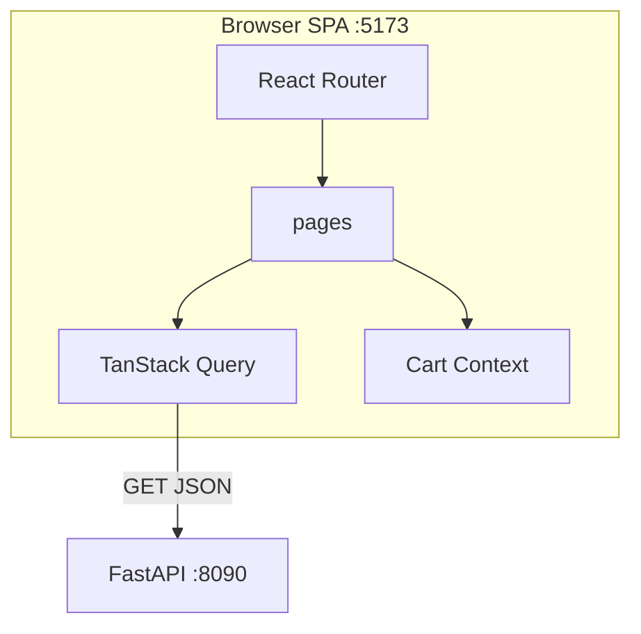

# 38. Capstone: Shop Catalog SPA (6–8 часов)

## Введение: зачем capstone

До этой главы вы учили **фрагменты** React: hooks в [09-useState.md](09-useState.md), Query в [20-tanstack-query.md](20-tanstack-query.md), Router в [23-react-router.md](23-react-router.md), Context в [30-lab-context.md](30-lab-context.md). Capstone собирает **полноценный SPA** mock-exams shop — клиент к FastAPI [`deploy/fastapi`](../../deploy/fastapi/README.md) на `:8090`.

Аналог в JS-треке — [javascript-basic/39-capstone](../javascript-basic/39-capstone.md) (CLI Task Tracker); в backend — [fastapi/42-capstone](../fastapi/42-capstone.md). Здесь — **6–8 часов** чистой работы (3–4 сессии по 2 часа).

Если застряли — возвращайтесь к урокам из таблицы «Когда смотреть», не копируйте готовый SPA из интернета.

**Оценка времени:** 6–8 часов.

---

## Задача

**Shop Catalog SPA** — одностраничное приложение каталога товаров с маршрутизацией, загрузкой данных через TanStack Query, корзиной на Context, формой обратной связи/заявки (controlled form), явными UI states и TypeScript.

Домен тот же, что в FastAPI stack: **items** (`id`, `title`, `description`). Корзина — клиентская до «оформления» (POST optional extension).

---

## Функциональные требования

### Маршруты (React Router)

| Path | Страница | Описание |
|------|----------|----------|
| `/` | Redirect | → `/catalog` |
| `/catalog` | CatalogPage | Список товаров с API |
| `/items/:id` | ItemDetailPage | Деталь одного товара |
| `/cart` | CartPage | Корзина из Context |
| `/contact` | ContactPage | Controlled form (не API обязательно) |
| `*` | NotFoundPage | 404 |

Layout route: общий `Header` (nav, theme toggle, cart badge) + `Footer` + `<Outlet />` ([24-nested-routes.md](24-nested-routes.md)).

### API (FastAPI :8090)

| Метод | Endpoint | Использование |
|-------|----------|---------------|
| GET | `/health` | (опционально) статус в footer |
| GET | `/api/v1/items` | Catalog list |
| GET | `/api/v1/items/{id}` | Item detail |

Базовый URL: `VITE_API_URL` или `http://localhost:8090`. CORS — [18-cors-fastapi.md](18-cors-fastapi.md).

```bash
cd deploy/fastapi
docker compose up -d --build
curl http://localhost:8090/api/v1/items
```

### CatalogPage

- TanStack Query `useQuery` key `["items"]`
- **Loading:** skeleton ([31-ui-states.md](31-ui-states.md))
- **Error:** message + «Повторить» (`refetch`)
- **Empty:** empty state (если массив пуст)
- **Success:** grid карточек `ProductCard`
- Поиск: local filter **или** query param `?q=` ([26-url-state.md](26-url-state.md)) — минимум один вариант
- Кнопка «В корзину» → `useCart()`

### ItemDetailPage

- `useQuery` `["item", id]` + `fetchItemById`
- 404 от API → «Товар не найден» + link catalog
- Add to cart

### CartPage

- Список lines: title, qty +/-, remove, clear
- `totalItems` в Header badge
- Empty cart state
- (Extension) persist localStorage

### Theme

- `ThemeProvider` light/dark ([30-lab-context.md](30-lab-context.md))
- CSS variables ([33-styling.md](33-styling.md))

### ContactPage (form)

Controlled fields минимум:

| Поле | Тип | Валидация |
|------|-----|-----------|
| name | text | 2–100 символов |
| email | email | формат email |
| message | textarea | 10–1000 символов |

Submit: `preventDefault`, показ success message **или** mock delay 500ms (POST на API — extension B). Ошибки валидации inline под полями ([10-events-controlled.md](10-events-controlled.md)).

---

## Нефункциональные требования

| Требование | Зачем |
|------------|-------|
| TypeScript strict, без `any` на новом коде | [32-typescript-react.md](32-typescript-react.md) |
| `types/item.ts` + `api/items.ts` | [34-lab-typescript.md](34-lab-typescript.md) |
| Структура `app/`, `pages/`, `features/`, `components/` | [35-project-structure.md](35-project-structure.md) |
| Keys `item.id` в списках | [07-lists-keys.md](07-lists-keys.md) |
| Rules of Hooks | [28-custom-hooks.md](28-custom-hooks.md) |
| README в `capstone/` или `examples/` с скриншотами/командами | для проверяющего |
| `npm run build` без ошибок | production-ready |

---

## Целевая структура

```text
examples/capstone/          # или evolve examples/src/
├── README.md
├── .env.example
├── package.json
├── vite.config.ts
├── tsconfig.json
├── index.html
└── src/
    ├── main.tsx
    ├── app/
    │   ├── App.tsx
    │   ├── providers.tsx
    │   └── routes.tsx
    ├── pages/
    │   ├── CatalogPage.tsx
    │   ├── ItemDetailPage.tsx
    │   ├── CartPage.tsx
    │   ├── ContactPage.tsx
    │   └── NotFoundPage.tsx
    ├── features/
    │   ├── catalog/
    │   │   └── components/ProductCard.tsx
    │   └── cart/
    │       └── context/CartContext.tsx
    ├── components/
    │   ├── layout/Header.tsx
    │   ├── layout/Footer.tsx
    │   └── feedback/ErrorPanel.tsx
    ├── api/
    │   ├── client.ts
    │   └── items.ts
    ├── hooks/
    │   └── useDebouncedValue.ts
    ├── context/
    │   └── ThemeContext.tsx
    ├── types/
    │   └── item.ts
    └── styles/
        └── index.css
```



---

## Пошаговый план (рекомендуемый)

### Сессия 1 (~2 ч): каркас + API + catalog list

1. Scaffold Vite React TS (или скопируйте `examples/`).
2. `api/client.ts`, `types/item.ts`, `fetchItems`.
3. `QueryClientProvider`, `BrowserRouter`, layout Header/Footer.
4. `CatalogPage` + Query + skeleton/error/list.
5. **Критерий:** catalog показывает demo item с `:8090`.

**Уроки:** [18-cors-fastapi.md](18-cors-fastapi.md), [19-lab-fetch-items.md](19-lab-fetch-items.md), [20-tanstack-query.md](20-tanstack-query.md), [31-ui-states.md](31-ui-states.md).

### Сессия 2 (~2 ч): Router + detail + cart

1. Routes `/catalog`, `/items/:id`, `/cart`, 404.
2. `ItemDetailPage` + `useParams`.
3. `CartProvider`, add/remove/qty, badge in Header.
4. **Критерий:** add on catalog → visible on `/cart` after navigation.

**Уроки:** [23-react-router.md](23-react-router.md), [29-context.md](29-context.md), [30-lab-context.md](30-lab-context.md).

### Сессия 3 (~2 ч): theme, search, contact form

1. `ThemeProvider` + CSS variables.
2. Search filter или URL `?q=`.
3. `ContactPage` controlled form + validation.
4. **Критерий:** theme persists session; invalid form blocked.

**Уроки:** [10-events-controlled.md](10-events-controlled.md), [26-url-state.md](26-url-state.md), [33-styling.md](33-styling.md).

### Сессия 4 (~1–2 ч): polish + README

1. Empty states, a11y focus, responsive grid.
2. `npm run build`, fix TS errors.
3. README: setup, env, screenshots, known limits.
4. Self-check acceptance criteria below.
5. Profiler smoke — нет obvious render storm ([36-devtools.md](36-devtools.md)).

**Уроки:** [35-project-structure.md](35-project-structure.md), [34-lab-typescript.md](34-lab-typescript.md).

---

## Подсказки по реализации

### Query keys factory

```tsx
export const itemKeys = {
  all: ["items"] as const,
  detail: (id: number) => ["item", id] as const,
};
```

### Item detail enabled

```tsx
const { id } = useParams();
const numericId = Number(id);

useQuery({
  queryKey: itemKeys.detail(numericId),
  queryFn: () => fetchItemById(numericId),
  enabled: Number.isFinite(numericId),
});
```

### Cart add immutability

```tsx
setLines((prev) => {
  const i = prev.findIndex((l) => l.id === item.id);
  if (i >= 0) {
    return prev.map((l, idx) =>
      idx === i ? { ...l, qty: l.qty + 1 } : l
    );
  }
  return [...prev, { ...item, qty: 1 }];
});
```

### Form validation sketch

```tsx
function validateContact(values: ContactForm) {
  const errors: Partial<Record<keyof ContactForm, string>> = {};
  if (values.name.trim().length < 2) errors.name = "Минимум 2 символа";
  if (!/^[^\s@]+@[^\s@]+\.[^\s@]+$/.test(values.email))
    errors.email = "Некорректный email";
  if (values.message.trim().length < 10)
    errors.message = "Минимум 10 символов";
  return errors;
}
```

---

## Расширения (опционально)

| Уровень | Задача | Часы |
|---------|--------|------|
| A | `ReactQueryDevtools` + `localStorage` cart | +0.5 |
| B | POST feedback на mock endpoint / `jsonplaceholder` | +1 |
| C | Mutation optimistic add + toast | +1 |
| D | Pagination query `?page=` + UI | +1.5 |
| E | Vitest + Testing Library smoke test CatalogPage | +2 |

Стенд: [`deploy/fastapi`](../../deploy/fastapi/README.md).

---

## Критерии приёмки (самопроверка)

- [ ] `docker compose up` → catalog загружает items без CORS error
- [ ] `/items/1` показывает demo item; `/items/999` — not found UI
- [ ] Cart: add, qty change, remove, empty state, badge count
- [ ] Theme toggle меняет оформление на всех routes
- [ ] Contact form не submit при invalid; success UI при valid
- [ ] Loading skeleton, error retry, empty catalog/search работают
- [ ] `npm run build` успешен
- [ ] README с командами запуска frontend + backend
- [ ] Нет monolith 600-line component — структура [35-project-structure.md](35-project-structure.md)
- [ ] Пройден [interview-cheatsheet.md](interview-cheatsheet.md) один раз без подглядывания

---

## Типичные ошибки

1. **Provider ниже Routes** — cart reset при navigation. Providers **оборачивают** Router (или на том же уровне выше outlet tree).

2. **Забыли `enabled` на detail query** — fetch с `id=NaN`.

3. **Index as key** в cart lines после sort — use `id`.

4. **Дублирование items в Context** — cart хранит `{id, title, qty}`, не весь catalog.

5. **Effect fetch вместо Query** — нет retry/refetch/cache; refactor to Query.

6. **Hardcode API URL** — use `VITE_API_URL` for CI/staging.

7. **Нет 404 route** — blank page on unknown URL.

---

## Когда смотреть уроки

| Проблема | Урок |
|---------|------|
| CORS / API | 18, 19 |
| Query loading | 20, 31 |
| Router params | 23, 25 |
| Cart global | 29, 30 |
| Form validation | 10 |
| TS errors | 32, 34 |
| Folder chaos | 35 |
| Re-render debug | 27, 36 |

---

## После capstone

1. Ещё раз [interview-cheatsheet.md](interview-cheatsheet.md) и [37-interview-qa.md](37-interview-qa.md).
2. Отметьте в [javascript-path.md](../javascript-path.md): **react-intermediate** или **javascript-testing**.
3. Опционально: деплой static build за nginx ([deploy/nginx](../../deploy/nginx/README.md)) + API `:8090`.
4. Portfolio: скриншоты + ссылка на репозиторий/ветку `capstone-shop-spa`.

Поздравляем — **react-basic** завершён.
