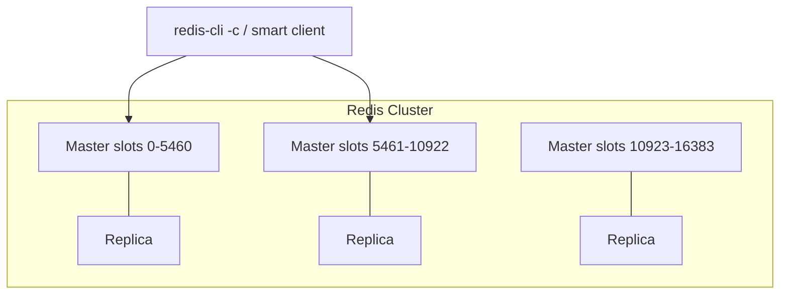

# 02. Redis Cluster

## Введение: «MOVED 3999» в логах приложения

После миграции с одного инстанса на Cluster разработчики видят в логах странные ответы Redis: не `OK`, а **MOVED** или **ASK**. Клиент без поддержки cluster mode перестаёт работать. Ops говорит: «У нас 6 нод, всё healthy». Проблема не в «падении Redis», а в том, что **ключи распределены по 16384 слотам**, и клиент обязан ходить на **правильный master**.

## Что вы узнаете

- **Hash slots**, CRC16, **hash tags** `{...}`.
- Роли: **master / replica**, **quorum**, failover.
- Протокол **MOVED / ASK**, **resharding**.
- Ограничения Cluster (multi-key, Lua, transactions).
- Связь со стендом `7001-7006` и `init-cluster.sh`.

---

## Архитектура



| Понятие | Значение |
|---------|----------|
| **16384 slots** | Фиксированное пространство шардирования |
| **Master** | Владеет набором slots, принимает write |
| **Replica** | Async replica master; может стать master |
| **Cluster bus** | Порт **16379** (offset +10000 от client port) — gossip |

Учебный стенд: [`deploy/redis/docker-compose.cluster.yml`](../../deploy/redis/docker-compose.cluster.yml) — 6 контейнеров, с хоста **7001-7006**, инициализация [`scripts/init-cluster.sh`](../../deploy/redis/scripts/init-cluster.sh).

---

## Куда попадает ключ

```text
slot = CRC16(key) mod 16384
```

**Hash tag:** только подстрока в `{...}` участвует в CRC:

```bash
# Оба ключа в одном slot — можно MGET в Cluster
SET user:{42}:profile "..."
SET user:{42}:cart "..."
```

Без тега `user:42:profile` и `user:42:cart` могут оказаться на **разных** нодах → `CROSSSLOT` при multi-key.

---

## MOVED и ASK

| Ответ | Когда | Действие клиента |
|-------|-------|------------------|
| **MOVED** | Слот **уже** на другой ноде (постоянно) | Обновить slot map, retry |
| **ASK** | Временно при **миграции** слота | `ASKING` + команда на target |

Клиенты production: **lettuce**, **go-redis**, **redis-py** cluster mode, **Jedis** — с auto redirect.

```bash
redis-cli -c -p 7001 SET product:1001 '{"sku":"x"}'
redis-cli -p 7001 CLUSTER KEYSLOT product:1001
```

Флаг **`-c`** в `redis-cli` включает follow redirects.

---

## Failover

1. Master недоступен > `cluster-node-timeout` (стенд: **5000 ms**).
2. Реплики голосуют (**quorum** majority masters).
3. Replica promote → master, слоты переназначены.
4. Старый master при возврате — обычно **replica** (если не split-brain с особыми настройками).

**На собеседовании:** Cluster **не** гарантирует strong consistency при partition; возможна **потеря последних записей** при promote replica (async replication).

---

## Resharding и масштабирование

Добавление ноды:

1. `CLUSTER MEET` новая нода.
2. `redis-cli --cluster reshard` — перенос диапазона slots.
3. Во время миграции — **ASK** redirects.

Планируйте **равномерность** slots и **размер данных** на ноду — не только число нод.

---

## Ограничения

| Возможность | В standalone | В Cluster |
|-------------|--------------|-----------|
| Multi-key без общего slot | Да | **Нет** (кроме hash tag) |
| `SELECT db` (1-15) | Да | **Только db 0** |
| Lua с несколькими ключами | Да | Ключи **в одном slot** |
| Sentinel для failover | Да | **Не нужен** — встроенный |

**Альтернативы** без полного Cluster: **client-side sharding**, **Twemproxy**, **managed** (ElastiCache cluster mode).

---

## Сравнение с Sentinel (intermediate)

| | Sentinel | Cluster |
|---|----------|---------|
| Шардирование | Нет (один master) | Да (slots) |
| Failover | Да | Да |
| Write scale-out | Нет | Да (masters) |
| Сложность ops | Ниже | Выше |

Многие команды живут с **Sentinel + один master** до реального предела RAM/CPU.

---

## Типичные ошибки

- Запуск `redis-cli` **без `-c`** на Cluster — «случайные» ошибки.
- Hot key на **одном slot** → один master 100% CPU ([04](04-hot-keys-stampede.md)).
- `CLUSTERDOWN` — не хватает quorum masters ([09](09-troubleshooting.md)).
- Забыли `init-cluster.sh` после `compose up` — ноды в состоянии **fail**.

---

## Резюме

1. **16384 slots**, master владеет диапазоном, replica — failover.
2. Клиент **cluster-aware** обязателен.
3. **Hash tags** — для локальности multi-key.
4. Учебный кластер: порты **7001-7006**, bus **17001-17006**.

**Дальше:** [03. Лаба: cluster](03-lab-cluster.md).
