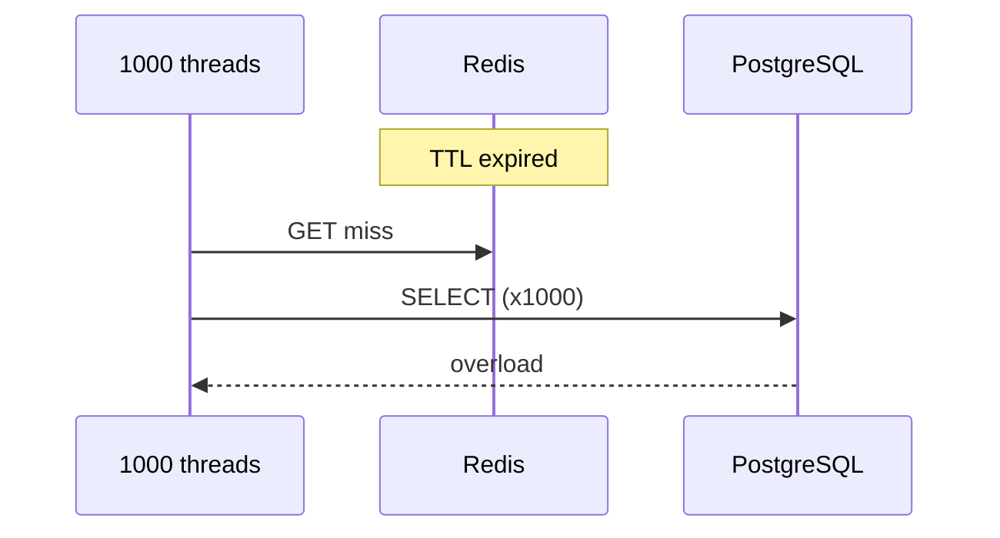

# 04. Hot keys и cache stampede

## Введение: «один ключ убил Black Friday»

Мониторинг показывает: Redis **healthy**, latency API **2 s**. В `INFO commandstats` 90% времени — `GET promo:banner:2025`. Один ключ на одном master в Cluster — **hot key**: single-threaded Redis превращается в узкое горлышко. Ещё хуже — **cache stampede**: TTL тысячи ключей истёк одновременно, все потоки пошли в PostgreSQL.

## Что вы узнаете

- Диагностика **hot key** (latency, commandstats, --hotkeys).
- Митигация: **sharding key**, read replica, **local cache**.
- **Stampede**: jitter, lock, singleflight, early refresh.
- Hot key в **Cluster** (один slot).

---

## Hot key: симптомы

| Сигнал | Инструмент |
|--------|------------|
| Один master CPU 100% | `INFO CPU`, per-node Grafana |
| Spike `GET` одного ключа | `INFO commandstats` |
| Плохой p99 при низком avg | latency doctor, slowlog |
| Cluster: один slot hot | `CLUSTER NODES` + нагрузка на одну ноду |

```bash
redis-cli INFO commandstats | grep -E 'cmdstat_get|cmdstat_set'
redis-cli --hotkeys   # осторожно: O(N) на больших DB
```

**В проде:** sampling в proxy (Envoy, Twemproxy), client-side metrics по key prefix, Redis Enterprise **hot key detection**.

---

## Стратегии снижения hot key

### 1. Логический sharding счётчика

Вместо `INCR global:views`:

```text
global:views:{0} ... global:views:{15}
```

Чтение: `MGET` + sum в приложении (или pipeline). Запись: `INCR` на `hash(userId) % 16`.

### 2. Read replicas (standalone / не cluster write)

Горячие **read-only** ключи — чтение с replicas (eventual consistency).

### 3. Local / CDN cache

Статический баннер, конфиг — **in-process cache** 1-5 с + Redis.

### 4. Hash tag осторожно

`{promo}:banner` и `{promo}:details` — **один slot** → один hot master. Иногда нужно **разнести** намеренно.

---

## Cache stampede



| Техника | Идея |
|---------|------|
| **TTL jitter** | `TTL = base + random(0..60s)` |
| **Mutex в Redis** | Первый ставит lock `SET lock NX EX`; остальные ждут/ stale |
| **Singleflight** | Один запрос на ключ в приложении (Go `singleflight`) |
| **Early refresh** | Фоновый worker обновляет до expiry при hit rate |
| **Stale-while-revalidate** | Отдавать старое + async refresh |

Псевдокод mutex:

```text
v = GET key
if v: return v
if SET lock:key NX EX 10:
  v = load_from_db()
  SET key v EX 300
  DEL lock:key
  return v
else:
  sleep/retry GET key
```

---

## Cluster и hot keys

Даже с 6 masters **один** популярный ключ → **один** slot → один CPU thread. Решение — **разбить ключ** (sharded counter) или **копии read** вне Redis.

---

## На собеседовании

- **Вопрос:** «Как найдёте hot key в 10M keys?» — sampling, proxy metrics, `redis-cli --hotkeys` на staging, не в peak prod.
- **Вопрос:** «Stampede после deploy?» — массовый сброс TTL / cold cache — jitter + prewarm.

---

## Типичные ошибки

- Увеличивать **RAM**, когда bottleneck — **один ключ / один поток**.
- `EXPIRE` всех ключей в **полночь** cron-ом.
- Redlock для **каждого** cache miss ([15](15-patterns-redlock.md)).

---

## Резюме

1. Hot key — **не всегда** «мало памяти», часто **skew** и single-thread.
2. Sharding ключа, local cache, replicas — основной арсенал.
3. Stampede лечат **jitter + singleflight + lock**.

**Дальше:** [05. Лаба: stampede](05-lab-stampede.md).
