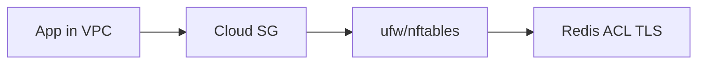

# 07. Security advanced

## Введение: «Redis без пароля в интернете»

Shodan находит открытые инстансы Redis каждый день: `CONFIG SET dir /var/spool/cron`, `FLUSHALL`, шифровальщики. В облаке чаще ошибка **Security Group 0.0.0.0/6379**, но и **host firewall** без правил — та же дыра. Redis в production — **private network + ACL + TLS + минимум команд**.

## Что вы узнаете

- **Defense in depth**: SG + [host firewall](../linux-intermediate/07-firewall.md) + bind.
- **ACL** (users, categories, key patterns).
- **rename-command** и отключение опасных команд.
- **TLS**, `protected-mode`, audit.
- Связь с лабой [08](08-lab-rename-commands.md) и [`examples/redis-security.conf`](examples/redis-security.conf).

---

## Слои защиты



| Слой | Практика |
|------|----------|
| Сеть | Private subnet, **нет** публичного 6379 |
| SG/NSG | Только security group приложения → Redis |
| Host | [ufw: deny by default](../linux-intermediate/07-firewall.md), allow 6379 from app subnet |
| Redis | `bind`, `protected-mode`, ACL, TLS |
| Ops | Отдельный user для admin, audit log |

**На собеседовании:** «Достаточно Security Group?» — нет, defense in depth; compromise app host ≠ scan всей VPC без host fw.

---

## ACL (Redis 6+)

Файл [`deploy/redis/config/users.acl`](../../deploy/redis/config/users.acl) на стенде — учебный `default on nopass` (**только lab**).

Production-пример:

```text
user default off
user app on >AppSecretSha256... ~app:* +@read +@write -@dangerous
user admin on >AdminSecret... ~* +@all
```

| Элемент | Смысл |
|---------|--------|
| `on` / `off` | Включён ли user |
| `>password` | SHA256 пароль |
| `~pattern` | Доступные ключи |
| `+@read` / `-flush` | Команды и категории |

```bash
redis-cli ACL LIST
redis-cli ACL WHOAMI
```

---

## rename-command

Отключение или переименование опасных команд ([08-lab](08-lab-rename-commands.md)):

```text
rename-command FLUSHALL ""
rename-command FLUSHDB ""
rename-command CONFIG "CONFIG_SECRET_a8f3"
rename-command DEBUG ""
```

Пустая строка `""` — команда **удалена**. Клиенты и **Sentinel** должны знать новые имена.

---

## TLS

```text
tls-port 6379
port 0
tls-cert-file /tls/redis.crt
tls-key-file /tls/redis.key
tls-ca-cert-file /tls/ca.crt
tls-auth-clients optional
```

Managed (ElastiCache, MemoryDB) — TLS **обязателен** в compliance-средах.

---

## protected-mode и bind

- **`protected-mode yes`**: без bind/ACL — только localhost.
- **`bind 10.0.1.5`**: слушать только internal IP.
- На **учебном** cluster compose — `protected-mode no` для Docker DNS; **не копировать в прод**.

---

## Аудит и секреты

- Пароли ACL — в **Secrets Manager**, не в git.
- Ротация credentials с **dual-write** периодом.
- Логировать отказ ACL (`ACL LOG`).

---

## Типичные ошибки

- `0.0.0.0/0` в SG «временно на отладку».
- Один user `default` с `+@all` и паролем в README.
- `rename-command CONFIG` без обновления **мониторинга** (exporter ломается).

---

## Резюме

1. Redis **не аутентифицирует** сам по себе сеть — вы строите периметр.
2. **ACL** — least privilege per application.
3. **rename-command** — убрать footguns; связка с [firewall](../linux-intermediate/07-firewall.md).

**Дальше:** [08. Лаба: rename-command](08-lab-rename-commands.md).
