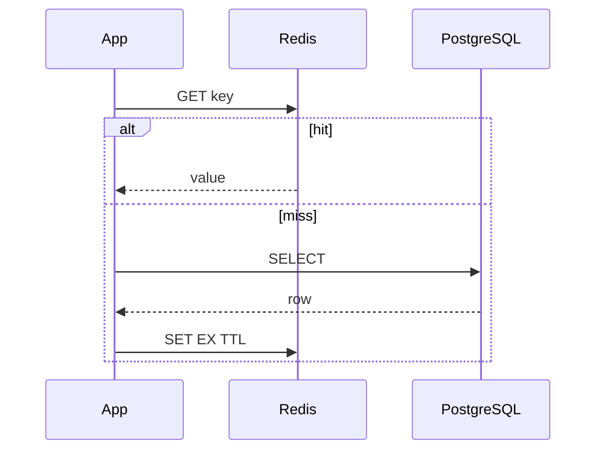

# 13. System design: Redis на собеседовании

## Введение

Задача senior: **«Спроектируйте кэш и сессии для API 50k RPS, каталог 5 GB, пики x5»**. Оценивают **trade-offs**, **failure modes**, **операционную** зрелость — не «поставил Redis».

## Framework ответа (45 мин)

1. **Requirements** (5 мин) — read/write ratio, consistency, TTL, DR.
2. **Estimates** (5 мин) — RAM, QPS per shard, network.
3. **API & key design** (5 мин) — prefixes, TTL, hash tags.
4. **Architecture** (10 мин) — diagram app, Redis, DB.
5. **Deep dives** (15 мин) — stampede, hot keys, security, failover.
6. **Risks** (5 мин) — OOM, split brain, cache penetration.

---

## Clarifying questions

- **Consistency:** stale cache 30 с допустимы?
- **Durability:** сессии терять нельзя → `noeviction` + persistence?
- **Multi-region:** active-active или cache per region?
- **Payload size:** median/max value?
- **Invalidation:** event-driven или только TTL?

---

## Back-of-envelope

Пример каталога:

| Параметр | Значение |
|----------|----------|
| SKU | 2M |
| JSON avg | 2 KB |
| Cold dataset | ~4 GB |
| Cache hit 90% @ 50k RPS | ~5k RPS to DB |
| Session | 500k × 2 KB ≈ 1 GB |
| **RAM target** | ~6 GB data + 30-50% overhead + replica ≈ **12-16 GB** |

```text
QPS per Redis core ~ 100k simple GET (идеал) → реально 20-40k с TLS/JSON
→ 50k RPS may need 2-3 shards (Cluster) or bigger instance
```

---

## Паттерн cache-aside



| Вариант | Когда |
|---------|-------|
| Cache-aside | Универсально |
| Write-through | Нужна свежесть write |
| Write-behind | Высокая write нагрузка (сложность) |

---

## Key design

```text
catalog:sku:{id}     EX 3600 ± jitter
session:{uuid}       EX 86400
ratelimit:{ip}:{min} EX 60
```

- **Prefix** для ACL `~catalog:*`.
- **UUID** session — не sequential hot keys.
- **Jitter** на TTL ([04](04-hot-keys-stampede.md)).

---

## Topology choice

| Вариант | Плюс | Минус |
|---------|------|-------|
| Single primary + replicas | Просто | Vertical limit |
| Sentinel | Auto failover | Нет shard write scale |
| Cluster | Shard | Ops, CROSSSLOT |
| ElastiCache cluster mode | Managed | Vendor lock, cost |

---

## Failure modes (назовите сами)

| Риск | Mitigation |
|------|------------|
| Cache stampede | jitter, lock, singleflight |
| Hot key | sharded counter, local cache |
| OOM | maxmemory, policy, alerts on evicted_keys |
| Thundering herd on cold start | prewarm, gradual TTL |
| Penetration (fake ids) | bloom filter, short TTL null |

---

## Security (1 слайд)

Private subnet, ACL per service, TLS, [firewall](../linux-intermediate/07-firewall.md), no `FLUSHALL` for app user ([07](07-security.md)).

---

## Monitoring

- `used_memory`, `evicted_keys`, `connected_clients`
- Latency p99 per node
- Hit rate (app metric)
- Replication lag / cluster state

---

## Резюме

Сильный ответ = **цифры + diagram + 3 риска + что НЕ кладёте в Redis (большие blob, source of truth).

**Дальше:** [14. Лаба: system design](14-lab-system-design.md).
