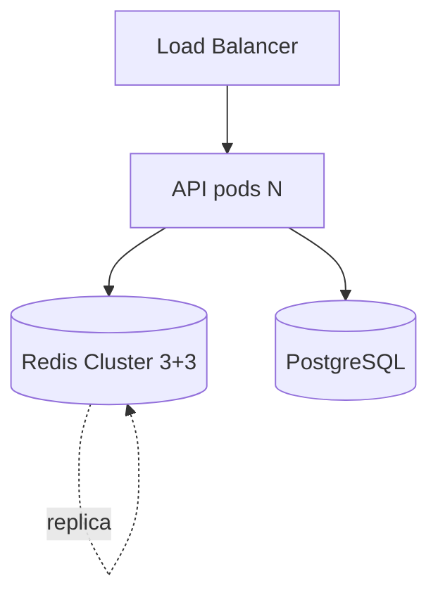

# 14. Лаба: system design — разбор эталона

## Цель

Самостоятельно решить промпт из [12-lab-mock-interview](12-lab-mock-interview.md), затем свериться с эталоном ниже. Отметить пробелы в знаниях.

## Промпт (повтор)

Маркетплейс: каталог 2M SKU (~2 KB JSON), **50k RPS read**, пики **x3**. **500k** online sessions (~2 KB). PostgreSQL — source of truth. Регион **EU**.

---

## Эталон: requirements

| Тип | Решение |
|-----|---------|
| Read-heavy | Cache-aside, 90%+ hit target |
| Sessions | TTL 24h, `noeviction` или отдельный инстанс |
| Consistency | Eventual on catalog; session read-your-writes via same key |
| DR | RPO 1h — AOF everysec + replica; не multi-master cache |

---

## Эталон: sizing

```text
Catalog hot set (20% SKU): 400k × 2KB ≈ 800 MB
Full catalog if cached: 2M × 2KB ≈ 4 GB  → cache hot + long tail in DB
Sessions: 500k × 2KB ≈ 1 GB
Total ≈ 2-5 GB working set + 50% overhead + replica ≈ 8-12 GB RAM minimum
Peak RPS: 150k → Cluster 3 masters или r6g.2xlarge class (уточнять бенчмарк)
```

---

## Эталон: diagram



---

## Эталон: key patterns

```text
cat:v1:{skuId}     TTL 1800 + rand(0,300)
sess:{sessionId} TTL 86400
lock:cat:{skuId}   NX EX 10  # optional refresh
```

Hot SKU (Black Friday): `cat:v1:{skuId}` → local cache 2s + Redis; или read replica.

---

## Эталон: anti-stampede

1. TTL jitter на catalog keys.
2. On miss: `SET lock:cat:{id} NX EX 5` → один loader.
3. Optional: prewarm top 10k SKU после deploy.

---

## Эталон: security

- Redis в private subnet; SG only from EKS nodes.
- ACL: `api` user `~cat:* ~sess:* +@read +@write -@dangerous`.
- Host [ufw](../linux-intermediate/07-firewall.md) deny 6379 except node SG.
- TLS in-transit (ElastiCache in-transit encryption).

---

## Эталон: alerts

1. `used_memory > 80% maxmemory`
2. `evicted_keys` rate > 0 на session instance (should be 0)
3. p99 `redis_commands_latency` > 5ms

---

## Самопроверка

| Критерий | Вы | Эталон |
|----------|-----|--------|
| RAM estimate | | ✓ order 8-12 GB |
| Cluster vs single | | ✓ Cluster at 150k peak |
| Session policy | | ✓ separate or noeviction |
| Hot SKU plan | | ✓ local / replica |
| Security layers | | ✓ 3+ layers |

**Дальше:** [15. Redlock](15-patterns-redlock.md).
