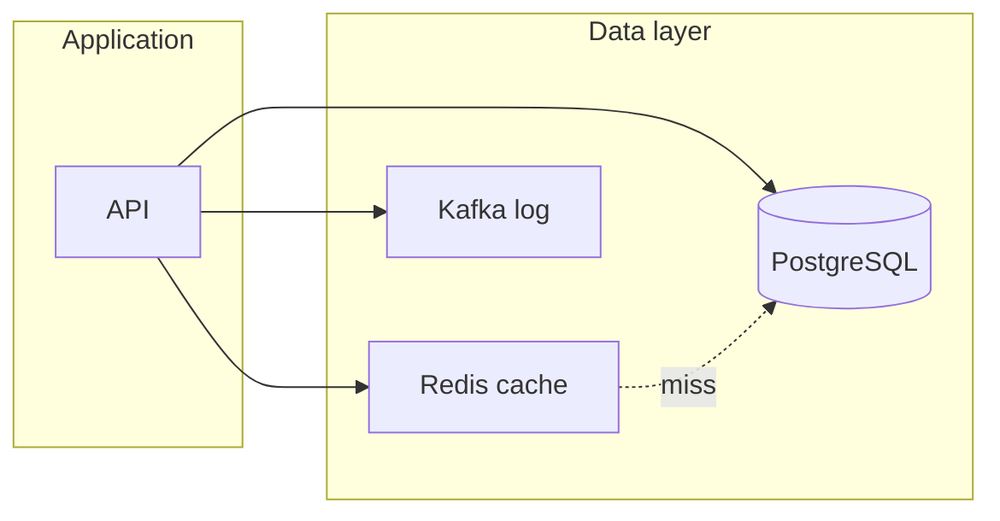

# 01. Зачем Redis: память, скорость и границы

## Введение: «PostgreSQL не успевает за каталогом»

Интернет-магазин отдаёт главную страницу: **10 000** однотипных запросов в секунду к PostgreSQL за списком категорий. CPU БД на 90%, p99 latency растёт, checkout страдает. Команда кэширует ответ в **Redis** — один ключ `catalog:tree:v3`, TTL 5 минут. Нагрузка на Postgres падает; Redis отвечает за **субмиллисекунды** из RAM.

Через месяц тот же Redis используют как **хранилище сессий** и **счётчик корзины**. Потом кладут туда **очередь задач** «как в Kafka» — и теряют сообщения при рестарте без AOF. Эта глава — **ментальная модель**: что Redis умеет хорошо и где он не замена БД или брокеру.

## Что вы узнаете

- Чем **in-memory data store** отличается от **OLTP БД** и **message broker**.
- Типовые кейсы: **кэш**, **сессия**, **rate limit**, **leaderboard**, **Pub/Sub**.
- Ограничения: объём RAM, персистентность, single-thread на команду.
- Формулировки для **собеседования**.

## Три роли в архитектуре

| Роль | Метафора | Redis | PostgreSQL | Kafka |
|------|----------|-------|------------|-------|
| **Источник правды** | Книга учёта | нет* | да | нет |
| **Быстрый снимок / кэш** | Стикер на мониторе | да | иногда (materialized view) | нет |
| **Поток событий** | Лента новостей | частично (Streams) | нет | да |

\* Redis **может** быть primary store для сессий и лидербордов, но с осознанным риском потери при сбое — см. persistence в [02. Архитектура](02-architecture.md).



## Почему «просто поднять больше Postgres»

| | PostgreSQL | Redis |
|---|------------|-------|
| Хранение | диск + buffer pool | **преимущественно RAM** |
| Модель | строки, SQL, JOIN | **ключ → типизированная структура** |
| Latency | миллисекунды (норма) | **суб-мс** на простые команды |
| Масштаб чтения | реплики, connection pool | **очень высокий QPS** на один инстанс |

Redis **не** заменяет сложные запросы, транзакции между таблицами и долгую историю. Он **снимает горячий read** и хранит **эфемерное** состояние.

## Типовые сценарии (basic)

1. **Кэш страниц и справочников** — TTL, cache-aside ([06. Паттерны](06-patterns-cache.md)).
2. **Сессия пользователя** — HASH + TTL ([05. Лаба](05-lab-session-cart.md)).
3. **Корзина / избранное** — HASH, SET ([04. Типы данных](04-data-types.md)).
4. **Rate limiting** — INCR + EXPIRE ([17. Финал](17-final-project.md)).
5. **Leaderboard** — Sorted Set (ZSET).
6. **Pub/Sub уведомления** — fire-and-forget ([08. Pub/Sub](08-pubsub.md)); не гарантия доставки.

## Redis vs «положим в память приложения»

| | Локальный cache в JVM/Go | Redis |
|---|--------------------------|-------|
| Общий для N инстансов API | нет | **да** |
| Eviction централизованно | сложно | **maxmemory-policy** |
| Переживает рестарт процесса | нет | опционально (RDB/AOF) |

## На стенде: первое касание

Поднимите [`deploy/redis`](../../deploy/redis/README.md):

```bash
cd deploy/redis
docker compose up -d
docker compose ps
```

Проверка:

```bash
docker exec mock-redis redis-cli ping
```

Ответ `PONG` — инстанс готов. Подробные команды — в [03. Лаба: первые ключи](03-lab-first-keys.md).

## Типичные ошибки

| Ошибка мышления | Почему плохо | Как правильно |
|-----------------|--------------|---------------|
| «Redis = база данных» | нет JOIN, объём = RAM | кэш + эфемерное состояние; правда в Postgres |
| «Redis = Kafka» | Pub/Sub без persistence по умолчанию | события в Kafka; Redis — кэш/сессия/счётчик |
| «Без TTL всё ок» | память кончится, eviction выкинет случайное | **всегда** TTL для кэша и сессий |
| «Один ключ на весь JSON каталога 50 MB» | блокировки, медленный replication | дробить ключи, сжимать, лимит размера |

## В продакшене

- **Кластер** или **Sentinel** для HA (intermediate/advanced).
- **ACL**, TLS, отдельные инстансы под cache vs sessions.
- Мониторинг: **memory**, **evicted_keys**, **connected_clients**, **slowlog**.
- Runbook при **OOM**: политика eviction, тяжёлые ключи, `KEYS` запрещён — только `SCAN`.

Сравнение с Memcached и Kafka — [16. Redis vs Memcached vs Kafka](16-vs-memcached-kafka.md).

## Заметки для собеседования

- **Redis** — структурированное **in-memory** хранилище с опциональной персистентностью.
- **Single-threaded** обработка команд (на один инстанс) — нет lock contention, но длинная команда блокирует всех.
- **Cache-aside**: приложение читает Redis → при miss идёт в БД → пишет в Redis.
- **Pub/Sub** — at-most-once, подписчик offline — сообщения потеряны.

## Резюме

Redis — инструмент **скорости и простых структур** в общей памяти для многих клиентов. БД хранит **правду** и историю. Kafka — **лог событий** с replay. Выбор начинается с вопроса: нужна ли **миллионная read latency** и **простая модель ключ–значение**, или **SQL/лог**?

## Чек-лист

- Назовите три законных кейса Redis в e-commerce.
- Почему кэш каталога без TTL опасен?
- Чем сессия в Redis отличается от JWT-only?
- Можно ли восстановить пропущенные Pub/Sub сообщения?

Следующий урок: [02. Архитектура](02-architecture.md).
