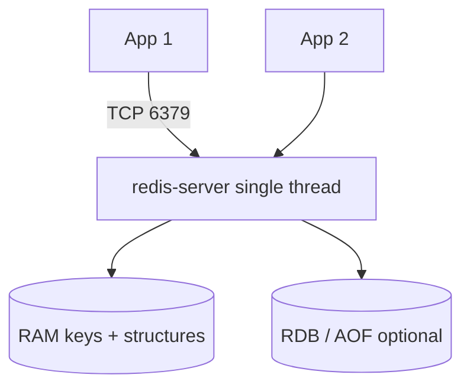

# 02. Архитектура: процесс, память, ключи, персистентность

## Введение: «Redis завис на одну секунду»

Оператор запустил `KEYS *` на проде с миллионом ключей — **весь** инстанс перестал отвечать на checkout. Redis обрабатывает команды **в одном потоке** (основной event loop): долгая O(N) операция блокирует всех клиентов. Архитектура Redis = понимание **памяти**, **модели ключей** и **что нельзя делать в CLI**.

## Что вы узнаете

- Модель **процесс / single-thread** и последствия для latency.
- Пространство имён **ключей**, TTL, типы значений.
- **RDB** и **AOF** на учебном стенде.
- Как читать `INFO server` и `INFO memory`.

## Процесс и сеть

Один инстанс Redis — процесс `redis-server`. Клиенты подключаются по **TCP** (порт **6379** на стенде).

| Подключение | Адрес |
|-------------|--------|
| С хоста | `localhost:6379` |
| Из контейнера в compose | `redis:6379` |

Учебный контейнер: **`mock-redis`**. CLI:

```bash
docker exec -it mock-redis redis-cli
```

Конфиг стенда: [`deploy/redis/config/redis-single.conf`](../../deploy/redis/config/redis-single.conf) — `maxmemory 256mb`, `allkeys-lru`, AOF включён.



## Single-thread и latency

- Команды выполняются **последовательно** (исключения: I/O threads для сети в новых версиях — детали в advanced).
- **Атомарность** одной команды — да; составные сценарии — `MULTI`/`EXEC` ([10. Pipeline и транзакции](10-pipeline-transactions.md)).
- **Долгие** команды: `KEYS`, большой `HGETALL`, `SMEMBERS` на гигантский set — избегать в prod.

| Команда | Сложность | Риск |
|---------|-----------|------|
| `GET key` | O(1) | низкий |
| `HGETALL big` | O(N) | высокий при большом hash |
| `KEYS pattern` | O(N) всех ключей | **критичный** |
| `SCAN` | итеративно | безопаснее |

## Ключи и TTL

Ключ — **строка байтов** (обычно UTF-8 текста):

```text
app:session:sess-7f3a2b1c
app:product:sku-BOOK-101
lab:hello
```

**Соглашения** (рекомендация):

- префикс окружения/сервиса: `app:`, `lab:`;
- разделитель `:` для иерархии;
- избегать пробелов и гигантских ключей.

**TTL** — время жизни ключа:

```bash
SET lab:ttl-demo "value" EX 60
TTL lab:ttl-demo
```

`-1` — без expire; `-2` — ключ не существует.

## Типы значений (preview)

Один ключ → **один тип** (нельзя сменить тип без удаления ключа):

| Тип | Назначение |
|-----|------------|
| **string** | JSON, счётчик, blob |
| **hash** | объект с полями (сессия) |
| **list** | очередь, лента (осторожно с O(N)) |
| **set** | уникальные id |
| **zset** | рейтинг, leaderboard |

Подробно — [04. Типы данных](04-data-types.md).

## Память и maxmemory

Данные живут в **RAM**. Параметр `maxmemory` ограничивает использование; при достижении — **eviction** ([12. Память и eviction](12-memory-eviction.md)).

На стенде:

```text
maxmemory 256mb
maxmemory-policy allkeys-lru
```

`INFO memory` показывает `used_memory_human`, `maxmemory`, `mem_fragmentation_ratio`.

## Персистентность (упрощённо)

| Механизм | Суть | Плюс | Минус |
|----------|------|------|-------|
| **RDB** | снимок на диск по расписанию | компактный, быстрый restore | потеря данных между снимками |
| **AOF** | лог каждой записи | меньше потерь | больше диска, rewrite |

Стенд: `appendonly yes`, `appendfsync everysec` — типичный компромисс.

**Важно:** Redis — не замена бэкапа PostgreSQL; RDB/AOF защищают **состояние Redis**, не вашу OLTP.

## На стенде: INFO и конфиг

```bash
docker exec mock-redis redis-cli INFO server | head -20
docker exec mock-redis redis-cli CONFIG GET maxmemory
docker exec mock-redis redis-cli CONFIG GET maxmemory-policy
```

Пример фрагмента:

```text
redis_version:7.2.x
tcp_port:6379
```

```bash
docker exec mock-redis redis-cli SET lab:arch-ping ok
docker exec mock-redis redis-cli TYPE lab:arch-ping
docker exec mock-redis redis-cli DEL lab:arch-ping
```

**Что увидите:** `string`, затем ключ удалён.

## Типичные ошибки

| Симптом | Причина | Решение |
|---------|---------|---------|
| Все клиенты «висят» | `KEYS *`, огромный `LRANGE 0 -1` | `SCAN`, лимиты, пагинация |
| WRONGTYPE | пишете LIST в существующий STRING | `DEL` или отдельный ключ |
| Память растёт без TTL | кэш без EX | политика TTL + eviction |
| «Пропали» сессии после `FLUSHALL` | тест на общем стенде | префикс `lab:yourname:` |

## В продакшене

- Отдельные инстансы: **cache** (можно терять) vs **critical** (сессии, persistence).
- Лимит размера значения (например, < 1 MB на ключ).
- Алерты на `used_memory > 80%`, `evicted_keys` rate, `blocked_clients`.
- Redis Commander / RedisInsight — визуализация; на prod — только read-only роли.

## Резюме

**Redis-server** — один основной поток команд, данные в RAM, ключи с TTL и строгим типом значения. **maxmemory** + **eviction** защищают от OOM. **AOF/RDB** — страховка состояния Redis, не OLTP. Безопасная эксплуатация = короткие команды и `SCAN` вместо `KEYS`.

## Чек-лист

- Почему `KEYS` опасен на production?
- Что означает `TTL` = -2?
- Где на стенде задан лимит памяти?
- Чем AOF отличается от RDB одной фразой?

Следующий урок: [03. Лаба: первые ключи](03-lab-first-keys.md).
