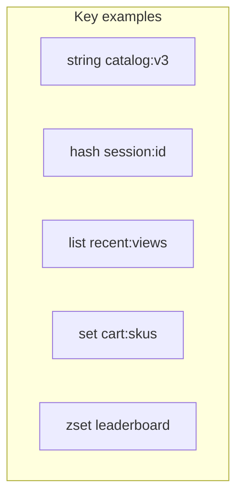

# 04. Типы данных: string, hash, list, set, zset

## Введение: «всё в одном JSON-строке»

Команда хранит сессию как `SET session:abc '{"userId":1,"cart":[...]}'`. При смене одного поля — **перезапись всего JSON**, гонки при параллельных запросах, лишний трафик. **HASH** даёт поля `userId`, `locale` отдельно; **SET** — уникальные SKU в корзине; **ZSET** — рейтинг с сортировкой по score. Эта глава — выбор типа под задачу.

## Что вы узнаете

- Команды и сложность **string, hash, list, set, zset**.
- Когда **не** использовать LIST как надёжную очередь.
- Соглашения по ключам для сессии и корзины.
- Примеры на стенде `mock-redis`.

## String

Универсальный тип: текст, числа, бинарные данные (до разумного размера).

| Команда | Назначение |
|---------|------------|
| `SET` / `GET` | запись/чтение |
| `INCR` / `DECR` | счётчики |
| `SET key value EX sec` | значение + TTL |
| `GETSET` | атомарно заменить и вернуть старое |

```bash
docker exec mock-redis redis-cli SET lab:types:counter 0
docker exec mock-redis redis-cli INCR lab:types:counter
```

**Когда string:** простой кэш JSON целиком, флаги, счётчики просмотров.

## Hash

Поля внутри одного ключа — «мини-объект»:

```bash
docker exec mock-redis redis-cli HSET lab:types:user:1 name "Anna" tier "GOLD"
docker exec mock-redis redis-cli HGET lab:types:user:1 name
docker exec mock-redis redis-cli HGETALL lab:types:user:1
```

| Команда | Назначение |
|---------|------------|
| `HSET` / `HGET` | одно поле |
| `HMGET` | несколько полей |
| `HDEL` | удалить поле |
| `HINCRBY` | счётчик в поле |

**Когда hash:** **сессия**, профиль, настройки с частичным обновлением.

**Осторожно:** `HGETALL` на hash с тысячами полей — как тяжёлый `KEYS`.

## List

Двусвязный список строк, упорядочен по вставке:

```bash
docker exec mock-redis redis-cli DEL lab:types:queue
docker exec mock-redis redis-cli LPUSH lab:types:queue job1 job2
docker exec mock-redis redis-cli RPOP lab:types:queue
```

| Команда | Назначение |
|---------|------------|
| `LPUSH` / `RPUSH` | вставка |
| `LPOP` / `RPOP` | извлечение |
| `LRANGE 0 -1` | весь список (осторожно) |
| `BLPOP` | блокирующее ожидание |

**Когда list:** лента последних N событий (`LTRIM`), простая очередь **в одном инстансе** с пониманием рисков.

**Не путать** с Kafka/Rabbit: при падении consumer между `RPOP` и ACK данные уже извлечены. Надёжная очередь — **Streams** (intermediate) или брокер.

## Set

Неупорядоченное множество уникальных строк:

```bash
docker exec mock-redis redis-cli SADD lab:types:tags redis cache session
docker exec mock-redis redis-cli SADD lab:types:tags redis
docker exec mock-redis redis-cli SMEMBERS lab:types:tags
docker exec mock-redis redis-cli SISMEMBER lab:types:tags cache
```

| Команда | Назначение |
|---------|------------|
| `SADD` / `SREM` | добавить/удалить |
| `SISMEMBER` | проверка |
| `SCARD` | размер |
| `SINTER` / `SUNION` | пересечение/объединение |

**Когда set:** теги, «кто онлайн», уникальные id в корзине.

## Sorted Set (ZSET)

Member + **score** (float); сортировка по score:

```bash
docker exec mock-redis redis-cli ZADD lab:types:board 100 user:alice 250 user:bob 180 user:carol
docker exec mock-redis redis-cli ZREVRANGE lab:types:board 0 2 WITHSCORES
docker exec mock-redis redis-cli ZINCRBY lab:types:board 50 user:alice
```

| Команда | Назначение |
|---------|------------|
| `ZADD` | добавить/обновить score |
| `ZRANGE` / `ZREVRANGE` | топ N |
| `ZRANK` / `ZSCORE` | место и очки |
| `ZINCRBY` | атомарно +очки |

**Когда zset:** **leaderboard**, rate limit по времени (score = timestamp), отложенные задачи.



## Сравнение выбора типа

| Задача | Тип | Ключ (пример) |
|--------|-----|----------------|
| Кэш JSON API | string | `app:cache:product:101` |
| Сессия | hash | `app:session:{id}` |
| Последние 10 просмотров | list + `LTRIM` | `app:user:1:recent` |
| SKU в корзине | set или hash | `app:cart:{userId}` |
| Топ продавцов дня | zset | `app:lb:daily` |

## На стенде: очистка демо-ключей

После экспериментов:

```bash
docker exec mock-redis redis-cli DEL lab:types:counter lab:types:user:1 lab:types:queue lab:types:tags lab:types:board
```

## Типичные ошибки

| Ошибка | Последствие | Решение |
|--------|-------------|---------|
| Гигантский JSON в string | лишний CPU, конфликты | hash или отдельные ключи |
| LIST как глобальная очередь prod | потеря при сбое, нет consumer group | Streams / SQS / Kafka |
| `SMEMBERS` на set из 1M | блокировка | `SSCAN` |
| Один ZSET на весь год лидерборда | огромный ключ | шард по дате `lb:2026-05-18` |

## В продакшене

- Сериализация: **JSON** в string/hash полях — норма; MessagePack для экономии.
- Версия схемы в ключе: `catalog:v3` — смена кэша без «призраков» v2.
- Документируйте **соглашение по ключам** (как [`rate-limit-keys.txt`](examples/rate-limit-keys.txt)).

## Резюме

**String** — простота и счётчики. **Hash** — объекты с полями. **List** — упорядоченные элементы с O(N) операциями на диапазоны. **Set** — уникальность. **Zset** — сортировка и рейтинги. Тип выбирают по операциям приложения, не «что удобнее сериализовать».

## Чек-лист

- Чем hash лучше одного JSON-string для сессии?
- Почему LIST ≠ Kafka?
- Как получить топ-3 в leaderboard?
- Когда `HGETALL` опасен?

Следующий урок: [05. Лаба: сессия и корзина](05-lab-session-cart.md).
