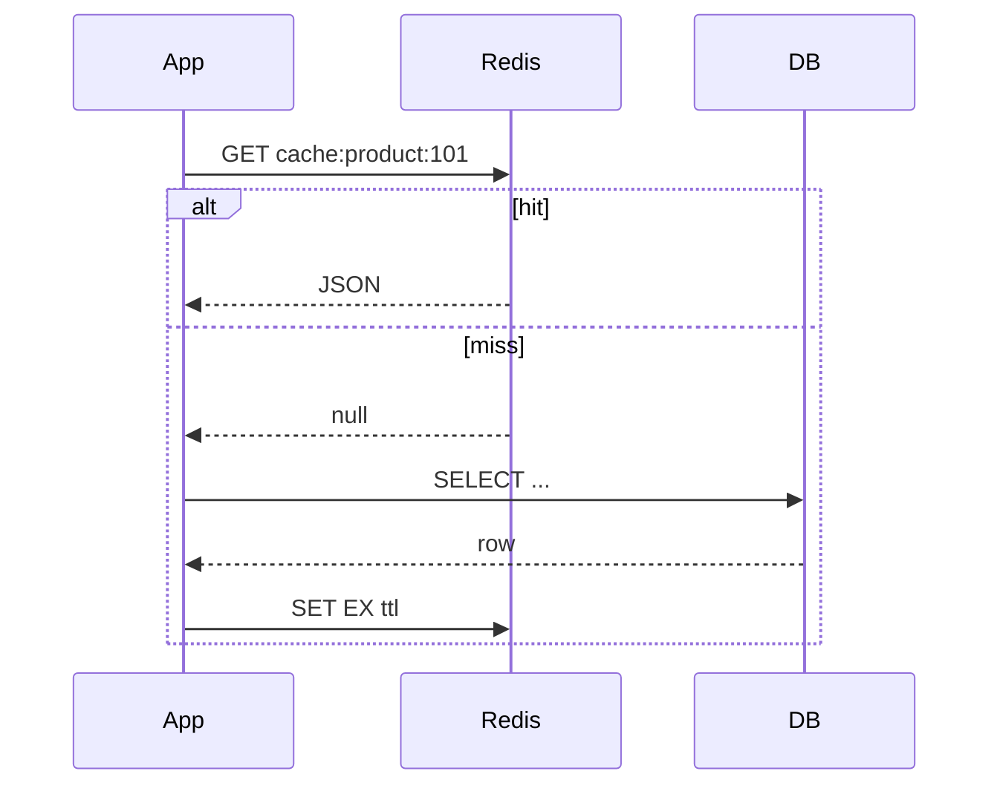
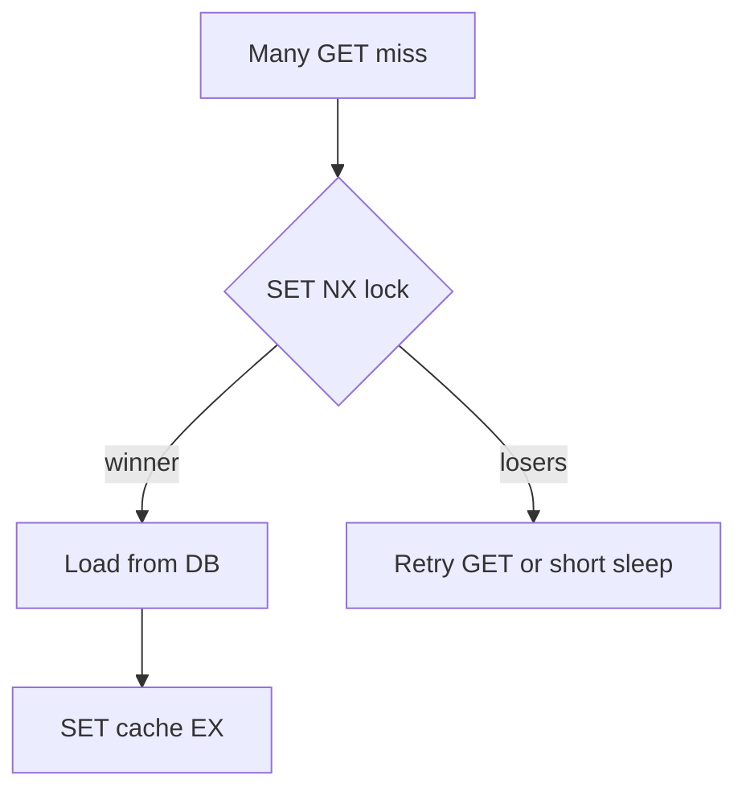

# 06. Паттерны: cache-aside, TTL, stampede

## Введение: «кэш протух — и БД легла»

Акция в полночь: TTL кэша каталога истёк у **всех** инстансов API одновременно. Тысячи запросов ударили в PostgreSQL — **cache stampede**. Через минуту кэш снова тёплый, но SLA уже нарушен. Паттерны кэширования — не «положить в Redis», а **когда** читать, **как** инвалидировать и **как** пережить miss.

## Что вы узнаете

- **Cache-aside** (lazy loading) vs **write-through** (preview).
- Выбор **TTL**, **jitter**, версионирование ключей.
- **Cache stampede** и митигации (lock, singleflight).
- Антипаттерны: вечный кэш, кэш без источника правды.

## Cache-aside (самый частый)



| Шаг | Действие |
|-----|----------|
| 1 | `GET` из Redis |
| 2 | hit → вернуть клиенту |
| 3 | miss → читать **БД** |
| 4 | `SET` в Redis с **TTL** |
| 5 | вернуть клиенту |

**Плюсы:** простота, БД остаётся source of truth.  
**Минусы:** первый запрос после expire — медленный; возможны **stale** данные до TTL.

Практика в [07. Лаба: cache-aside](07-lab-cache-aside.md).

## Write-through и write-behind (preview)

| Паттерн | Запись | Когда в basic |
|---------|--------|----------------|
| **Write-through** | сначала Redis, потом БД (или вместе) | редко на basic |
| **Write-behind** | Redis сразу, БД асинхронно | риск потери; advanced |

На basic достаточно **cache-aside** + явная **инвалидация** при изменении в админке: `DEL cache:product:101`.

## TTL и jitter

| Параметр | Рекомендация |
|----------|--------------|
| Справочники | 5–60 мин |
| Персональные данные | секунды–минуты или не кэшировать |
| Hot keys | короче TTL + мониторинг |

**Jitter:** `TTL = base + random(0..60)` — чтобы ключи не истекали одновременно.

```bash
# Псевдокод: EX = 300 + rand(0, 60)
SET app:cache:product:101 "{...}" EX 347
```

## Cache stampede

**Проблема:** при miss N потоков одновременно идут в БД за одним ключом.

**Митигации:**

1. **Mutex в Redis:** `SET lock:product:101 1 NX EX 5` — только один строит кэш.
2. **Логическое истечение:** хранить значение + `softExpire`; при soft — отдать stale, один поток обновляет.
3. **Предпрогрев** перед акцией.
4. **Singleflight** в приложении (один запрос на ключ в процессе).



## Что кэшировать (и что нет)

| Кэшировать | Не кэшировать |
|------------|----------------|
| read-heavy справочники | персональные секреты |
| агрегаты главной | данные с жёсткой консистентностью без stale |
| rendered HTML fragment | огромные ответы > лимита |

## Версия в ключе

При смене формата ответа:

```text
app:cache:product:v2:101
```

Старые `v1` ключи истекают по TTL без массового `KEYS`.

## На стенде: имитация miss

```bash
docker exec mock-redis redis-cli DEL lab:cache:product:demo
docker exec mock-redis redis-cli GET lab:cache:product:demo
```

`(nil)` — miss. После лабы 07 ключ появится с TTL.

## Типичные ошибки

| Ошибка | Последствие | Решение |
|--------|-------------|---------|
| Нет TTL | память, вечный stale | `EX` всегда |
| Инвалидация только TTL | админка меняет цену — час stale | `DEL` при update |
| Кэш без fallback на БД | Redis down → 500 | degrade: идти в БД |
| Один TTL на 1M ключей | stampede | jitter + lock |

## В продакшене

- Метрики: **hit rate**, `keyspace_hits` / `keyspace_misses` в `INFO stats`.
- Алерт на резкий рост latency БД после deploy (сломали ключ/версию).
- **Не** кэшировать ошибки (404/500) надолго — «антикэш» от пустых ответов.

## Резюме

**Cache-aside:** приложение управляет чтением и записью кэша. **TTL + jitter** снижают пики. **Stampede** лечат блокировкой или stale-while-revalidate. Redis — ускоритель, **не** замена инвалидации бизнес-логики.

## Чек-лист

- Опишите cache-aside в 4 шагах.
- Зачем jitter к TTL?
- Что делать при обновлении товара в админке?
- Почему кэшировать 500 ошибку опасно?

Следующий урок: [07. Лаба: cache-aside](07-lab-cache-aside.md).
