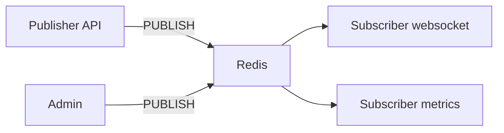

# 08. Pub/Sub: каналы, паттерны, ограничения

## Введение: «уведомление не дошло после рестарта»

Сервис **Notifications** подписан на канал `orders:paid`. Redis перезапустили — подписчик подключился снова, но событие опубликовали **в момент даунтайма**. Сообщение **не сохраняется** в Pub/Sub: подписчика не было — данных нет. Это не баг, это модель **fire-and-forget**. Для истории событий — Kafka ([kafka-basic/01](../kafka-basic/01-why-kafka.md)) или **Redis Streams** (intermediate).

## Что вы узнаете

- Команды **SUBSCRIBE**, **PUBLISH**, **PSUBSCRIBE**.
- Отличие **channel** от **pattern**.
- Семантика доставки: **at-most-once**, нет backlog.
- Когда Pub/Sub уместен, когда — нет.

## Модель Pub/Sub



- **Publisher** не знает, кто слушает.
- **Subscriber** в режиме подписки **не может** выполнять обычные команды (кроме подписки) в том же соединении — для приложений часто **второе** соединение.
- Сообщения **не пишутся на диск** как очередь (в отличие от Streams/Kafka).

## Команды

| Команда | Назначение |
|---------|------------|
| `SUBSCRIBE channel` | подписка на канал |
| `UNSUBSCRIBE` | отписка |
| `PUBLISH channel message` | отправка всем подписчикам |
| `PSUBSCRIBE orders:*` | подписка по шаблону |
| `PUBSUB CHANNELS` | список активных каналов (диагностика) |

Пример (два терминала — в лабе 09):

```bash
# Терминал A
SUBSCRIBE lab:notify:orders

# Терминал B
PUBLISH lab:notify:orders '{"orderId":"ord-1","status":"paid"}'
```

**Что увидите** в A: сообщение типа `message`, канал, payload.

## Channel vs pattern

| | `SUBSCRIBE foo` | `PSUBSCRIBE foo:*` |
|---|-----------------|---------------------|
| Совпадение | точное имя | шаблон с `*` `?` |
| Сообщение PUBLISH | `PUBLISH foo` | `PUBLISH foo:bar` |

Именование как для ключей: `app:domain:event`.

## Семантика и сравнение

| | Redis Pub/Sub | Kafka consumer |
|---|---------------|----------------|
| Хранение | нет | log + retention |
| Offline consumer | пропуск | догоняет с offset |
| Масштаб | тысячи подписчиков на канал | partition + groups |
| Гарантия | at-most-once | at-least-once (настройка) |

Подробное сравнение — [16. Redis vs Memcached vs Kafka](16-vs-memcached-kafka.md) и [kafka-basic/18-vs-queues](../kafka-basic/18-vs-queues.md).

## Типичные кейсы (да)

- **Live** уведомления: «заказ оплачен» → websocket gateway.
- **Сброс кэша** между инстансами: `PUBLISH cache:invalidate product:101`.
- **Внутренние сигналы** с потерей допустима.

## Типичные кейсы (нет)

- Биллинг, платежи, интеграция с 1С — нужен **брокер** или **Streams**.
- Задачи воркерам с ACK — **очередь** (SQS, Rabbit, Streams consumer group).

## На стенде: PUBSUB NUMSUB

```bash
docker exec mock-redis redis-cli PUBLISH lab:notify:ping "hello"
docker exec mock-redis redis-cli PUBSUB NUMSUB lab:notify:ping
```

**Что увидите:** `0` подписчиков — сообщение никуда не ушло (это нормально без SUBSCRIBE).

## Типичные ошибки

| Ошибка | Последствие | Решение |
|--------|-------------|---------|
| Pub/Sub как очередь задач | потеря при offline | Streams / SQS |
| SUBSCRIBE в том же пуле, что GET/SET | блокировка соединения | отдельный клиент |
| Огромные payload в PUBLISH | давление на сеть и память | id в сообщении, детали по GET |
| Нет мониторинга подписчиков | тихая потеря | healthcheck подписчика, метрики |

## В продакшене

- **Redis 7 sharded Pub/Sub** в cluster — отдельная тема (advanced).
- Для **cache invalidation** часто проще Pub/Sub, чем polling.
- Критичные домены — **outbox + Kafka**, не PUBLISH.

## Резюме

**Pub/Sub** — лёгкий broadcast в реальном времени без персистентности. Подписчик должен быть **онлайн**. Для **истории** и **replay** — другой инструмент. Лаба: [09. Pub/Sub](09-lab-pubsub.md).

## Чек-лист

- Что происходит с сообщением, если подписчиков 0?
- Можно ли в том же `redis-cli` после SUBSCRIBE делать GET?
- Чем Pub/Sub отличается от Kafka log?
- Назовите один законный кейс Pub/Sub в e-commerce.

Следующий урок: [09. Лаба: Pub/Sub](09-lab-pubsub.md).
