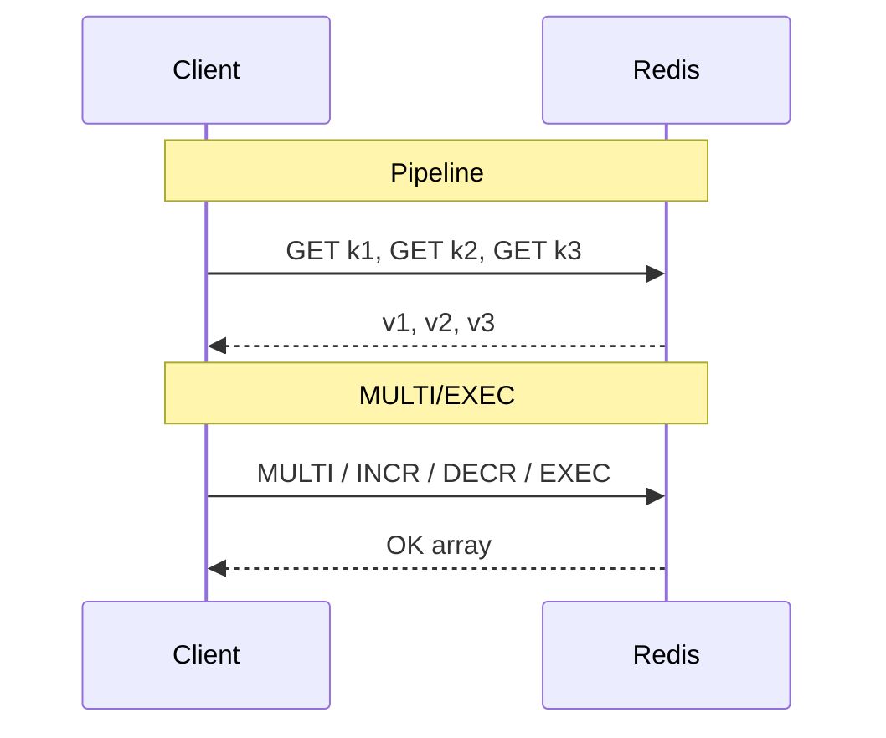

# 10. Pipeline и транзакции: MULTI, EXEC, WATCH

## Введение: «1000 запросов — и API тормозит»

Сервис в цикле делает `GET` по 500 ключам — 500 round-trip к Redis. **PIPELINE** упаковывает команды в один сетевой пакет: сервер выполняет по очереди, клиент получает массив ответов. Latency падает в разы. Для **атомарности** нескольких команд — **MULTI/EXEC**; для оптимистичной блокировки — **WATCH**.

## Что вы узнаете

- **Pipeline** vs обычные запросы (RTT).
- **MULTI/EXEC** — транзакция без rollback отдельных команд.
- **WATCH** — CAS перед транзакцией.
- Ограничения: не вложенный MULTI, ошибки в очереди.

## Round-trip и pipeline

| Режим | Сеть | Атомарность всех команд |
|-------|------|-------------------------|
| По одной | N RTT | каждая команда атомарна |
| **Pipeline** | ~1 RTT | **нет** общей атомарности |
| **MULTI/EXEC** | 1 RTT (batch) | да, блок между MULTI и EXEC |



## Pipeline в redis-cli

```bash
cat <<'EOF' | docker exec -i mock-redis redis-cli --pipe
SET lab:pipe:1 a
SET lab:pipe:2 b
SET lab:pipe:3 c
EOF
```

Или интерактивно: `redis-cli` с флагом `--pipe` для массовой загрузки.

В коде (псевдокод): `pipe.get("k1"); pipe.get("k2"); pipe.execute()`.

**Важно:** при ошибке одной команды в pipeline остальные **всё равно** выполняются (в отличие от SQL transaction).

## MULTI / EXEC

```bash
docker exec mock-redis redis-cli MULTI
docker exec mock-redis redis-cli INCR lab:tx:account:a
docker exec mock-redis redis-cli DECR lab:tx:account:b
docker exec mock-redis redis-cli EXEC
```

В **одном** интерактивном сеансе удобнее:

```text
127.0.0.1:6379> MULTI
OK
127.0.0.1:6379> INCR lab:tx:bal
QUEUED
127.0.0.1:6379> INCR lab:tx:bal
QUEUED
127.0.0.1:6379> EXEC
1) (integer) 1
2) (integer) 2
```

| Поведение | Деталь |
|-----------|--------|
| Очередь | команды отвечают `QUEUED` |
| EXEC | выполнение **последовательно**, без interleave других клиентов |
| Ошибка синтаксиса в MULTI | EXEC abort (зависит от версии/типа ошибки) |
| Ошибка runtime (WRONGTYPE) | команда может «провалиться», остальные выполнятся |

**Нет ROLLBACK** как в SQL: проектировать идемпотентность.

## WATCH — optimistic locking

```text
WATCH lab:tx:version
val = GET lab:tx:version
MULTI
SET lab:tx:data ...
INCR lab:tx:version
EXEC
```

Если `lab:tx:version` изменился между `WATCH` и `EXEC` — `EXEC` вернёт `(nil)`, нужен retry.

**Кейс:** резервирование остатка на складе без pessimistic lock в Postgres.

## Pipeline vs MULTI

| Нужно | Выбор |
|-------|-------|
| Только ускорить много чтений | **Pipeline** |
| Перевод денег / счётчиков связано | **MULTI/EXEC** или Lua (intermediate) |
| Условие «если не изменилось» | **WATCH** + MULTI |

## На стенде: подготовка ключей

```bash
docker exec mock-redis redis-cli SET lab:tx:account:a 100
docker exec mock-redis redis-cli SET lab:tx:account:b 50
```

Лаба 11 — измерение batch через pipeline.

## Типичные ошибки

| Ошибка | Последствие | Решение |
|--------|-------------|---------|
| Ожидать rollback при ошибке INCR | данные частично применены | Lua script / проверка типов заранее |
| MULTI в pipeline | протокол | отдельные режимы |
| Огромный MULTI (10k команд) | блокировка event loop | чанки по 100–500 |
| WATCH без retry в приложении | lost update | цикл retry |

## В продакшене

- Hot path чтения — **pipeline** + connection pooling (lettuce, redis-py).
- Сложная логика — **Lua** (`EVAL`) атомарно (intermediate).
- Мониторинг длительных транзакций через **SLOWLOG** ([14. CLI](14-cli-observability.md)).

## Резюме

**Pipeline** экономит RTT, не даёт атомарности пакета. **MULTI/EXEC** — атомарный batch без SQL-rollback. **WATCH** — проверка «ключ не менялся» перед commit. Выбор зависит от того, нужна ли **скорость** или **согласованность** нескольких ключей.

## Чек-лист

- Чем pipeline отличается от MULTI по атомарности?
- Что вернёт EXEC, если WATCH обнаружил изменение?
- Почему 10 000 команд в одном MULTI опасно?
- Когда достаточно pipeline без MULTI?

Следующий урок: [11. Лаба: pipeline](11-lab-pipeline.md).
