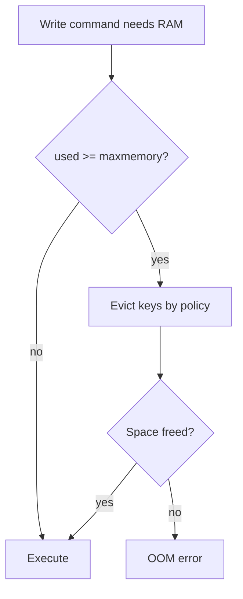

# 12. Память, maxmemory и политики eviction

## Введение: «Redis выкинул сессии, но оставил кэш»

Ночью алерт: `used_memory` у лимита. Началась **eviction** — Redis удаляет ключи по политике `maxmemory-policy`. При `allkeys-lru` мог уйти **важный** ключ без TTL, если к нему давно не обращались, а горячий кэш остался. На учебном стенде [`redis-single.conf`](../../deploy/redis/config/redis-single.conf): **256mb**, **allkeys-lru**. Эта глава — как память учитывается и как выбирают политику.

## Что вы узнаете

- Метрики **used_memory**, **fragmentation**, **maxmemory**.
- Политики **volatile-*** и **allkeys-***.
- Поведение при **OOM command not allowed**.
- Практики: TTL, отдельные инстансы, мониторинг `evicted_keys`.

## Как Redis считает память

| Метрика | Смысл |
|---------|--------|
| `used_memory` | память, выделенная allocator (данные + overhead) |
| `used_memory_rss` | RSS процесса (ОС) |
| `mem_fragmentation_ratio` | rss / used; >> 1 — фрагментация |
| `maxmemory` | жёсткий потолок (0 = без лимита) |

```bash
docker exec mock-redis redis-cli INFO memory
```

На стенде ищите:

```text
maxmemory:268435456
maxmemory_policy:allkeys-lru
```

## Что происходит при достижении maxmemory

1. Новая запись, требующая памяти → Redis пытается **освободить** место по policy.
2. Если освободить нечего (или policy `noeviction`) → ошибка **`OOM command not allowed`** на write-командах.
3. Read-команды обычно работают.



## Политики eviction (основные)

| Policy | Кого удаляет | Когда выбирают |
|--------|--------------|----------------|
| **noeviction** | никого | ошибка на write; критичные данные без потерь |
| **allkeys-lru** | любые ключи, LRU | **чистый кэш** (стенд basic) |
| **allkeys-lfu** | любые, LFU | hot keys с частыми обращениями |
| **volatile-lru** | только с TTL, LRU | смесь кэша и «постоянных» без TTL |
| **volatile-ttl** | с TTL, ближайший expire | акцент на скором истечении |
| **volatile-random** / **allkeys-random** | случайно | редко |

**LRU** в Redis — приближённый (sample), не идеальный LRU.

## volatile vs allkeys

| Сценарий | Policy |
|----------|--------|
| Все ключи — кэш с TTL | `allkeys-lru` или `volatile-lru` |
| Сессии без TTL + кэш с TTL | **отдельный инстанс** или `volatile-lru` + **никогда** не хранить сессии без TTL на cache-инстансе |
| Данные нельзя терять | `noeviction` + алерт до лимита |

На стенде **allkeys-lru**: ключ **без TTL** тоже может быть выгнан — важно для лабы 13.

## TTL как первая линия защиты

Eviction — **второй** рубеж. Первый — **EXPIRE** на кэш и сессии:

```bash
SET app:cache:x "..." EX 300
```

Сессии: sliding TTL при каждом запросе ([05. Лаба](05-lab-session-cart.md)).

## Фрагментация и активная память

Высокий `mem_fragmentation_ratio` после массовых удалений — повод на **перезапуск** в окно обслуживания или `MEMORY PURGE` (зависит от allocator). В basic — знать, что метрика есть.

## На стенде: evicted_keys

```bash
docker exec mock-redis redis-cli INFO stats | grep evicted
```

После лабы 13 `evicted_keys` должен вырасти.

## Типичные ошибки

| Ошибка | Последствие | Решение |
|--------|-------------|---------|
| Нет maxmemory в prod | Redis съедает всю RAM хоста | лимит + policy |
| Сессии на cache-инстансе allkeys-lru | logout массово | разделение инстансов |
| Гигантские значения | быстрый OOM | лимит размера ключа |
| Игнор `evicted_keys` | скрытый рост miss в БД | алерт |

## В продакшене

- **maxmemory** ~ 75% RAM инстанса (оставить ОС и replica buffer).
- Дашборд: memory %, evictions/s, hit rate.
- Тесты нагрузки с **реальным** размером value.
- Для critical — **noeviction** + запас + масштабирование.

## Резюме

**maxmemory** ограничивает RAM; **policy** решает, **какие** ключи жертвуются. **allkeys-lru** на стенде — агрессивный кэш-режим. **TTL** обязателен. **OOM** — сигнал сменить policy, объём или архитектуру.

## Чек-лист

- Какая policy на учебном стенде?
- Удалит ли `allkeys-lru` ключ без TTL?
- Что означает `OOM command not allowed`?
- Зачем смотреть `evicted_keys`?

Следующий урок: [13. Лаба: eviction](13-lab-eviction.md).
