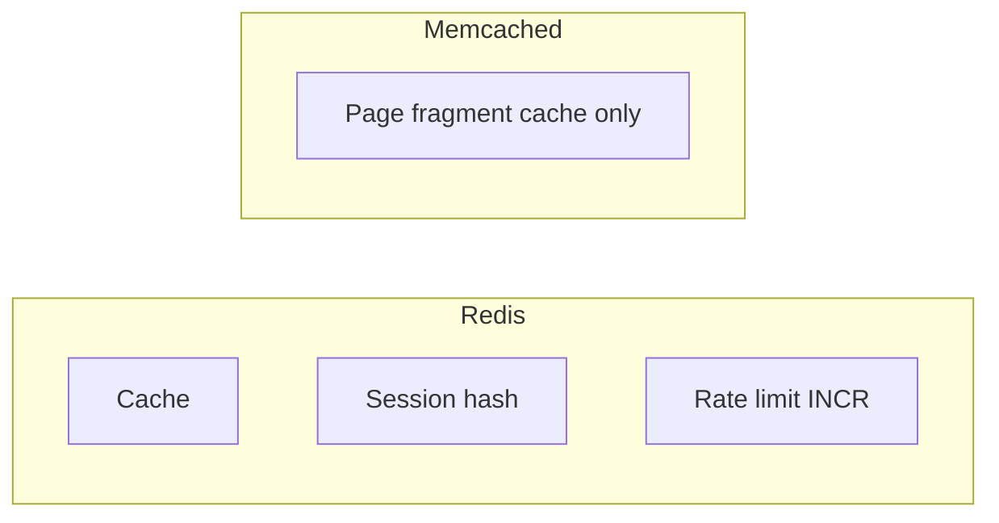
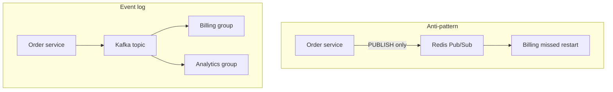

# 16. Redis vs Memcached vs Kafka (собеседование)

## Введение: «поставим Redis везде»

На system design interview спрашивают: кэш каталога, сессии, очередь уведомлений и поток заказов для аналитики — **один** Redis? Ответ «да» смешивает **три разные модели**: in-memory **структуры**, простой **кэш** и **commit log**. Эта глава — матрица trade-offs и связь с курсом Kafka.

## Что вы узнаете

- Сравнение **Redis** и **Memcached** для кэша.
- Сравнение **Redis** (Pub/Sub, Streams) и **Kafka** для событий.
- Типовые вопросы interview и формулировки ответов.
- Ссылки на [kafka-basic/01](../kafka-basic/01-why-kafka.md) и [kafka-basic/18](../kafka-basic/18-vs-queues.md).

## Сводная таблица

| Критерий | **Redis** | **Memcached** | **Apache Kafka** |
|----------|-----------|---------------|------------------|
| Модель | структуры в RAM + опции disk | key-value **только string** | **distributed log** |
| Типы данных | string, hash, list, set, zset, … | string | bytes в partition |
| Персистентность | RDB/AOF опционально | нет | да (сегменты на диске) |
| Pub/Sub | да, без backlog | нет | через consumer groups |
| Replay | Streams (intermediate) | нет | да (retention) |
| Масштаб записи | высокий на узел | очень высокий простой GET/SET | очень высокий горизонтально |
| Типичный кейс | кэш, сессия, rate limit, leaderboard | чистый кэш HTML/объектов | event streaming, интеграция |

## Redis vs Memcached

| | Redis | Memcached |
|---|-------|-----------|
| **Структуры** | hash, zset — нативно | сериализуете всё в string |
| **TTL** | да | да |
| **Атомарные ops** | INCR, HINCRBY, … | INCR/DECR на string |
| **Кластер** | Redis Cluster | client-side sharding |
| **Память** | один поток + эффективные encodings | проще, иногда меньше overhead на чистый GET |

**Выбор Memcached:** только **простой кэш** строк, максимум QPS, команда не хочет ops Redis.

**Выбор Redis:** сессии в **hash**, **leaderboard** (zset), **rate limit**, один стек инструментов.



## Redis vs Kafka

Kafka — **не** кэш и **не** сессионное хранилище. См. [01. Зачем Kafka](../kafka-basic/01-why-kafka.md): **commit log**, **offset**, **retention**, независимые **consumer groups**.

| Вопрос | Redis Pub/Sub | Kafka |
|--------|---------------|-------|
| Сообщение после offline consumer | **потеряно** | читается с offset |
| Хранение | нет | retention по политике |
| Порядок | нет глобального | в partition |
| Нагрузка «вся история заказов» | не подходит | подходит |

**Redis Streams** (intermediate) — ближе к логу с consumer groups, но масштаб и экосистема Kafka для **центральной шины** обычно шире.

Сравнение Kafka с RabbitMQ/SQS — [18. Kafka vs очереди](../kafka-basic/18-vs-queues.md).



## Когда что в одном проекте

| Задача | Инструмент |
|--------|------------|
| Кэш каталога | Redis (или Memcached) |
| Сессия пользователя | Redis HASH + TTL |
| Rate limit API | Redis INCR + EXPIRE |
| «Заказ создан» для 5 сервисов + replay | **Kafka** |
| Фоновая job на один worker | SQS / Rabbit / Redis Streams |
| Live websocket «статус доставки» | Redis Pub/Sub |

## Пары для interview

**В: Redis vs Memcached?**  
О: Memcached — **простой string cache**. Redis — **структуры**, персистентность, больше паттернов (zset, hash); чуть сложнее ops.

**В: Можно ли заменить Kafka на Redis Pub/Sub?**  
О: Нет для **интеграции** с историей: Pub/Sub **не хранит** сообщения для offline consumer. Kafka — **log** с offset.

**В: Redis как primary DB?**  
О: Только осознанно (сессии, leaderboard) с **persistence** и backup; OLTP — PostgreSQL.

**В: Где Redis в event-driven архитектуре?**  
О: **Кэш и эфемерное состояние** рядом с Kafka; события в Kafka, не в Pub/Sub.

## На стенде: одна фраза — три инструмента

```bash
docker exec mock-redis redis-cli SET app:cache:demo "from-redis" EX 60
docker exec mock-redis redis-cli GET app:cache:demo
docker exec mock-redis redis-cli DEL app:cache:demo
```

Kafka на том же ноутбуке — отдельный compose [`deploy/kafka`](../../deploy/kafka/README.md); порты не путать: Redis **6379**, Kafka **9094**.

## Типичные ошибки на interview

| Ошибка | Исправление |
|--------|-------------|
| «Kafka быстрее Redis» | разные задачи; сравнивают log ingest vs GET |
| «Один Redis на всё» | разделить cache / sessions / optional queue |
| «Pub/Sub = очередь» | нет ACK backlog; см. kafka 18 |
| «Memcached устарел» | всё ещё валиден для простого cache |

## Резюме

**Memcached** — узкий **string cache**. **Redis** — **структуры**, кэш, сессии, счётчики, лёгкий realtime. **Kafka** — **поток событий** с историей. На design рисуют **три слоя**: OLTP, Redis, Kafka — и не смешивают семантику доставки.

## Чек-лист

- Назовите один кейс только для Kafka, не для Redis.
- Почему leaderboard — zset, а не Memcached?
- Чем Pub/Sub отличается от consumer group?
- Куда отправить ссылку на сравнение с RabbitMQ/SQS?

Следующий урок: [17. Финальный проект](17-final-project.md).
