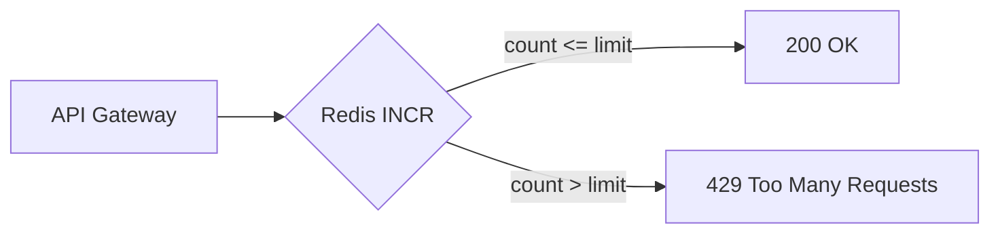

# 17. Финальный проект: rate limit или leaderboard

## Введение: собрать basic в один контур

Отдельно вы умеете ключи, hash, zset, TTL, INCR, eviction и CLI. **Финал** — один связный сценарий на [`deploy/redis`](../../deploy/redis/README.md): либо **rate limiting** API, либо **leaderboard** магазина. Без отдельного приложения — `redis-cli` и shell; опционально Redis Commander.

## Что вы узнаете (итог курса)

- Спроектировать **соглашение по ключам** и TTL.
- Реализовать **fixed window** rate limit или **топ-N** leaderboard.
- Зафиксировать **операторский** чеклист и краткий отчёт.

## Выберите трек

| Трек | Сложность | Основные команды |
|------|-----------|------------------|
| **A. Rate limit** | basic | `INCR`, `EXPIRE`, `TTL` |
| **B. Leaderboard** | basic+ | `ZADD`, `ZINCRBY`, `ZREVRANGE` |

Один трек на отчёт; второй — опционально для практики.

---

## Трек A: Rate limit (рекомендуется)

### Архитектура



**Правило:** не более **10 запросов в минуту** на `clientId` для scope `api`.

Соглашение по ключам — [`examples/rate-limit-keys.txt`](examples/rate-limit-keys.txt):

```text
rl:fw:api:{clientId}:{bucketId}
```

`bucketId = floor(unix_time / 60)` — в лабе считайте в shell или вручную подставляйте bucket.

### Требования

| # | Требование | Критерий |
|---|------------|----------|
| 1 | Стенд | `mock-redis` healthy, `PING` → `PONG` |
| 2 | Ключи | префикс `app:fp:` или `rl:fw:` (не `FLUSHALL`) |
| 3 | Лимит | 10 req / 60 s на одного client |
| 4 | Демо | client `fp-user-1` — 12 запросов, запросы 11–12 отклонены логически |
| 5 | TTL | ключ окна с EX ≥ 60 |
| 6 | Второй client | `fp-user-2` не делит счётчик с первым |
| 7 | CLI | отчёт: `GET`/`TTL`/`INFO stats` фрагмент |
| 8 | Документ | `PROJECT.md` в своей копии (шаблон ниже) |

### Runbook — фаза 1: стенд

```bash
cd deploy/redis
docker compose up -d
docker compose ps
bash scripts/smoke.sh
```

### Runbook — фаза 2: симуляция (пример)

Подставьте `BUCKET` (например, `28600600`):

```bash
CLIENT=fp-user-1
SCOPE=api
BUCKET=28600600
KEY="rl:fw:${SCOPE}:${CLIENT}:${BUCKET}"

for n in $(seq 1 12); do
  COUNT=$(docker exec mock-redis redis-cli INCR "$KEY")
  docker exec mock-redis redis-cli EXPIRE "$KEY" 90 >/dev/null
  if [ "$COUNT" -le 10 ]; then
    echo "req $n: ALLOW count=$COUNT"
  else
    echo "req $n: DENY count=$COUNT"
  fi
done

docker exec mock-redis redis-cli TTL "$KEY"
```

**Что увидите:** `ALLOW` для 1–10, `DENY` для 11–12.

### Runbook — фаза 3: очистка

```bash
docker exec mock-redis redis-cli DEL "rl:fw:api:fp-user-1:${BUCKET}" "rl:fw:api:fp-user-2:${BUCKET}"
```

---

## Трек B: Leaderboard

### Архитектура

ZSET `app:fp:lb:daily` — member = `userId`, score = очки.

### Требования

| # | Требование | Критерий |
|---|------------|----------|
| 1 | Стенд | healthy |
| 2 | ZSET | ≥5 пользователей с очками |
| 3 | Обновление | `ZINCRBY` после «покупки» |
| 4 | Топ-3 | `ZREVRANGE 0 2 WITHSCORES` |
| 5 | Место | `ZRANK` / `ZREVRANK` для одного user |
| 6 | TTL | опционально EXPIRE на ключ 86400 |
| 7 | Отчёт | `PROJECT.md` |

### Runbook (пример)

```bash
docker exec mock-redis redis-cli ZADD app:fp:lb:daily 100 u-alice 80 u-bob 120 u-carol 90 u-dave 70 u-eve
docker exec mock-redis redis-cli ZINCRBY app:fp:lb:daily 50 u-bob
docker exec mock-redis redis-cli ZREVRANGE app:fp:lb:daily 0 2 WITHSCORES
docker exec mock-redis redis-cli ZREVRANK app:fp:lb:daily u-bob
docker exec mock-redis redis-cli DEL app:fp:lb:daily
```

**Что увидите:** топ после INCRBY отражает новые очки.

---

## Шаблон PROJECT.md

```markdown
# Redis Basic — финальный проект

## Трек
A (rate limit) / B (leaderboard)

## Стенд
- deploy/redis, mock-redis healthy
- Дата:

## Реализация
- Схема ключей:
- Лимит / правила leaderboard:

## Доказательства
- Вставьте вывод команд (фрагменты)

## Инциденты
- Что пошло не так / как исправили

## Выводы (3 пункта)
1.
2.
3.
```

## Критерии сдачи (общие)

- [ ] Стенд поднят по [`deploy/redis/README.md`](../../deploy/redis/README.md)
- [ ] Выбран трек A или B, все требования трека выполнены
- [ ] Нет `FLUSHALL` / чужих префиксов без `lab:` / `app:fp:` / `rl:`
- [ ] `PROJECT.md` заполнен
- [ ] Ключи удалены или задокументированы

## Связь с другими курсами

- События заказов в шину — [`kafka-basic`](../kafka-basic/README.md), не Redis Pub/Sub.
- Репликация Redis — [`redis-intermediate`](../redis-intermediate/README.md).

## Резюме курса

Вы прошли путь от **зачем Redis** до **операций и сравнения с Kafka**. Финал проверяет, что вы можете **спроектировать ключи**, **применить тип данных** и **объяснить поведение** под нагрузкой и при eviction — навык, который переносится в любой стек с Redis.
