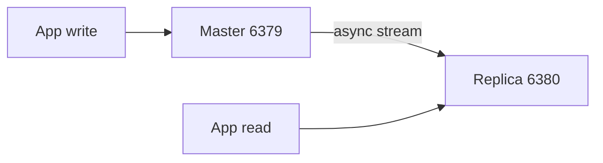

# 03. Репликация master–replica

## Введение: «читали с реплики — увидели вчерашние цены»

Каталог товаров кэшируется в Redis. После аварии master подняли, реплика **догоняет** с lag 30 секунд — часть запросов на read replica отдаёт **устаревшие** остатки. Репликация в Redis **асинхронная**: master не ждёт, пока replica подтвердит каждую запись.

На intermediate вы разделяете **запись** (master) и **чтение** (replica), читаете `INFO replication` и понимаете ручной **promote** до Sentinel.

## Что вы узнаете

- Роли **master** и **replica** (ранее slave).
- `REPLICAOF`, `replica-read-only`.
- Partial resync, backlog, `master_repl_offset`.
- Ограничения: запись только на master.

## Как работает репликация



1. Replica при старте: `REPLICAOF master-host 6379` (в конфиге — `replicaof`).
2. Master отдаёт **RDB snapshot** + поток команд (replication buffer).
3. При обрыве — **partial resync**, если хватает `repl_backlog`.

Учебный стенд: [`docker-compose.replication.yml`](../../deploy/redis/docker-compose.replication.yml)

| Роль | С хоста | Контейнер |
|------|---------|-----------|
| Master | `localhost:6379` | `mock-redis-master` |
| Replica | `localhost:6380` | `mock-redis-replica` |

Конфиг replica: [`redis-replica.conf`](../../deploy/redis/config/redis-replica.conf) — `replicaof redis-master 6379`, `replica-read-only yes`.

## INFO replication

```bash
docker compose -f docker-compose.replication.yml up -d
docker exec mock-redis-master redis-cli INFO replication
docker exec mock-redis-replica redis-cli -p 6379 INFO replication
```

На master:

- `role:master`, `connected_slaves:1`
- `master_repl_offset`

На replica:

- `role:slave` (в выводе может остаться legacy-имя) / `role:replica`
- `master_link_status:up`
- `slave_read_only:1`

## Чтение с реплики

Клиенты с политикой **read your writes** не должны читать с replica без sticky routing. Для отчётов и тяжёлых `GET` — replica с допустимым **eventual consistency**.

Проверка read-only:

```bash
redis-cli -p 6380 SET x 1
# (error) READONLY You can't write against a read only replica.
```

## Ручной failover (без Sentinel)

Если master мёртв:

1. Выбрать **самую свежую** replica (`INFO replication` → offset).
2. `REPLICAOF NO ONE` на выбранной — она становится master.
3. Остальные: `REPLICAOF new-master 6379`.
4. Обновить DNS / connection string приложений.

Это **ручная** процедура; автоматизация — [05. Sentinel](05-sentinel.md).

## На стенде

```bash
cd deploy/redis
docker compose down
docker compose -f docker-compose.replication.yml up -d

redis-cli -p 6379 SET course:repl:test ok
redis-cli -p 6380 GET course:repl:test
```

Задержка репликации (симуляция lag):

```bash
docker exec mock-redis-master redis-cli CONFIG SET repl-backlog-size 1048576
docker exec mock-redis-replica redis-cli INFO replication | grep master_repl_offset
```

## Типичные ошибки

| Симптом | Причина | Решение |
|---------|---------|---------|
| Replica `DOWN` | сеть, master недоступен | DNS между контейнерами, healthcheck |
| Двойной master | два `REPLICAOF NO ONE` | Sentinel / orchestration |
| Пишут в replica | неверный endpoint | порт 6379 vs 6380 |
| Полный resync каждый раз | маленький backlog | увеличить `repl-backlog-size` |
| «Потеряли» записи | async, master упал до replicate | ждать ack (Redis 7 wait), Sentinel |

## В продакшене

- Минимум **одна** replica в другой AZ; для HA — Sentinel или K8s Operator.
- Мониторинг: `master_link_down_since_seconds`, offset lag.
- Не используйте replica как **единственный** бэкап — это живая копия, не архив.
- TLS и ACL на replication port в облаке (ElastiCache).

## Резюме

Master принимает записи; replica **асинхронно** копирует. Read scaling — да; strong consistency на replica — нет. Учебный стенд: **6379 master, 6380 replica**.

## Чек-лист

- Куда пойдёт `SET` при подключении к `6380`?
- Что делает `REPLICAOF NO ONE`?
- Как проверить, что replica догнала master?
- Чем репликация Redis отличается от синхронной в Postgres standby?

Следующий урок: [04. Лаба: replica и failover](04-lab-replica-failover.md).
