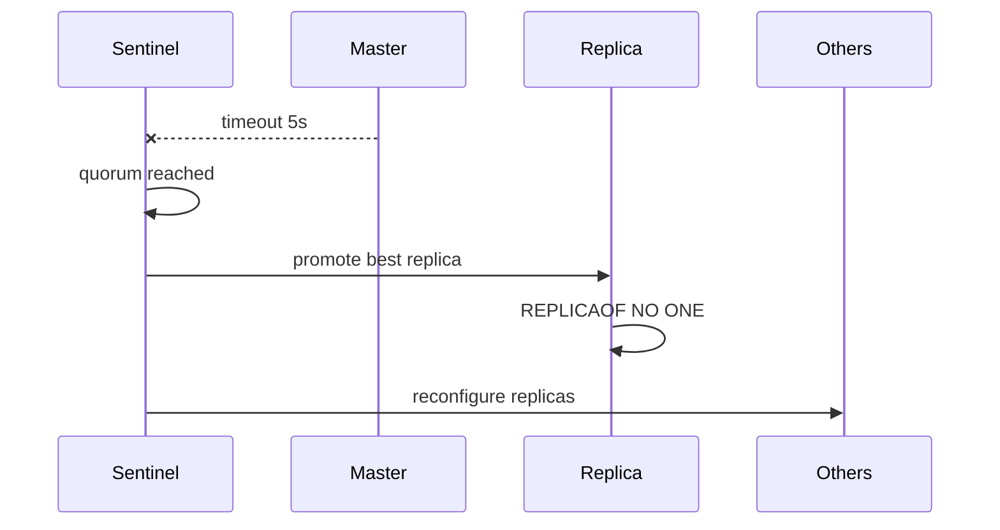

# 05. Redis Sentinel

## Введение: «master упал ночью — дежурный спал, API лежал 40 минут»

Ручной failover из [главы 03](03-replication.md) требует человека и runbook. **Sentinel** — процессы-наблюдатели: голосуют за недоступность master, **выбирают** replica, выполняют `REPLICAOF NO ONE` и публикуют новый адрес master клиентам.

Это не полноценный Kubernetes, но классический HA-паттерн для self-hosted Redis до Cluster.

## Что вы узнаете

- Архитектуру Sentinel (quorum, subjective/objective down).
- Конфиг `sentinel monitor`.
- Команды `SENTINEL masters`, `get-master-addr-by-name`.
- Как приложения должны подключаться (Sentinel-aware client).

## Архитектура учебного стенда

[`docker-compose.sentinel.yml`](../../deploy/redis/docker-compose.sentinel.yml):

- 1 master + 2 replica
- 3 Sentinel (кворум **2** из 3)

[`sentinel.conf`](../../deploy/redis/config/sentinel.conf):

```text
sentinel monitor mymaster redis-master 6379 2
sentinel down-after-milliseconds mymaster 5000
sentinel failover-timeout mymaster 60000
```

| Параметр | Смысл |
|----------|--------|
| `mymaster` | логическое имя master |
| `6379 2` | порт Redis и **quorum** — сколько Sentinel должны согласиться |
| `down-after-milliseconds 5000` | 5 с без ответа → субъективный down |
| `failover-timeout` | таймаут этапов failover |

С хоста:

| Сервис | Порт |
|--------|------|
| Master (начальный) | `6379` |
| Sentinel | `26379` (только `sentinel-1` проброшен) |

## Обнаружение master

```bash
cd deploy/redis
docker compose -f docker-compose.sentinel.yml up -d
redis-cli -p 26379 SENTINEL get-master-addr-by-name mymaster
redis-cli -p 26379 SENTINEL masters
redis-cli -p 26379 SENTINEL replicas mymaster
```

Клиенты (Jedis, redis-py, go-redis) принимают список Sentinel и имя `mymaster` — при failover переподключаются к **новому** IP.

## Этапы failover (упрощённо)



1. **SDOWN** — один Sentinel считает master недоступным.
2. **ODOWN** — достигнут quorum.
3. Выбор replica (приоритет, offset, runid).
4. Failover: promote → reconfigure replicas → обновить конфиги.

## На стенде

Запись через текущий master:

```bash
MASTER=$(redis-cli -p 26379 SENTINEL get-master-addr-by-name mymaster)
echo "Master: $MASTER"
redis-cli -h localhost -p 6379 SET lab:sentinel:ping 1
```

## Типичные ошибки

| Симптом | Причина | Решение |
|---------|---------|---------|
| Failover не стартует | quorum слишком высокий | `quorum ≤ N/2 + 1` Sentinel |
| Split-brain два master | сеть разорвана | нечётное число AZ, fencing |
| Клиент на старый IP | не Sentinel client | driver с Sentinel |
| Бесконечные failover | `down-after` слишком мал | tuning, проверка сети |
| Потеря записей | async replication | `min-replicas-to-write` (риск availability) |

## В продакшене

- Минимум **3** Sentinel на независимых хостах (не на тех же VM, что единственный Redis).
- Мониторинг: `sentinel_masters`, последний failover, `+switch-master` в pub/sub.
- В AWS — **ElastiCache Multi-AZ** вместо самостоятельного Sentinel (см. [19](19-managed-elasticache.md)).
- Тест failover в maintenance window.

## Резюме

Sentinel автоматизирует promote и смену master. Quorum защищает от ложных срабатываний. Приложения должны использовать **Sentinel-aware** конфигурацию, а не статический IP.

## Чек-лист

- Зачем три Sentinel при quorum=2?
- Что вернёт `get-master-addr-by-name` после failover?
- Чем Sentinel отличается от Redis Cluster?
- Кто может стать новым master?

Следующий урок: [06. Лаба: Sentinel](06-lab-sentinel.md).
