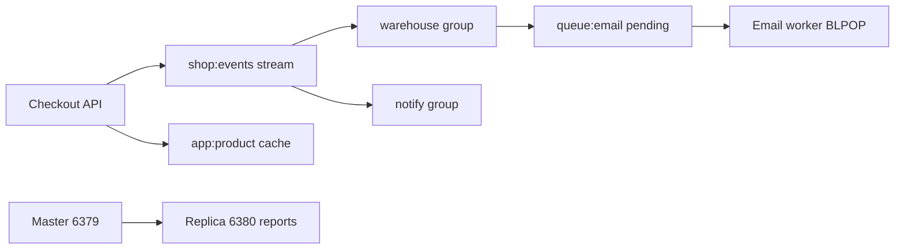

# 20. Финальный проект: мини-платформа уведомлений

## Введение: собрать intermediate в один контур

Отдельно вы прошли persistence, replication, Sentinel, Streams, ACL, Lua, очередь, мониторинг и backup. **Финал** — связный сценарий «интернет-магазин»: события заказов в **Stream**, обработка в **consumer group**, кэш каталога с **ACL**, **очередь** email на List, **read replica** для отчётов (опционально), runbook и короткий отчёт.

## Что вы узнаете (итог курса)

- Спроектировать **имена ключей** и потоки.
- Провести событие через **Stream pipeline**.
- Ограничить доступ **ACL**.
- Зафиксировать **операторский** чеклист.

## Архитектура



| Компонент | Redis структура | Стенд |
|-----------|-----------------|-------|
| События заказа | Stream `shop:events` | single `6379` |
| Consumer groups | `warehouse`, `notify` | single |
| Кэш товаров | String `app:product:{id}` | single + ACL |
| Email очередь | List `queue:email:pending` | single |
| Отчёты (опц.) | `GET` с replica | replication `6380` |

## Требования

| # | Требование | Критерий |
|---|------------|----------|
| 1 | Single стенд | `mock-redis` healthy |
| 2 | Stream | ≥5 событий `order.*` с полями `orderId`, `event` |
| 3 | Groups | `warehouse` и `notify` оба прочитали все с `XACK` |
| 4 | ACL | пользователь `readonly` читает `app:*`, не пишет |
| 5 | Очередь | ≥3 задачи email через `LMOVE` + ACK |
| 6 | Lua lock | захват `lock:shop:import` с TTL 30s |
| 7 | Persistence | после restart single ключи `app:product:*` на месте |
| 8 | SLOWLOG | ≥1 запись после учебной нагрузки |
| 9 | Backup | `dump.rdb` в каталоге + успешный restore на копии стенда |
| 10 | Replication (опц.) | чтение `app:report:count` с `6380` |
| 11 | Документ | `PROJECT.md` (шаблон ниже) |

## Runbook — рекомендуемый порядок

### Фаза 1: инфраструктура

```bash
cd deploy/redis
docker compose down
docker compose up -d
docker compose ps
bash scripts/smoke.sh
```

### Фаза 2: каталог и ACL

```bash
docker exec mock-redis redis-cli SET app:product:101 '{"name":"Notebook","price":10}'
docker exec mock-redis redis-cli SET app:product:102 '{"name":"Mouse","price":25}'
# ACL readonly — см. 10-lab-acl-readonly.md
docker exec mock-redis redis-cli ACL SETUSER readonly on '>readonly-secret' '~app:*' '-@all' '+@read' '+ping'
docker exec mock-redis redis-cli --user readonly --pass readonly-secret GET app:product:101
```

### Фаза 3: Stream pipeline

```bash
for id in 1001 1002 1003 1004 1005; do
  docker exec mock-redis redis-cli XADD shop:events '*' event order.created orderId $id
done
docker exec mock-redis redis-cli XGROUP CREATE shop:events warehouse 0 MKSTREAM
docker exec mock-redis redis-cli XGROUP CREATE shop:events notify 0
# XREADGROUP + XACK для каждой группы — см. 08-lab-streams-consumer.md
```

`notify` при обработке `order.created` — `LPUSH queue:email:pending` JSON с `orderId`.

### Фаза 4: Email worker

```bash
# LMOVE queue:email:pending → queue:email:processing
# обработка → LREM + SADD queue:email:done <orderId>
```

### Фаза 5: Lua lock на «импорт каталога»

Скрипт из [12-lab-lua-lock](12-lab-lua-lock.md) на ключ `lock:shop:import`.

### Фаза 6: Операции

```bash
docker exec mock-redis redis-cli INFO memory
docker exec mock-redis redis-cli SLOWLOG GET 3
./courses/redis-intermediate/examples/backup-restore.sh backup ./project-backup
```

### Фаза 7 (опционально): replica для отчёта

```bash
docker compose down
docker compose -f docker-compose.replication.yml up -d
redis-cli -p 6379 SET app:report:count 42
redis-cli -p 6380 GET app:report:count
```

## Шаблон PROJECT.md

Создайте в своей копии (не обязательно коммитить):

```markdown
# Redis Intermediate — финальный проект

## Архитектура
(диаграмма или список ключей)

## Stream
- Имя: shop:events
- Группы: warehouse, notify
- Пример ID и XACK

## ACL
- Пользователь readonly: что может / не может

## Очередь email
- Списки: pending, processing, done
- Идемпотентность: queue:email:done

## Операции
- INFO memory (used_memory_human):
- SLOWLOG: (вставить одну строку)
- Backup file path:

## Replication (если делали)
- Master/replica порты, GET app:report:count

## Что бы сделали в AWS
- ElastiCache Multi-AZ, SG, ссылка на aws-basic/07-databases
```

## Критерии приёмки (самопроверка)

- [ ] Можете объяснить **at-least-once** на очереди и Stream.
- [ ] Знаете, когда **Sentinel** vs **ElastiCache Multi-AZ**.
- [ ] Сравнили **Streams** с **Kafka consumer group** в одном абзаце.
- [ ] Runbook воспроизводим с нуля за < 2 часов.

## Troubleshooting

| Проблема | См. |
|----------|-----|
| Порт 6379 занят | `deploy/redis/README.md` — down других compose |
| NOPERM | [10-lab-acl-readonly](10-lab-acl-readonly.md) |
| PEL растёт | [08-lab-streams-consumer](08-lab-streams-consumer.md) — XACK |
| После restart пусто | volume, [02-lab-rdb-aof](02-lab-rdb-aof.md) |

## Дальше

[`redis-advanced`](../redis-advanced/README.md) — Cluster, Redis Stack, продвинутые паттерны.
