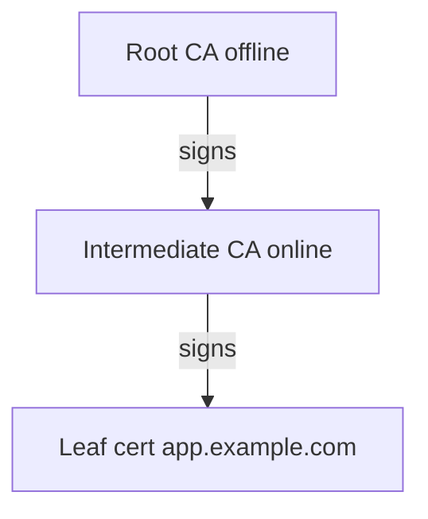

# 01. PKI в Vault: обзор и модель доверия

## Введение: «Сертификат истёк в субботу»

Микросервис поднялся после деплоя, но **TLS handshake failed**. В Grafana — всплеск `certificate has expired`. Оказалось: leaf выдали вручную год назад, **никто не настроил renewal**, а секрет в Kubernetes Secret не обновлялся. На собеседовании ждут не только «что такое TLS», а **кто выдаёт**, **как ротировать**, **где хранится private key** и почему **Vault PKI** лучше, чем `openssl req` в CI без учёта.

## Что вы узнаете

- Роль **secrets engine PKI** в Vault.
- Цепочка **root CA → intermediate → leaf**.
- **Roles**, **TTL**, **allowed_domains**, leases.
- Отличие **internal CA** на стенде от **public CA** (Let's Encrypt).
- Связь с [linux-security: секреты на диске](../linux-security/07-secrets-disk.md) и [aws-intermediate: KMS](../aws-intermediate/11-secrets-kms.md).

---

## Зачем PKI в Vault

| Подход | Плюс | Минус |
|--------|------|-------|
| Ручной openssl | Быстро в лабе | Нет audit, нет централизованной ротации |
| Public CA (ACME) | Браузеры доверяют | Не для внутреннего mTLS mesh |
| **Vault PKI** | API, policies, TTL, audit, automation | Нужна эксплуатация CA hierarchy |

Vault хранит **ключи CA** внутри storage (зашифровано master key). Операторы **не** копируют `ca.key` по SSH — выдача через API и policy.

---

## Модель доверия



На стенде [`deploy/vault`](../../deploy/vault/README.md) скрипт `init-engines.sh` создаёт **один internal root** с `common_name=lab.mock-exams.local` — для курса достаточно. В production:

- **Root** — редко, длинный TTL, offline/HSM.
- **Intermediate** — подписывает leaf, можно ротировать чаще.
- **Leaf** — короткий TTL (дни/недели), автоматический renewal.

---

## Включение и настройка (стенд)

После `docker compose up -d`:

```bash
cd deploy/vault
bash scripts/init-engines.sh
```

Скрипт:

1. `vault secrets enable pki`
2. `vault secrets tune -max-lease-ttl=87600h pki`
3. `vault write pki/root/generate/internal` — генерирует root
4. `vault write pki/config/urls` — issuing CA и CRL URLs
5. `vault write pki/roles/lab-server` — role для лаб

Проверка:

```bash
export VAULT_ADDR=http://localhost:8200
export VAULT_TOKEN=course
vault read pki/cert/ca
vault read pki/roles/lab-server
```

**Пути API:** mount `pki/` → endpoints `pki/issue/...`, `pki/sign/...`, `pki/cert/...`.

---

## Role: ограничения выдачи

Role — шаблон **кто и какой cert может получить**. Пример с стенда — см. [`examples/pki-role.json`](examples/pki-role.json).

| Параметр | Смысл |
|----------|--------|
| `allowed_domains` | Суффиксы CN/SAN |
| `allow_subdomains` | `api.lab.mock-exams.local` |
| `max_ttl` / `ttl` | Верхняя и дефолтная длительность |
| `server_flag` / `client_flag` | EKU для TLS server/client |
| `allow_ip_sans` | IP в SAN (сервисы без DNS) |

**На собеседовании:** «Как запретить выдачу cert на `evil.com`?» — жёсткий `allowed_domains`, без `allow_any_name`, review policy на `pki/issue/*`.

---

## Выдача leaf (концепт)

```bash
vault write pki/issue/lab-server \
  common_name="api.lab.mock-exams.local" \
  ttl=24h \
  -format=json
```

Ответ содержит `certificate`, `private_key`, `ca_chain`, `lease_id`. **Private key** показывается **один раз** — как у dynamic secrets; приложение должно записать в PEM и забыть ответ API.

Альтернатива: принести CSR:

```bash
vault write pki/sign/lab-server csr=@request.csr
```

Приложение **генерирует key локально** — Vault не видит private key (лучше для compliance).

---

## Leases и revocation

При `generate_lease=true` cert привязан к **lease**. Досрочно:

```bash
vault lease revoke <lease_id>
```

CRL обновляется на `pki/crl`. Клиенты должны проверять **срок + отзыв** (или OCSP в Enterprise).

---

## PKI vs KMS / Secrets Manager

| | Vault PKI | AWS ACM / PCA | KMS |
|---|-----------|---------------|-----|
| Объект | X.509 + key | Сертификаты | Симметричные ключи |
| mTLS mesh | Да | Частично (PCA) | Нет |
| Audit кто выдал | Vault audit | CloudTrail | CloudTrail |

KMS шифрует **данные**; PKI удостоверяет **идентичность** канала. Часто вместе: TLS cert + application payload encrypted ключом из Transit ([05](05-transit-encryption.md)).

---

## Anti-patterns

| Плохо | Почему | Лучше |
|-------|--------|-------|
| Root CA online с TTL 10 лет на всех | Компрометация = полный крах доверия | Offline root + intermediate |
| Один role `allow_any_name` | Внутренний «публичный» CA | Разные roles per team/env |
| Private key в Git | Утечка = impersonation | CSR flow или short-lived + agent |
| Игнорировать CRL/renewal | «Внезапный» outage | Мониторинг expiry, [03](03-rotation-renewal.md) |

---

## На собеседовании

1. **Чем PKI engine отличается от KV с PEM-файлом?** — Lifecycle, signing API, CRL, roles, не храните готовые cert статически без TTL discipline.
2. **Internal vs public CA?** — Internal для service-to-service; public для пользователей в браузере.
3. **Где private key leaf?** — Либо ephemeral в ответе issue, либо только у клиента при CSR.

---

## Резюме

- PKI в Vault — **централизованный CA** с policy и audit.
- На стенде: `init-engines.sh` → root `lab.mock-exams.local`, role `lab-server`.
- **Role** ограничивает домены и TTL; **issue** vs **sign** — trade-off по месту хранения key.
- Следующий шаг: [02. Лаба: выдача сертификата](02-lab-pki-issue-cert.md).
