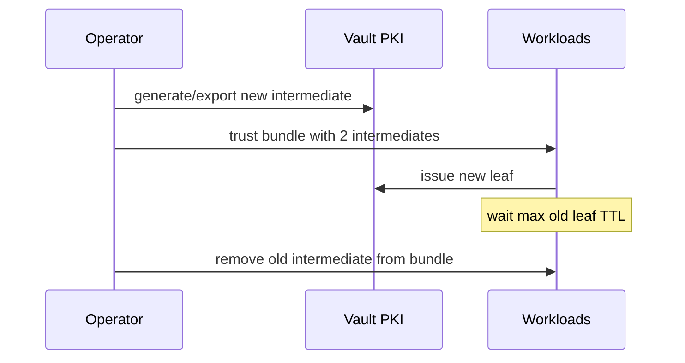

# 03. Ротация, renewal и жизненный цикл сертификатов

## Введение: «Renewal не сработал — но только в prod»

В staging cert обновлял **cert-manager** каждые 60 дней. В production забыли синхронизировать **Issuer** после смены intermediate CA — поды приняли новый cert, а **legacy Java client** всё ещё доверял старому chain. Ротация — это не одна кнопка, а **процесс**: TTL, мониторинг, trust store, отзыв, коммуникация.

## Что вы узнаете

- **Renewal** vs **reissue** vs **ротация CA**.
- Правило **⅔ TTL** и алерты.
- CRL, `vault lease revoke`, cross-signing intermediate.
- Чек-лист: [`examples/rotation-checklist.md`](examples/rotation-checklist.md).

---

## Слои ротации

| Уровень | Частота | Риск при ошибке |
|---------|---------|-----------------|
| **Leaf** | Дни–недели | Один сервис |
| **Intermediate** | Месяцы–годы | Кластер / регион |
| **Root** | Годы | Вся организация |

Vault PKI позволяет:

```bash
# продление до истечения (тот же mount/role)
vault write pki/issue/lab-server common_name="api.lab.mock-exams.local" ttl=24h

# отзыв конкретного lease
vault lease revoke <lease_id>
```

**Renewal** в смысле ACME (`vault write pki/renew`) — для cert, выданных через тот же engine, с тем же serial policy (зависит от версии и настройки). На практике чаще **новая issue** с тем же CN — проще автоматизировать.

---

## Правило ⅔ TTL

Если TTL = 90 дней, **обновляйте не позже 30-го дня** до expiry. Причины:

- Clock skew, часовые пояса деплоя.
- Rolling restart подов занимает время.
- Откат деплоя не должен оставлять вас без margin.

```text
alert: cert_expiry_days < 14  → warning
alert: cert_expiry_days < 7   → page
```

Метрики: экспортер с `openssl x509 -enddate`, или Vault lease metadata, или Kubernetes `cert-manager_certificate_expiration_timestamp_seconds`.

---

## Ротация intermediate без простоя

Схема **dual chain**:

1. Сгенерировать новый intermediate, подписать root.
2. Публиковать **оба** issuing CA клиентам (bundle).
3. Выдавать новые leaf с нового intermediate.
4. После max старого leaf TTL — убрать старый intermediate из bundle.



На dev-стенде полный dual-chain не разворачиваем — достаточно понимать **порядок операций** ([04-lab](04-lab-cert-rotation.md)).

---

## CRL и отзыв

После компрометации key:

```bash
vault write pki/revoke serial_number=<hex>
# или
vault lease revoke <lease_id>
```

CRL: `GET /v1/pki/crl` (DER/PEM). Клиенты TLS **должны** проверять CRL/OCSP, иначе отзыв бессмысленен.

**На собеседовании:** «Что быстрее — отозвать cert или сменить DNS?» — отзыв для mTLS; для публичного HTTP часто ротация + короткий TTL.

---

## Интеграция с платформой

| Платформа | Паттерн |
|-----------|---------|
| Kubernetes | cert-manager + Vault issuer / CSI |
| VM | Vault Agent Template → reload nginx |
| AWS | ACM для ALB, PCA для private; Vault — hybrid on-prem |
| CI | Короткий TTL client cert для deploy job |

Связь с [aws-intermediate/11-secrets-kms](../aws-intermediate/11-secrets-kms.md): Secrets Manager хранит **строку** PEM; Vault PKI **выдаёт** и **учитывает** lease.

---

## Статические секреты в KV vs PKI

Хранить `tls.crt` + `tls.key` в `secret/` — антипаттерн для **частой** ротации: нет CRL discipline, легко забыть версию. KV уместен для **bootstrap** или **внешних** cert, импортированных `vault write pki/config/ca pem_bundle=...`.

---

## Anti-patterns

| Плохо | Лучше |
|-------|-------|
| TTL 3650d на всех leaf | TTL 30–90d + automation |
| Ротация только в runbook, без алертов | Prometheus + runbook |
| Revoke без проверки, что клиенты читают CRL | Тест отзыва на staging |
| Один PEM в Git «навсегда» | [07-secrets-disk](../linux-security/07-secrets-disk.md) |

---

## Резюме

- Ротация многоуровневая: leaf часто, root редко.
- Автоматизируйте **до ⅔ TTL**; используйте [`rotation-checklist.md`](examples/rotation-checklist.md).
- Отзыв через **lease** или **revoke** + CRL.
- Следующий шаг: [04. Лаба: ротация](04-lab-cert-rotation.md).
