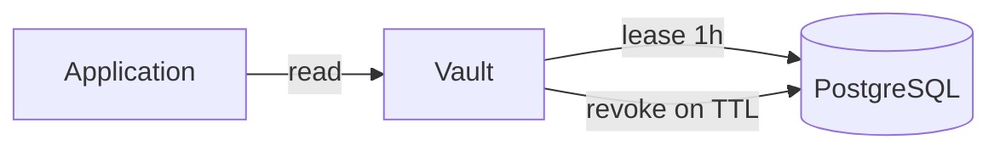

# 01. Зачем менеджер секретов: static, dynamic и экосистема

## Введение: пароль в `config.yaml` в Git

Релиз checkout: разработчик кладёт **RDS password** в `values.yaml`, MR проходит review, пароль в **истории Git** навсегда. Ротация — «найти все копии в 40 репозиториях». Security открывает **incident**: токен GitLab CI с правами deploy утёк в лог job из-за `set -x`. Platform вводит **единый источник правды** для секретов — HashiCorp Vault, AWS Secrets Manager или встроенные механизмы (GitLab Variables, K8s Secret). Эта глава — **зачем выделять секреты**, чем **static** отличается от **dynamic**, и как курс стыкуется с **GitLab**, **AWS**, **Kubernetes** и **Kafka**.

## Что вы узнаете

- Почему **секрет в репозитории** и **в образе** — антипаттерн.
- **Static secrets** (пароль, API key) vs **dynamic** (временный DB user, short-lived cert).
- Карта инструментов в mock-exams: Vault, AWS SM, GitLab masked, K8s Secret.
- Учебный стенд: `VAULT_ADDR`, token `course` — только лаб.

## Что считается секретом

| Тип | Примеры | Риск при утечке |
|-----|---------|-----------------|
| Credentials | DB password, API keys | доступ к данным |
| Tokens | JWT signing key, CI token | impersonation |
| Crypto material | TLS private key, KMS DEK | decrypt traffic/data |
| Connection strings | `postgres://user:pass@…` | lateral movement |

**Не секреты** (но часто путают): публичные URL, имена хостов без auth, feature flags без бизнес-риска.

## Static secrets

**Static** — значение **задаёт человек или Terraform** и живёт, пока не сменят вручную:

- пароль приложения к PostgreSQL;
- API key Stripe test/prod;
- kubeconfig с long-lived token.

Хранение: Vault **KV**, AWS **Secrets Manager**, GitLab **masked variable**, файл `.env` (плохо в Git).

Плюсы: просто, предсказуемо. Минусы: **ротация боль**, один ключ на все окружения, копии в логах и бэкапах.

## Dynamic secrets

**Dynamic** — Vault (или облако) **выдаёт** credential на время lease:

- **database** engine: `CREATE USER … VALID UNTIL` + auto revoke;
- **AWS** engine: временные `AKIA…` с IAM policy;
- **PKI** engine: сертификат на 24h (advanced-курс).

Плюсы: **короткий TTL**, audit «кто запросил», меньше blast radius. Минусы: сложнее ops, приложение должно **обновлять** secret до expiry.



В **secrets-basic** фокус на **static KV**; dynamic — в [secrets-advanced](../secrets-advanced/README.md).

## Где секреты «прятали» до Vault

| Место | Проблема |
|-------|----------|
| Git / Terraform state | история, fork, CI artifact |
| ConfigMap / env в Pod | etcd, describe pod, screenshots |
| Shared wiki | нет audit, нет TTL |
| Один `.env` на сервере | нет RBAC по сервисам |

## Экосистема mock-exams

| Курс / урок | Роль |
|-------------|------|
| [gitlab-basic/07](../gitlab-basic/07-variables-secrets.md) | masked/protected CI variables |
| [gitlab-advanced/07](../gitlab-advanced/07-oidc-cloud.md) | OIDC → cloud без long-lived key |
| [aws-intermediate/11](../aws-intermediate/11-secrets-kms.md) | Secrets Manager + KMS |
| [kuber-basic/12](../kuber-basic/12-config-and-secret.md) | ConfigMap vs Secret (base64 ≠ encrypt) |
| [kafka-intermediate/19](../kafka-intermediate/19-security-basics.md) | SASL passwords, ACL — отдельный контур |
| **secrets-basic** (этот курс) | Vault: policy, auth, KV, CI/K8s интеграция |

Vault **не заменяет** все системы: в AWS часто SM + IAM; в K8s — Secret + external operator; в GitLab — Variables для **доступа к Vault**, не для всех app secrets.

## HashiCorp Vault в одном абзаце

**Vault** — централизованное хранилище с **политиками ACL**, **auth methods** (кто ты), **secrets engines** (что хранить/выдавать), **audit log**. Клиент аутентифицируется → получает **token** → читает path `secret/data/...` если policy разрешает.

Учебный стенд: [`deploy/vault`](../../deploy/vault/README.md) — dev mode, `http://localhost:8200`, root token **`course`** (запрещён в prod).

## На стенде: первое касание

```bash
cd deploy/vault
docker compose up -d
export VAULT_ADDR=http://localhost:8200
export VAULT_TOKEN=course
bash scripts/smoke.sh
```

```bash
docker exec -e VAULT_TOKEN=course mock-vault vault status
docker exec -e VAULT_TOKEN=course mock-vault vault secrets list
```

| URL | Назначение |
|-----|------------|
| [localhost:8200/ui](http://localhost:8200/ui) | UI: Secrets, Policies, Access |
| `VAULT_ADDR` | API для CLI и приложений |

## Типичные ошибки

| Ошибка | Почему плохо | Как правильно |
|--------|--------------|---------------|
| Root token в приложении | полный доступ, нет TTL | policy + role + short token |
| Один пароль на dev/stage/prod | утечка с ноутбука = prod | path `secret/course/dev/…` vs `prod/…` |
| «Замаскировали в GitLab — значит безопасно» | `set -x`, artifacts | Vault KV + минимальные CI vars |
| Secret в ConfigMap | RBAC слабее, логи | Secret или Vault Agent |
| Dev mode Vault в prod | root в env, нет seal | Raft, auto-unseal, audit |

## В продакшене

- **Rotation**: календарь + автоматизация (SM rotation, Vault dynamic).
- **Least privilege**: policy на path prefix, не `sudo` token.
- **Audit**: кто читал `secret/data/prod/db` — compliance.
- **Break-glass**: процедура emergency root, не daily ops.
- **Гибрид**: app secrets в Vault; CI OIDC в AWS без static AWS key ([gitlab-advanced/08](../gitlab-advanced/08-lab-oidc-aws.md)).

## Заметки для собеседования

- **Static vs dynamic**: кто создаёт credential и каков TTL?
- Vault **не шифрует диск** приложения — он **централизует выдачу** и policy.
- K8s Secret **base64** — не encryption at rest без KMS/etcd encryption.
- GitLab **masked** не спасает от echo и malicious job.

## Резюме

Секреты нельзя жить в Git и общих config. **Static** KV покрывает большинство стартовых кейсов; **dynamic** снижает риск для DB/cloud. Vault — hub с ACL и auth; рядом — AWS SM, GitLab Variables, K8s Secret. Basic-курс строит модель на `mock-vault`; сравнение инструментов — [глава 12](12-comparison-managers.md).

## Чек-лист

- Одно предложение: static vs dynamic?
- Три места, где секреты «утекают» без взлома Vault?
- Ссылка на GitLab variables и K8s Secret в курсе?
- Почему token `course` только для лаб?

Следующий урок: [02. Архитектура Vault](02-vault-architecture.md).
