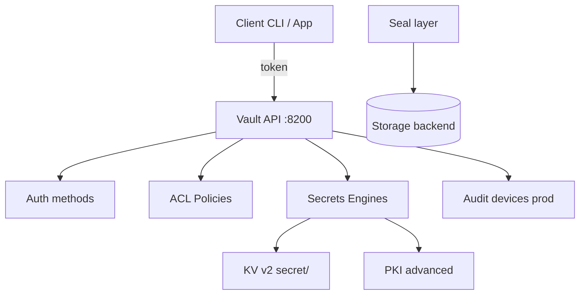

# 02. Архитектура Vault: seal, storage, engines, paths

## Введение: «Vault sealed» в 3 ночи

On-call: деплой падает с `503`, в UI **Sealed**. После рестарта узла без **unseal keys** (или auto-unseal) API не отдаёт секреты — by design. На учебном стенде **dev mode** Vault всегда unsealed и root token в env — это **не** production. Эта глава — **ментальная модель**: storage, seal, **secrets engines**, **auth**, **политики**, пути **KV v2**.

## Что вы узнаете

- Жизненный цикл: **init → unseal → configure → use**.
- Отличие **secrets engine** от **auth method**.
- Пути **KV v2**: `secret/data/...` vs `secret/metadata/...`.
- CLI: `vault status`, `secrets list`, `kv` через `mock-vault`.

## Компоненты Vault



| Компонент | Роль |
|-----------|------|
| **Storage** | encrypted data at rest (Raft, Consul; dev — in-memory) |
| **Seal** | master key защищён; без unseal — только status |
| **Auth** | доказать личность → **token** |
| **Policy** | что token может на `path` |
| **Secrets engine** | mount: `secret/`, `pki/`, `database/` |

## Seal и unseal (prod vs lab)

**Sealed** — Vault не расшифровывает storage. **Unseal** — Shamir shares или **auto-unseal** (KMS, HSM).

На стенде:

```bash
docker exec -e VAULT_TOKEN=course mock-vault vault status
```

Ожидайте `Sealed: false`, `Storage Type: inmem` (dev).

## Secrets engines (mounts)

Engine **монтируется** на path prefix:

```bash
docker exec -e VAULT_TOKEN=course mock-vault vault secrets list
```

После smoke / init:

```bash
docker exec -e VAULT_TOKEN=course mock-vault vault secrets enable -path=secret kv-v2
```

| Engine | Path (пример) | Назначение |
|--------|---------------|------------|
| **kv** (v2) | `secret/` | key-value, версии |
| **pki** | `pki/` | CA, certs (advanced) |
| **transit** | `transit/` | encrypt-as-a-service |
| **database** | `database/` | dynamic SQL users |

`vault secrets enable` — админская операция; в лабах делает `smoke.sh` или вы вручную.

## KV v2: два слоя пути

KV **version 2** хранит версии и soft-delete.

| Операция | API path (CLI сокращение) |
|----------|---------------------------|
| Write / read data | `secret/data/course/app` → `vault kv put secret/course/app` |
| Metadata, versions | `secret/metadata/course/app` |
| Delete version | `secret/delete/...` |
| Undelete | `secret/undelete/...` |

CLI `vault kv put secret/foo` автоматически пишет в `secret/data/foo`.

```bash
docker exec -e VAULT_TOKEN=course mock-vault vault kv put secret/course/demo key=value
docker exec -e VAULT_TOKEN=course mock-vault vault kv get secret/course/demo
```

## Auth methods (overview)

**Auth method** выдаёт **client token** после проверки identity:

| Method | Кто использует |
|--------|----------------|
| **token** | bootstrap, root (lab) |
| **userpass** | люди (UI login) |
| **approle** | CI / VM без human |
| **kubernetes** | Pod SA JWT → Vault role |
| **JWT/OIDC** | GitLab, GitHub Actions |

Token несёт **policies** (прямо или через entity). Следующие главы: [04](04-policies-acl.md), [06](06-auth-methods.md).

## Policies (preview)

Policy — HCL с `path` и `capabilities`: `create`, `read`, `update`, `delete`, `list`, `sudo`.

Пример из репозитория: [`policy-readonly.hcl`](../../deploy/vault/examples/policy-readonly.hcl) — read/list на `secret/data/course/*`.

## Identity: token, entity (кратко)

- **Token**: ID, TTL, renewable, policies.
- **Entity** (prod): связывает LDAP/OIDC user с policies.
- **Namespace** (Enterprise): multi-tenant; в basic не используем.

## UI

[http://localhost:8200/ui](http://localhost:8200/ui) → Login **Token** `course` → **Secrets** → `secret/` → browse `course/…`.

Полезно для лаб: визуально увидеть **versions** после повторного `kv put`.

## На стенде: обзор

```bash
cd deploy/vault && docker compose up -d
export VAULT_ADDR=http://localhost:8200 VAULT_TOKEN=course
docker exec -e VAULT_TOKEN=course mock-vault vault auth list
docker exec -e VAULT_TOKEN=course mock-vault vault policy list
```

Опционально PKI/Transit для advanced:

```bash
bash scripts/init-engines.sh
```

## Типичные ошибки

| Ошибка | Симптом | Исправление |
|--------|---------|-------------|
| `vault kv get secret/foo` на v1 path | 404 / wrong API | включить **kv-v2**, использовать `data/` в policy |
| Policy на `secret/course/*` без `data/` | permission denied | `secret/data/course/*` |
| Путать mount и key | put в несуществующий mount | `vault secrets list` |
| Root для приложения | полный доступ | отдельный token + policy |
| Забыть `VAULT_ADDR` | connection refused | export или `-address` |

## В продакшене

- **Raft integrated storage** (3+ nodes), backup snapshots.
- **Auto-unseal**, **audit** device на файл/SIEM.
- Отдельные mounts: `kv-prod/`, `kv-nonprod/` или namespaces.
- **Rate limits**, **IP allowlist** (firewall), TLS termination.
- **Disaster recovery**: replication (Enterprise) или runbook restore.

## Заметки для собеседования

- **Seal** защищает master key; **encryption** данных — storage + seal wrap.
- KV v2 = **versioning** + check-and-set (`cas`).
- Auth и secrets — **разные mounts** в API tree (`auth/`, `secret/`).
- Dev mode: in-memory, **не переживает** `docker compose down -v`.

## Резюме

Vault = storage + seal + API, через который клиент с **token** обращается к **engines** по **policy**. KV v2 — основной static store в basic; пути с `data/` и `metadata/`. Лаба закрепляет руками: [03. KV v2](03-lab-kv-v2.md).

## Чек-лист

- Что происходит, когда Vault sealed?
- Чем `secret/data/x` отличается от `secret/metadata/x`?
- Команда list secrets engines в `mock-vault`?
- Зачем отдельный auth method для Kubernetes?

Следующий урок: [03. Лаба: KV v2](03-lab-kv-v2.md).
