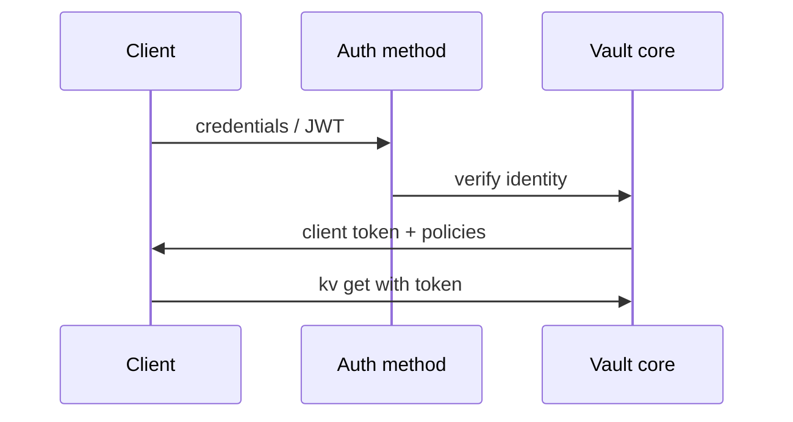

# 06. Auth methods: кто получает token и как

## Введение: «откуда у Pod токен Vault?»

Микросервис в Kubernetes не должен хранить **root** в `env`. Pod монтирует **service account JWT**, Vault **kubernetes** auth method проверяет подпись API server и выдаёт token с policy `checkout-app`. В GitLab — **AppRole** или OIDC. Эта глава — карта **auth methods**, жизненный цикл **token**, связь с лабой TTL.

## Что вы узнаете

- Зачем auth method отделён от secrets engine.
- **Token**, **AppRole**, **Kubernetes**, **JWT/OIDC** — когда что.
- TTL, **renew**, **revoke**, orphan tokens.
- Подготовка к [лабе 07](07-lab-token-ttl.md) и [K8s auth](10-kubernetes-vault.md).

## Auth flow



Mount auth: `auth/token/`, `auth/kubernetes/`, `auth/approle/`.

```bash
docker exec -e VAULT_TOKEN=course mock-vault vault auth list
```

## Token auth (bootstrap)

**Token auth** — встроенный метод: вы предъявляете token, Vault проверяет не истёк ли и какие policies.

- Root token `course` на стенде — только bootstrap.
- `vault token create` — выпуск дочернего token (лаба 05).

| Параметр | Смысл |
|----------|--------|
| `ttl` | время жизни |
| `renewable` | можно продлить до `max_ttl` |
| `explicit_max_ttl` | потолок |
| `no_default_policy` | без `default` |

## Userpass (люди)

Login/password для админов в UI. В prod — LDAP/OIDC вместо локальных паролей.

## AppRole (машины, CI)

**Role ID** (не секрет) + **Secret ID** (секрет, одноразовый) → token.

Подходит для VM и CI **без** Kubernetes. Ротация Secret ID; хранить в GitLab masked variable.

```bash
# tabletop (не выполняйте на prod root без need)
vault auth enable approle
vault write auth/approle/role/ci-checkout token_policies=course-readonly token_ttl=15m
```

## Kubernetes auth

1. Включить `vault auth enable kubernetes`.
2. Настроить `kubernetes_host`, CA, reviewer JWT.
3. Создать **role** с `bound_service_account_names`, `policies` — см. [`examples/k8s-auth-role.json`](examples/k8s-auth-role.json).
4. Pod вызывает `vault write auth/kubernetes/login role=... jwt=@/var/run/secrets/...`.

Связь с [kuber-basic/12](../kuber-basic/12-config-and-secret.md): K8s Secret — статика в etcd; Vault — центр + короткий token.

## JWT / OIDC (GitLab, cloud)

GitLab CI может аутентифицироваться **JWT** ([gitlab-advanced/07](../gitlab-advanced/07-oidc-cloud.md)) — без static `VAULT_TOKEN` в долгоживущей variable. Basic-курс в [08](08-ci-gitlab-vault.md) использует **token** для tabletop.

## Token lifecycle

| Событие | Команда / эффект |
|---------|------------------|
| Создать | `token create` |
| Продлить | `token renew` (если renewable) |
| Отозвать | `token revoke` — немедленная недействительность |
| Истёк TTL | 403 на все API |

**Batch token** (lightweight, no renew) — для массовых CI (advanced).

## Entity и groups (кратко)

В prod человек → **entity** → несколько policies. Auth method alias связывает LDAP user с entity. В basic достаточно знать, что token может наследовать policies от role.

## На стенде

```bash
docker exec -e VAULT_TOKEN=course mock-vault vault auth list
docker exec -e VAULT_TOKEN=course mock-vault vault token lookup
```

`lookup` показывает `policies`, `ttl`, `renewable`.

## Типичные ошибки

| Ошибка | Почему плохо | Как правильно |
|--------|--------------|---------------|
| Бессрочный token | утечка = вечный доступ | ttl 15m–1h + renew automation |
| Один AppRole на все сервисы | lateral movement | role per service |
| K8s auth без audience/namespace bound | любой SA в кластере | bound SA name + namespace |
| Renew без мониторинга | silent expiry | alert на 403 rate |
| Revoke не вызывают при compromise | старый token жив до TTL | revoke + rotate |

## В продакшене

- **Periodic tokens** с автомат renew sidecar (Vault Agent).
- **OIDC** для humans; **K8s/AppRole** для workloads.
- Отключить **root** после bootstrap; хранить shares offline.
- Audit log: `auth`, `token`, `kv` access.

## Заметки для собеседования

- Auth method **не хранит** секреты приложения — только выдаёт token.
- K8s auth доверяет **API server JWT**, не произвольному файлу в Pod.
- `vault token revoke -self` — logout pattern для CI job end.

## Резюме

Auth отвечает на «кто ты»; policy — «что можно». Для CI/K8s избегаем root; используем role с коротким TTL и revoke. Лаба [07](07-lab-token-ttl.md) тренирует TTL и отзыв.

## Чек-лист

- Назовите три auth method для machine identity.
- Чем role ID отличается от secret ID в AppRole?
- Что делает `token revoke`?
- Где в репо пример K8s role JSON?

Следующий урок: [07. Лаба: token TTL](07-lab-token-ttl.md).
