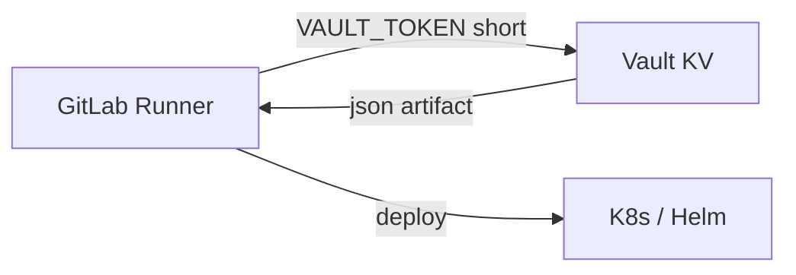

# 08. GitLab CI и Vault: переменные, KV и deploy secret

## Введение: deploy key только на время job

Pipeline staging тянет **API key** для Helm registry из Vault path `secret/course/checkout/deploy`, а в GitLab хранится только **доступ к Vault** (`VAULT_ADDR` + short-lived token или AppRole). Masked variable `DEPLOY_KEY` в YAML больше не нужна — ротация в одном месте. Эта глава — **паттерн tabletop** для связки [gitlab-basic/07](../gitlab-basic/07-variables-secrets.md) и KV из [лабы 03](03-lab-kv-v2.md).

## Что вы узнаете

- Что хранить в **GitLab Variables**, что в **Vault KV**.
- Этапы pipeline: fetch secret → deploy.
- Ограничения masked variables и почему `set -x` опасен.
- Сниппет [`examples/gitlab-vault-snippet.yml`](examples/gitlab-vault-snippet.yml).

## Разделение ответственности

| Хранилище | Что класть |
|-----------|------------|
| **Vault KV** | deploy API keys, DB passwords, TLS keys |
| **GitLab CI Variables** | `VAULT_ADDR`, role/secret для **входа** в Vault (masked, protected) |
| **Git repo** | только несекретные `VAULT_ADDR` для lab, никогда tokens |

Root `course` в variable — **только учебный стенд**. В prod: AppRole или [OIDC JWT](../gitlab-advanced/07-oidc-cloud.md).

## Поток pipeline



1. Job `fetch-secrets`: `vault kv get -format=json secret/course/checkout/deploy` → artifact.
2. Job `deploy`: читает JSON, применяет manifest (без `echo` секрета).

## GitLab Variables (напоминание)

Из [gitlab-basic/07](../gitlab-basic/07-variables-secrets.md):

| Флаг | Зачем |
|------|--------|
| **Masked** | скрыть в логах (≥8 символов, одна строка) |
| **Protected** | только protected branches |
| **File** | kubeconfig, CA bundle |

`VAULT_TOKEN` — masked + protected. **Не** кладите deploy key приложения сюда, если уже есть Vault.

## Пример secret в KV

Подготовка на стенде (root):

```bash
docker exec -e VAULT_TOKEN=course mock-vault vault kv put \
  secret/course/checkout/deploy api_key=deploy-lab-key-rotate-me env=staging
```

Policy `course-readonly` из [05](05-lab-policies.md) достаточно для read.

## Фрагмент `.gitlab-ci.yml`

Полный пример: [`examples/gitlab-vault-snippet.yml`](examples/gitlab-vault-snippet.yml).

Ключевые моменты:

- image `hashicorp/vault:1.16` в fetch job;
- artifact `deploy-secret.json` с `expire_in: 1 hour`;
- deploy job использует `jq`, не печатает ключ.

## Аутентификация CI к Vault (уровни)

| Уровень | Механизм | Basic курс |
|---------|----------|------------|
| Lab | `VAULT_TOKEN` variable | да (tabletop) |
| Better | **AppRole** role_id + secret_id | упоминание |
| Best | **GitLab OIDC JWT** → Vault | [gitlab-advanced/08](../gitlab-advanced/08-lab-oidc-aws.md) |

## Безопасность логов

```yaml
# ПЛОХО
script:
  - set -x
  - vault kv get secret/course/checkout/deploy
```

Masked не спасает от trace. Используйте `-field` в файл, `set +x`, [mask helpers](https://docs.gitlab.com/ee/ci/yaml/#log-redaction).

## Связь с AWS deploy

Если deploy в AWS без Vault app secrets: [aws-intermediate/11](../aws-intermediate/11-secrets-kms.md) + OIDC ([08-lab-oidc-aws](../gitlab-advanced/08-lab-oidc-aws.md)). Vault остаётся hub для **on-prem** и **multi-cloud**.

## На стенде: ручная эмуляция CI

```bash
export VAULT_ADDR=http://localhost:8200
export VAULT_TOKEN=course   # замените на readonly token из лабы 05
vault kv get -format=json secret/course/checkout/deploy > deploy-secret.json
jq -r '.data.data.api_key' deploy-secret.json | wc -c
rm -f deploy-secret.json
```

## Типичные ошибки

| Ошибка | Последствие | Исправление |
|--------|-------------|-------------|
| Artifact с секретом без expire | утечка в GitLab storage | `expire_in: 1h` |
| Root token в group variable | любой project читает всё | project-scoped AppRole |
| Echo JSON в лог | key в SIEM | jq в файл, redaction |
| Один secret на prod/stage | wrong env deploy | path `.../staging/deploy` |
| Нет revoke token | window после job | `after_script` revoke |

## В продакшене

- Отдельные **Vault namespaces** или mounts per env.
- **Branch protection** + protected variables для prod.
- **Separate runners** для prod (tags).
- Policy CI: read-only на нужный prefix; write только rotation job.
- Мониторинг: spike `secret/data` read с необычных IP.

## Заметки для собеседования

- GitLab masked ≠ encryption at rest в GitLab DB.
- Vault KV **versioning** помогает откатить случайную перезапись в CI.
- Artifact secrets — trade-off; лучше short-lived token straight to deploy tool.

## Резюме

GitLab хранит **доступ**, Vault — **значения**. Tabletop pipeline: fetch JSON artifact → deploy без печати. Лаба [09](09-lab-ci.md) проходит шаги на `mock-vault` без обязательного GitLab Runner.

## Чек-лист

- Что в Variables, что в KV?
- Зачем `expire_in` на artifact?
- Где сниппет `.gitlab-ci.yml` в курсе?
- Следующий шаг после basic для OIDC?

Следующий урок: [09. Лаба: CI tabletop](09-lab-ci.md).
