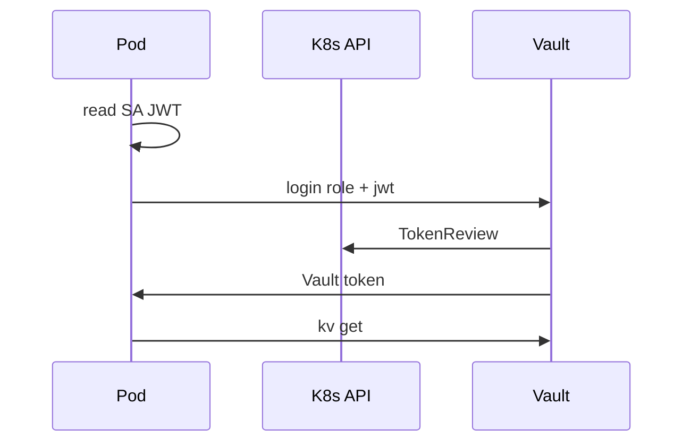

# 10. Vault и Kubernetes: Secret, sidecar, Kubernetes auth

## Введение: Secret в etcd — не «vault»

Platform читает [kuber-basic/12](../kuber-basic/12-config-and-secret.md): `kubectl get secret` показывает **base64**, не шифрование. Compliance требует **rotation** и audit «кто читал DB password». Варианты: **External Secrets Operator** (sync Vault → K8s Secret), **Vault Agent Injector** (файл в Pod), **прямой** Vault API с **Kubernetes auth**. Basic — **концепт** auth и роль; полный кластер — optional с `mockctl`.

## Что вы узнаете

- Почему K8s Secret ≠ enterprise secret manager.
- Как **Kubernetes auth** связывает ServiceAccount и Vault policy.
- Паттерны: init container, sidecar, CSI driver (overview).
- Ссылка на лабу [11](11-lab-k8s-auth.md) и [`k8s-auth-role.json`](examples/k8s-auth-role.json).

## K8s Secret vs Vault

| Аспект | K8s Secret | Vault |
|--------|------------|-------|
| Хранение | etcd (encrypt at rest опционально) | dedicated storage |
| RBAC | K8s RBAC | Vault policy |
| Rotation | manual / ESO | KV versions / dynamic |
| Audit | K8s audit logs | Vault audit device |
| Формат в Pod | env / volume | API / agent file |

Рекомендация: **не** дублировать долгоживущий prod password в Git и в ConfigMap; источник — Vault, в Pod — short-lived file или env от Agent.

## Kubernetes auth — модель доверия



1. Vault включает auth `kubernetes`.
2. Настраивается адрес API, CA, **token reviewer** SA.
3. **Role** ограничивает: namespace, service account name, audience.
4. Pod (или Agent) вызывает `auth/kubernetes/login`.

Пример role spec: [`examples/k8s-auth-role.json`](examples/k8s-auth-role.json):

- `bound_service_account_names`: `checkout-app`
- `bound_service_account_namespaces`: `checkout`
- `policies`: `course-readonly`
- `ttl`: `1h`

## Настройка на стенде (overview)

На полном кластере (`mockctl up`):

```bash
vault auth enable kubernetes
vault write auth/kubernetes/config \
  kubernetes_host="https://kubernetes.default.svc:443" \
  # token_reviewer_jwt, kubernetes_ca_cert — из SA vault-reviewer
vault write auth/kubernetes/role/checkout-app @examples/k8s-auth-role.json
```

В **dev Vault** без реального кластера — **tabletop**: разобрать JSON role и сопоставить с Deployment SA в [kuber-basic/12](../kuber-basic/12-config-and-secret.md).

## Паттерны доставки секрета в Pod

| Паттерн | Плюсы | Минусы |
|---------|--------|--------|
| **Vault Agent Injector** | автомат renew, файл в volume | sidecar, ops |
| **External Secrets** | привычный K8s Secret | задержка sync, два CRD |
| **CSI Secret Store** | mount как volume | настройка драйвера |
| **SDK в приложении** | контроль | код + renew |

Basic: понимать **injector** как «init/sidecar ходит в Vault, app читает файл».

## Связь с ConfigMap

ConfigMap — несекретные URL, feature flags. См. [kuber-basic/12](../kuber-basic/12-config-and-secret.md): не класть password в ConfigMap «потому что проще».

## mockctl (optional)

[`mockctl`](../../mockctl/README.md) поднимает локальный кластер для [kuber-intermediate](../kuber-intermediate/README.md). Лаба [11](11-lab-k8s-auth.md) даёт tabletop без кластера и шаги **если** `mockctl up` доступен.

## На стенде Vault only

```bash
docker exec -e VAULT_TOKEN=course mock-vault vault auth list
# kubernetes появится после enable на кластере
docker exec -e VAULT_TOKEN=course mock-vault vault policy read course-readonly
```

## Типичные ошибки

| Ошибка | Риск | Исправление |
|--------|------|-------------|
| Role без bound namespace | любой SA | bound SA + namespace |
| Vault token в Secret manifest | etcd leak | K8s auth + short TTL |
| Долгий TTL Vault token в Pod | украденный volume | 1h + Agent renew |
| Root для injector config | cluster-wide breach | отдельный config token |
| Синк всего KV в один K8s Secret | overexposure | path per app |

## В продакшене

- **Dedicated** Vault cluster или cloud HCP.
- Network: Vault только из mesh / private link.
- **IRSA** (AWS) / workload identity — см. [aws-advanced/15](../aws-advanced/15-irsa.md) для облачного аналога trust.
- Rotate **token reviewer** JWT по runbook.
- Prefer **dynamic DB** credentials для stateful apps (advanced).

## Заметки для собеседования

- K8s auth использует **TokenReview** API — Vault не доверяет JWT без проверки.
- Secret resource остаётся в модели K8s; Vault — **источник истины** при ESO/injector.
- Отличие от **Sealed Secrets** (encrypt in Git) — другой threat model.

## Резюме

Kubernetes Secret удобен для mount, но слаб для rotation/audit. Vault **Kubernetes auth** выдаёт policy-bound token Pod'у. Basic закрепляет role JSON и tabletop; при наличии кластера — enable auth в [лабе 11](11-lab-k8s-auth.md).

## Чек-лист

- Почему base64 в Secret — не encryption?
- Что проверяет Vault через TokenReview?
- Поля `bound_service_account_*` в примере JSON?
- Три способа доставить секрет в Pod?

Следующий урок: [11. Лаба: K8s auth](11-lab-k8s-auth.md).
