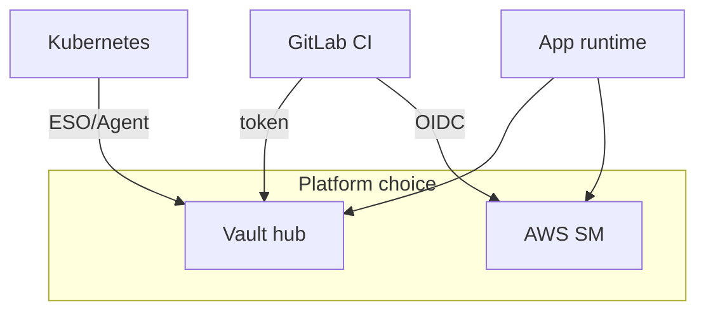

# 12. Сравнение менеджеров секретов (собеседование)

## Введение: «у нас AWS — зачем Vault?»

Architect review: команда хранит пароли в **SSM Parameter Store**, CI — в **GitLab masked**, K8s — в **Secret**, legacy — в **`.env` на сервере**. Новый сервис требует **rotation** и единый audit. Нужна таблица trade-offs без «всё в Vault». Эта глава систематизирует [01](01-why-secrets.md) для interview и выбора инструмента.

## Что вы узнаете

- Сравнение **Vault**, **AWS Secrets Manager + KMS**, **GitLab Variables**, **env files**, **K8s Secret**.
- Когда **гибрид** нормален.
- Формулировки ответов и ловушки.

## Сводная таблица

| Критерий | **HashiCorp Vault** | **AWS SM + KMS** | **GitLab masked** | **`.env` / config** | **K8s Secret** |
|----------|---------------------|------------------|-------------------|---------------------|----------------|
| Scope | multi-cloud, on-prem | AWS | CI/CD | single host | cluster |
| Rotation | KV versions, dynamic engines | native rotation Lambda | manual | manual | manual / ESO |
| Access control | Vault policy | IAM + resource policy | project/group RBAC | file perms | K8s RBAC |
| Audit | Vault audit | CloudTrail | job logs (limited) | нет | K8s audit |
| Dynamic creds | DB, AWS, PKI engines | SM rotation | нет | нет | нет |
| Ops burden | кластер Vault | managed | низкий | низкий | встроено в K8s |
| Типичный кейс | platform hub | AWS-native apps | CI bootstrap | local dev only | mount в Pod |

## HashiCorp Vault — когда да

- **Несколько** сред и облаков, единая policy модель.
- **Dynamic** credentials (DB, certs) — [secrets-advanced](../secrets-advanced/README.md).
- **Kubernetes auth**, **PKI**, **Transit** encryption.
- Строгий **audit** и path-based ACL.

## Vault — когда нет

- Стартап **только AWS**, команда без ops Vault → **Secrets Manager**.
- Нужен только **masked CI var** для одного ключа → GitLab достаточно (с рисками).
- Нет человека для **unseal**, backup, upgrade.

## AWS Secrets Manager и KMS

Урок: [aws-intermediate/11](../aws-intermediate/11-secrets-kms.md).

- **SM** — хранение secret string, rotation hooks.
- **KMS** — ключи шифрования для SM, S3, RDS.
- **IAM** `GetSecretValue` + `kms:Decrypt` на runtime role ([ECS/Lambda](../aws-intermediate/11-secrets-kms.md)).

**Плюсы:** managed, интеграция AWS. **Минусы:** привязка к AWS; cross-cloud сложнее.

**SSM Parameter Store** — дешевле для не-rotating config; SecureString с KMS.

## GitLab CI Variables

Урок: [gitlab-basic/07](../gitlab-basic/07-variables-secrets.md).

| Плюсы | Минусы |
|-------|--------|
| быстро, UI | не app runtime store |
| masked/protected | утечка через logs, artifacts |
| OIDC в advanced | нет dynamic DB users |

Паттерн: Variables → **доступ к Vault**; значения app secrets → **KV**.

## Файлы `.env` и config в репо

| Плюсы | Минусы |
|-------|--------|
| dev удобство | Git history навсегда |
| | нет central audit |
| | drift между машинами |

Допустимо: `.env.example` **без** секретов; реальный `.env` в `.gitignore` только local.

## Kubernetes Secret

Урок: [kuber-basic/12](../kuber-basic/12-config-and-secret.md).

- **Opaque** Secret в etcd; base64 в YAML.
- Encryption at rest etcd — **отдельная** настройка кластера.
- **External Secrets** / Vault Agent — sync из Vault.

**Не путать:** Secret resource — transport в Pod; **Vault** — source of truth.

## Kafka и messaging (смежно)

[SASL passwords / ACL](../kafka-intermediate/19-security-basics.md) — отдельный контур; не заменяется Vault, но пароли broker users могут **храниться** в Vault KV.

## Пары для interview

**В: Vault vs AWS SM?**  
О: SM — managed AWS store; Vault — platform-agnostic с dynamic engines и K8s auth. В pure AWS часто SM; в hybrid — Vault.

**В: Зачем Vault, если есть GitLab masked?**  
О: Masked — для CI bootstrap; не rotation/audit для runtime; не dynamic DB.

**В: K8s Secret достаточно?**  
О: Для lab — да; prod — encryption at rest + RBAC + external manager для rotation.

**В: Где хранить Terraform state secrets?**  
О: remote state encrypted; secrets в SM/Vault; не в plain tfvars в Git ([aws-intermediate/11](../aws-intermediate/11-secrets-kms.md)).

## Типичные ошибки на собеседовании

| Утверждение | Правка |
|-------------|--------|
| «Vault шифрует диски EC2» | Vault хранит secrets; диск — KMS/EBS |
| «Masked = encrypted» | redaction в UI/logs |
| «Один tool для всего» | гибрид SM + Vault Agent нормален |
| «K8s Secret безопасен по умолчанию» | RBAC + etcd encryption |

## Резюме

Выбор по **scope**, **cloud**, **rotation**, **audit**. Vault — hub; AWS SM — AWS-native; GitLab — CI gate; K8s Secret — delivery; `.env` — только local dev. Финал курса собирает Vault end-to-end: [13](13-final-project.md).

## Чек-лист

- Назовите три критерия выбора SM vs Vault.
- Где GitLab Variables в архитектуре с Vault?
- Почему K8s Secret ≠ Vault?
- Ссылка на урок AWS KMS в репо?

Следующий урок: [13. Финальный проект](13-final-project.md).
