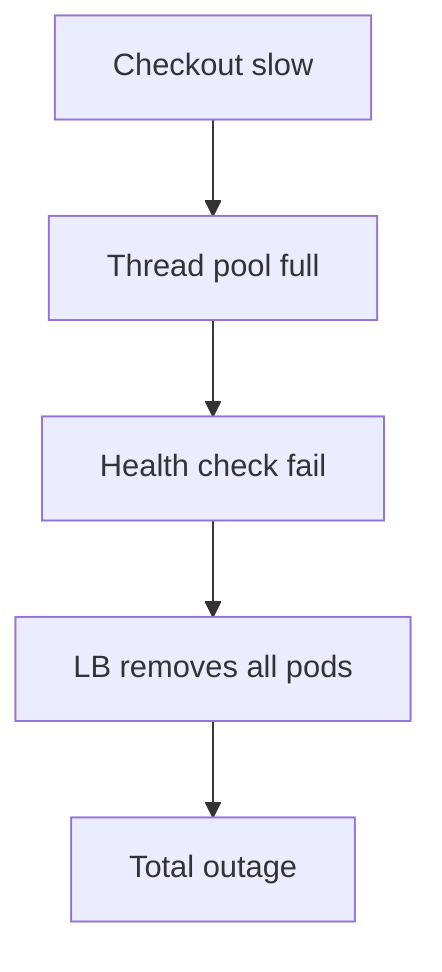

# 02. Надёжность, риск и отказы

## Введение: один баг, три катастрофы

Релиз API v2.1 прошёл canary «успешно»: ошибок в логах нет, CPU в норме. Через час **платёжный шлюз** начинает таймаутить — оказалось, новый connection pool **исчерпил** лимит на стороне Postgres, а checkout **ретраит** без jitter и **усиливает** шторм. Одновременно **кэш Redis** эвиктит ключи сессий — latency checkout растёт, пользователи жмут F5, **Ingress** задыхается. Один «мелкий» PR; три уровня системы отреагировали **цепочкой**.

SRE начинает не с «кто виноват», а с **модели отказа**: что ломается первым, что усиливает ущерб, где **граница blast radius**. Эта глава — фундамент перед SLI: без понимания риска SLO превращается в красивую цифру на слайде.

---

## Надёжность как вероятность

**Надёжность** — вероятность, что система выполнит свою функцию в заданных условиях за интервал времени. На практике измеряют **доступность** (availability), **латентность**, **корректность** (correctness), иногда **durability** данных.

| Свойство | Вопрос пользователя | Пример провала |
|----------|---------------------|----------------|
| Availability | «Сервис вообще отвечает?» | 503, DNS fail |
| Latency | «Отвечает быстро enough?» | p95 8 s |
| Correctness | «Ответ правильный?» | двойное списание |
| Durability | «Данные не пропадут?» | потеря заказа после «успеха» |

**Важно:** 100% по всем осям одновременно **недостижимо и не нужно**. Продукт выбирает, что **критичнее** — платёж чаще требует correctness + durability, лента новостей — availability + latency.

---

## Риск = вероятность × ущерб

Инженерия надёжности — **управление риском**, не его устранение.

```text
Risk = Likelihood × Impact
```

| Действие | Снижает likelihood | Снижает impact |
|----------|-------------------|----------------|
| Code review | ✓ | |
| Canary deploy | ✓ | ✓ |
| Multi-AZ | | ✓ |
| Rate limiting | ✓ | ✓ |
| Backup + restore drill | | ✓ |
| Feature flag kill switch | | ✓ |

**Residual risk** — то, что остаётся после контролей; его **кладут в error budget** и страховку (DR, поддержка).

---

## Failure domain и blast radius

**Failure domain** — минимальная зона, внутри которой отказ **коррелирован** (один причинный корень).

| Domain | Типичный отказ | Как изолировать |
|--------|----------------|-----------------|
| AZ / rack | потеря питания | multi-AZ, anti-affinity |
| Kubernetes node | kubelet dead | PDB, spread pods |
| Namespace | misconfigured NetworkPolicy | отдельные NS per team |
| Dependency | Redis down | cache aside, degrade mode |
| Region | облако недоступно | multi-region (дорого) |

**Blast radius** — сколько **пользователей / сервисов** затронуто одним событием.

Антипаттерн: **один кластер, один etcd, все продукты** — blast radius = вся компания.

В mock-exams: [`kuber-intermediate`](../kuber-intermediate/README.md) (PDB, spread), [`aws-intermediate`](../aws-intermediate/README.md) (multi-AZ VPC).

---

## Типы отказов

### Отказ компонента

Диск, NIC, Pod OOMKilled. **Ожидаем** — проектируем **N+1**, replicas, health checks.

### Отказ зависимости

База, брокер, SaaS. Контракт: **timeouts**, **circuit breaker**, **fallback** (read-only mode), **очередь** на отложенную обработку ([kafka-basic](../kafka-basic/README.md), [rabbitmq-basic](../rabbitmq-basic/README.md)).

### Отказ развертывания

Плохой образ, миграция schema. **Canary**, **автоматический rollback**, **миграции backward-compatible**.

### Отказ конфигурации

Неверный feature flag, ACL. **Git review**, **GitOps** ([gitops-basic](../gitops-basic/README.md)), **config validation** в CI.

### «Отказ человека»

Ошибочная команда в prod. **Guardrails**: dry-run, approval, break-glass audit. Postmortem **без blame** — система допустила действие ([глава 09](09-postmortems.md)).

### Каскадный отказ

Система A замедлилась → B накопил очередь → C исчерпил память. Лечение: **backpressure**, **timeouts**, **bulkheads** (ограничение параллелизма на dependency).



---

## RED и USE (мост к observability)

Для **сервиса** часто используют **RED**:

| Letter | Метрика | Смысл |
|--------|---------|-------|
| R | Rate | запросов/с |
| E | Errors | доля 5xx / failed |
| D | Duration | latency distribution |

Для **ресурса** (CPU, disk, node) — **USE**:

| Letter | Метрика |
|--------|---------|
| U | Utilization |
| S | Saturation |
| E | Errors |

SRE связывает RED **пользовательского пути** с USE **узкого места** при инциденте. Подробнее — [глава 06](06-observability-for-sre.md), курс [observability-basic](../observability-basic/README.md).

---

## Деградация осознанная

Не всегда цель — «всё зелёное». Иногда **сознательно** ухудшают опыт, чтобы **сохранить ядро**:

| Режим | Пример |
|-------|--------|
| Read-only | каталог виден, заказ отключён |
| Stale cache | старые цены лучше, чем 503 |
| Shed load | 429 для non-paying API tier |
| Queue | «заказ принят, обработаем позже» |

Деградация должна быть **задокументирована** в runbook и **протестирована** (Game Day), иначе команда «выключает» не то.

---

## HA, FT и «сколько девяток»

| Термин | Смысл |
|--------|-------|
| **HA** (High Availability) | архитектура переживает отказ компонента |
| **FT** (Fault Tolerance) | продолжение **без** перерыва (дорого: RAID, dual controller) |
| **Девятки** | 99,9% ≈ 8,76 ч downtime/год; 99,99% ≈ 52,6 мин |

Таблица для **планирования** (упрощённо, без учёта параллельных maintenance):

| Availability | Downtime / год | Типичный контекст |
|--------------|----------------|-------------------|
| 99% | ~3,65 дня | internal tools |
| 99,9% | ~8,8 ч | B2B API |
| 99,95% | ~4,4 ч | ecommerce checkout |
| 99,99% | ~52 мин | payments, core auth |

Каждая «девятка» **дороже** предыдущей — [глава 15](15-economics-of-reliability.md).

---

## Тестирование надёжности

| Практика | Что проверяет |
|----------|----------------|
| Unit / integration | логика |
| Load test | saturation, latency под RPS |
| Chaos engineering | отказ dependency / node |
| DR drill | restore из backup |
| Failure injection | timeout сети, DNS |

**Chaos** без SLO — шоу; с SLO — проверка **гипотез** («переживём ли потерю AZ»).

---

## В mock-exams

| Сценарий | Где тренировать |
|----------|-----------------|
| Pod crash, probes | [kuber-basic/08-probes](../kuber-basic/README.md) |
| HPA под нагрузкой | [kuber-intermediate/17-hpa](../kuber-intermediate/17-hpa.md) |
| Kafka lag cascade | [kafka-intermediate](../kafka-intermediate/README.md) |
| nginx 502 upstream | [nginx-basic/06](../nginx-basic/06-logs-502.md) |
| Vault недоступен | [secrets-basic](../secrets-basic/README.md) |

---

## Заметки для собеседования

- Назовите **failure domain** вашего последнего инцидента.
- Чем **каскад** отличается от **корневой причины**?
- RED vs USE — когда что?
- Почему **99,99% для всего** — плохая стратегия?

---

## Резюме

Надёжность — не отсутствие сбоев, а **контролируемый риск**: маленькие blast radius, понятные режимы деградации, метрики, привязанные к пользователю. SLI/SLO из следующей главы **оцифровывают**, сколько риска мы приняли.

---

## Чек-лист

- [ ] Нарисуйте цепочку каскада для своего сервиса (3 уровня).
- [ ] Укажите failure domain и один способ уменьшить blast radius.
- [ ] Выберите RED-метрики для одного API.
- [ ] Есть ли documented degrade mode?

**Дальше:** [03. SLI, SLO, SLA](03-sli-slo-sla.md).
