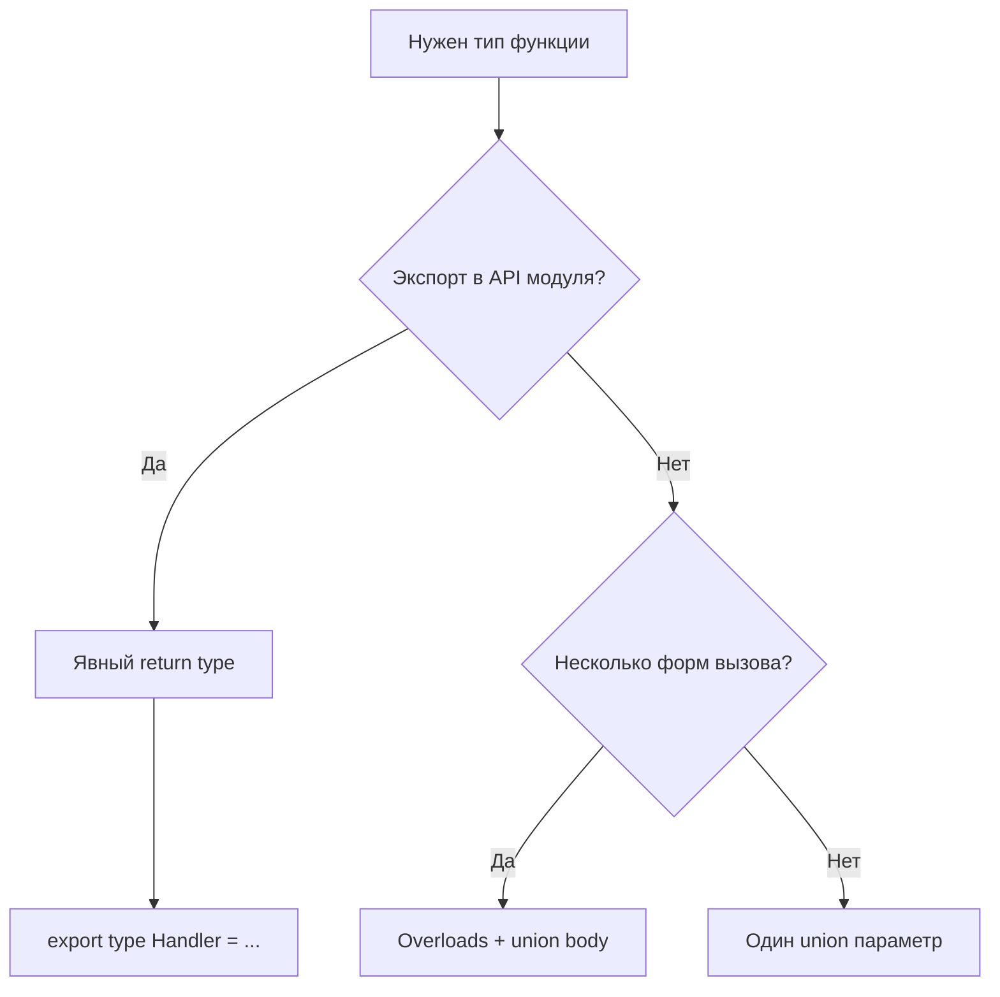

# 10. Типы функций: сигнатуры, overloads, rest

## Сценарий с работы

В BFF к FastAPI `:8090` коллега написал утилиту `formatPrice` и передал её в `items.map(formatPrice)`. После `tsc` всё зелёное, в runtime — `Cannot read properties of undefined`. Оказалось: `map` передаёт **три** аргумента `(element, index, array)`, а функция ожидала только `price: number`. В JavaScript лишние аргументы игнорируются; TypeScript **не спасает**, если сигнатура слишком широкая или колбэк не типизирован.

Параллельный кейс: middleware Express принимает `(req, res, next)`, а джун типизировал handler как `(req: Request) => void` — `next` «есть» в runtime, но TypeScript не напомнил про вызов. На code review просят: явные типы параметров и возврата, тип для `(...ids: number[])`, overload для `parseQuery` — строка **или** массив строк из query API shop.

В [javascript-basic/10-functions](../javascript-basic/10-functions.md) вы разобрали declaration, arrow и rest **в runtime**. Здесь — **контракт** функции на этапе компиляции.

## Что вы узнаете

- Синтаксис **типа функции**: `(a: T) => R` и `interface Fn { (x: T): R }`
- Типизацию **параметров**, **возврата** и **опциональных** аргументов
- **Rest-параметры** `...args: T[]` и tuple rest `...args: [string, ...number[]]`
- Введение в **function overloads**
- Типизацию **колбэков** (`map`, `filter`, middleware)
- Типичные production-баги и их корневые причины

---

## Тип функции: два эквивалентных способа

```typescript
type FormatPrice = (amount: number, currency?: string) => string;

interface FormatPriceFn {
  (amount: number, currency?: string): string;
}

const formatPrice: FormatPrice = (amount, currency = "USD") =>
  new Intl.NumberFormat("en-US", { style: "currency", currency }).format(amount);

formatPrice(79.99); // "$79.99"
```

**Почему два синтаксиса:** `type` удобен для union и composition; `interface` — для расширения и callable object с полями:

```typescript
interface Logger {
  (msg: string): void;
  level: "info" | "error";
}
```

Тип **не создаёт** функцию — только проверяет совместимость при присваивании и вызове.

---

## Параметры и возврат

```typescript
function connect(host: string, port: number = 3000, tls = false): string {
  return `${tls ? "https" : "http"}://${host}:${port}`;
}

export function parseItemId(raw: string): number | null {
  const n = Number(raw);
  return Number.isInteger(n) && n > 0 ? n : null;
}
```

| Элемент | Зачем явно |
|---------|------------|
| Параметры | Ловит передачу `string` вместо `number` до деплоя |
| Возврат | Защита от случайного `return undefined` в ветке |
| Default | TS выводит тип из литерала (`tls: boolean`) |

**Контекст shop:** `parseItemId` для `GET /api/v1/items/{id}` — невалидный id не должен уезжать в `fetch` как `NaN`. Default срабатывает только для `undefined`, как в JS ([javascript-basic/10-functions](../javascript-basic/10-functions.md)).

---

## Rest-параметры с типом

```typescript
function sum(...nums: number[]): number {
  return nums.reduce((acc, n) => acc + n, 0);
}

sum(1, 2, 3); // 6
// sum(1, "2"); // error TS2345
```

Rest всегда **массив** (или tuple) в типе:

```typescript
function logEvent(tag: string, ...details: unknown[]): void {
  console.log(tag, ...details);
}
```

Tuple rest — фиксированный префикс + хвост (см. [11-arrays-tuples](11-arrays-tuples.md)):

```typescript
function createOrder(customerId: number, ...lineIds: [number, ...number[]]) {
  const [first, ...rest] = lineIds;
  return { customerId, first, rest };
}

createOrder(1, 10, 20);   // OK
// createOrder(1);        // error — нужен хотя бы один lineId
```

**Почему rest лучше `arguments`:** читаемая сигнатура, настоящий массив, дружит с spread при вызове.

---

## Колбэки: `map`, `filter`, обработчики

```typescript
type Product = { id: number; name: string; price: number };

const products: Product[] = [
  { id: 1, name: "Keyboard", price: 79.99 },
];

const names = products.map((p) => p.name); // string[]
```

**Ловушка:** передать «узкую» функцию туда, где ожидается широкий колбэк:

```typescript
function onItems(items: Product[], cb: (item: Product, index: number) => void) {
  items.forEach(cb);
}

// formatPrice: (n: number) => string — несовместимо: cb получает Product
```

Правило: типизируйте **параметры колбэка** так, как их вызывает API.

### `void` в колбэках

```typescript
type ClickHandler = () => void;

const handler: ClickHandler = () => {
  return "ignored"; // OK — return value игнорируется при присваивании к () => void
};
```

TypeScript разрешает возвращать значение там, где ожидается `void`, если результат не используется.

---

## Function overloads (введение)

Одно **имя**, несколько **сигнатур вызова**. Реализация одна — с union-типами:

```typescript
function parseIds(input: string): number[];
function parseIds(input: string[]): number[];
function parseIds(input: string | string[]): number[] {
  const parts = Array.isArray(input) ? input : input.split(",");
  return parts.map((s) => Number(s.trim())).filter((n) => !Number.isNaN(n));
}

parseIds("1,2,3");     // number[]
parseIds(["4", "5"]);  // number[]
```

**Порядок overloads:** от более специфичного к общему. Компилятор выбирает **первую подходящую**.

Когда overload **нужен:** разный **тип возврата** от формы аргумента (`getConfig("db")` → `DbConfig`). Когда **не нужен:** хватает `input: string | string[]`.

Разный возврат по overload:

```typescript
function getById(id: number): Product;
function getById(sku: string): Product;
function getById(key: number | string): Product {
  // одна реализация
  return {} as Product;
}
```

---

## Типы для методов и стрелок в объектах

```typescript
type CartService = {
  addItem(id: number, qty: number): void;
  total: () => number;
};

const cart: CartService = {
  addItem(id, qty) {},
  total: () => 0,
};
```

Метод `addItem()` и свойство-стрелка `total` имеют разный `this` в JS ([javascript-basic/14-this](../javascript-basic/14-this.md)).

---

## Generics у функций (затравка)

```typescript
function first<T>(arr: T[]): T | undefined {
  return arr[0];
}

first([1, 2, 3]);   // number | undefined
first(["a", "b"]);  // string | undefined
```

Подробно — [13-generics](13-generics.md).

---

## Диаграмма: выбор сигнатуры



---

## Связь с курсом

| Урок | Связь |
|------|-------|
| [javascript-basic/10-functions](../javascript-basic/10-functions.md) | rest, default, arrow |
| [11-arrays-tuples](11-arrays-tuples.md) | `T[]`, tuple rest |
| [12-lab-functions](12-lab-functions.md) | shop helpers |
| [13-generics](13-generics.md) | `function id<T>(x: T)` |
| [`deploy/fastapi`](../../deploy/fastapi/README.md) `:8090` | query params, item ids |

---

## Типичные ошибки

| Ошибка | Корневая причина | Исправление |
|--------|------------------|-------------|
| `items.map(formatPrice)` падает в runtime | Колбэк map передаёт `(item, index, array)` | `(p) => formatPrice(p.price)` |
| `(): void` vs `(): string` в handler | Путаница с игнором return | Согласовать с интерфейсом библиотеки |
| Overload без реализации union | Только объявления без body | Одна функция с `string \| string[]` |
| `...args: any[]` | Отключает проверку | `unknown[]` или generic |
| Implicit `any` на параметре | `noImplicitAny` в strict | Явный тип или generic |
| Rest vs optional array | `nums?: number[]` — один необязательный массив | `...nums: number[]` — variadic |

---

## В продакшене

- **Экспортируйте** типы колбэков: `export type OnSave = (data: Product) => void` — потребители не дублируют сигнатуру.
- На границе с `:8090` типизируйте **парсеры** (`parseItemId`), не только DTO.
- Overloads в публичном API документируйте примерами — IDE показывает только overloads, не union body.
- ESLint `@typescript-eslint/explicit-function-return-type` на boundary-модулях — опционально, но полезно для BFF.

---

## Резюме

Тип функции описывает **контракт**: параметры (optional, rest), возврат, совместимость с колбэками. Rest типизируется как `T[]` или tuple. Overloads задают несколько законных форм вызова — не злоупотребляйте, если хватает union. Для shop/BFF явные сигнатуры отсекают неверные id и форматы до HTTP.

---

## Чек-лист

- Запишите тип `(host: string, port?: number) => URL` через `type` и interface call signature.
- Чем rest `...nums: number[]` отличается от optional `nums?: number[]`?
- Почему `map(formatPrice)` опасно, если `formatPrice` принимает только `number`?
- Когда overload лучше, чем `input: string | string[]` с одним возвратом?
- Что вернёт `parseIds("1,foo,3")` при фильтрации NaN?

Следующий урок: [11. Массивы и кортежи](11-arrays-tuples.md).
