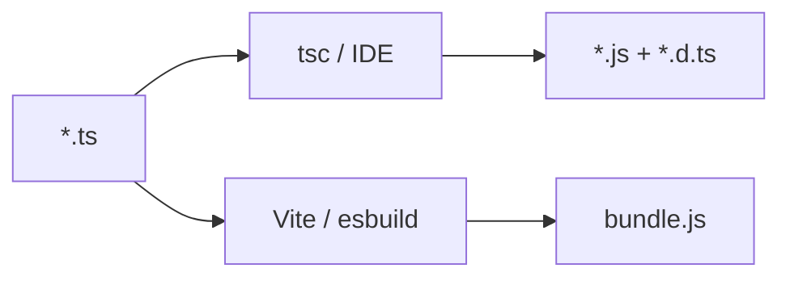

# 22. `tsconfig.json`: target, module, paths

## Сценарий с работы

Вы клонировали monorepo shop-платформы. В корне `tsconfig.json` с `"target": "ES5"`, в пакете `api-client` — `"module": "CommonJS"`, в `web` — `"moduleResolution": "bundler"`. CI падает: `Cannot find module '@/lib/api'`. Коллега добавил path alias в IDE, но не в `tsconfig` — локально «работает», в pipeline TypeScript не видит импорт. На code review: «почему `import type` не попал в `.js` после `tsc`?»

`tsconfig.json` — **контракт** между вашим кодом, компилятором и инструментами (ESLint, Vitest, IDE). Без него TypeScript не знает, **какой JS** вы хотите на выходе и **как** резолвить модули.

## Что вы узнаете

- Структура `tsconfig.json` и ключевые поля верхнего уровня
- `compilerOptions.target`, `module`, `moduleResolution`
- `rootDir`, `outDir`, `include`, `exclude`
- Path aliases: `baseUrl` и `paths`
- `extends` и project references (обзор)
- Связь с `"type": "module"` в `package.json`

---

## Минимальный `tsconfig.json`

```json
{
  "compilerOptions": {
    "target": "ES2022",
    "module": "NodeNext",
    "moduleResolution": "NodeNext",
    "strict": true,
    "outDir": "dist",
    "rootDir": "src",
    "skipLibCheck": true,
    "esModuleInterop": true
  },
  "include": ["src/**/*"],
  "exclude": ["node_modules", "dist"]
}
```

| Поле | Назначение |
|------|------------|
| `include` | какие файлы компилировать |
| `exclude` | что игнорировать (не всегда нужно дублировать `node_modules`) |
| `compilerOptions` | поведение `tsc` |

Запуск:

```bash
npx tsc
npx tsc --noEmit   # только проверка типов, без emit
```

---

## `target`: во что компилируем

`target` задаёт **уровень ECMAScript** в выходных `.js` файлах.

```json
"target": "ES2022"
```

| target | async/await в emit | типичное использование |
|--------|-------------------|------------------------|
| ES5 | через генераторы/хелперы | легаси браузеры (редко) |
| ES2017 | native async/await | Node 8+ |
| ES2022 | class fields, top-level await* | Node 18+ LTS |

\* top-level await также зависит от `module`.

**Правило курса:** для Node LTS и современных bundler — `ES2022` или `ESNext`. Не ставьте `ES5`, если не знаете **зачем**.

TypeScript **не полифиллит** runtime: если в коде `structuredClone`, а target старый — emit может сломаться на старом Node. Полифиллы — отдельно (core-js) или выше target.

---

## `module` и `moduleResolution`

Пара полей определяет **формат модулей** и **алгоритм поиска** файлов.

### Node ESM (рекомендация курса)

В `package.json`:

```json
{
  "type": "module"
}
```

В `tsconfig.json`:

```json
{
  "compilerOptions": {
    "module": "NodeNext",
    "moduleResolution": "NodeNext"
  }
}
```

Импорты с **расширением** в относительных путях:

```typescript
import { formatPrice } from "./format.js";
// Fetch from "node-fetch";
```

TypeScript требует `.js` в import даже при исходнике `.ts` — так будет в runtime после компиляции.

### Другие комбинации

| module | moduleResolution | Когда |
|--------|------------------|-------|
| `CommonJS` | `Node10` | старый Node без ESM |
| `ESNext` | `bundler` | Vite, webpack, esbuild |
| `Preserve` | `bundler` | TS 5.4+, bundler сам собирает |

**Ошибка:** `module: ESNext` + чистый `node dist/index.js` без bundler — часто ломается на extensionless imports.

---

## `rootDir` и `outDir`

```json
"rootDir": "src",
"outDir": "dist"
```

```text
src/
  index.ts
  api/client.ts
dist/
  index.js
  api/client.js
```

Структура каталогов в `dist` повторяет `src`. Если положить `.ts` вне `rootDir`, `tsc` может расширить inferred root или выдать ошибку.

Полезно с `"declaration": true` — генерирует `.d.ts` рядом с `.js` для библиотек.

---

## Path aliases: `baseUrl` и `paths`

Сценарий: импорт `from "@/schemas/item"` вместо `from "../../../schemas/item"`.

```json
{
  "compilerOptions": {
    "baseUrl": ".",
    "paths": {
      "@/*": ["src/*"]
    }
  }
}
```

```typescript
import { ItemSchema } from "@/schemas/item.js";
```

**Важно:** `tsc` **не переписывает** paths в emit. Для runtime нужен один из вариантов:

- bundler (Vite/webpack) понимает alias из tsconfig;
- `tsc-alias` / `tsconfig-paths` после компиляции;
- относительные импорты в библиотеках без bundler.

IDE (VS Code) читает `paths` для автодополнения — отсюда «у меня работает, у CI нет».

---

## `extends` и несколько конфигов

Базовый конфиг команды:

```json
// tsconfig.base.json
{
  "compilerOptions": {
    "strict": true,
    "skipLibCheck": true,
    "forceConsistentCasingInFileNames": true
  }
}
```

Пакет приложения:

```json
{
  "extends": "./tsconfig.base.json",
  "compilerOptions": {
    "outDir": "dist",
    "rootDir": "src"
  },
  "include": ["src"]
}
```

**Project references** (`references: [{ "path": "../shared" }]`) — для monorepo с инкрементальной сборкой; подробнее в nodejs-intermediate.

---

## Поля, которые включают почти всегда

| Опция | Зачем |
|-------|-------|
| `strict: true` | см. [23-strict-mode.md](23-strict-mode.md) |
| `skipLibCheck: true` | быстрее; не проверяет `.d.ts` в node_modules |
| `esModuleInterop: true` | удобный default import из CJS |
| `forceConsistentCasingInFileNames: true` | Linux CI vs Windows |
| `isolatedModules: true` | совместимость с esbuild/swc |
| `noEmit: true` | только check в frontend (Vite сам собирает) |

---

## `tsc` vs bundler vs IDE



- **Библиотека npm** — обычно `tsc` + `declaration`.
- **SPA (React)** — часто `noEmit: true`, сборка Vite.
- **Node CLI** — `tsc` или `tsx` для dev.

---

## Связь с курсом

- Типы и union — уроки 01–15.
- Strict flags — [23-strict-mode.md](23-strict-mode.md).
- ESM и `.d.ts` — [25-modules-declarations.md](25-modules-declarations.md).
- JS capstone CLI — [javascript-basic/39-capstone.md](../javascript-basic/39-capstone.md) (перенос на TS в [33-capstone.md](33-capstone.md)).

Стенд FastAPI `:8090` — [deploy/fastapi/README.md](../../deploy/fastapi/README.md).

---

## Типичные ошибки

1. **Path alias только в tsconfig** — runtime `MODULE_NOT_FOUND`. Настройте bundler или `tsconfig-paths`.

2. **`module: CommonJS` + `"type": "module"`** — смешение форматов, странные ошибки require/import.

3. **Забыли `.js` в import при NodeNext** — TS2307 на `./utils`.

4. **`include` не покрывает тесты** — Vitest видит ошибки, `tsc` молчит. Добавьте `vitest.config.ts` или отдельный `tsconfig.test.json`.

5. **Два tsconfig с разным strict** — IDE и CI расходятся.

6. **target ES5 «на всякий случай»** — раздутая сборка без реальной пользы.

---

## Резюме

`tsconfig.json` управляет target JS, форматом модулей и резолвом импортов. Для Node ESM курса: `"type": "module"`, `module`/`moduleResolution`: `NodeNext`, относительные import с `.js`. `paths` — для IDE и bundler, не магия для голого Node. `rootDir`/`outDir` задают layout артеfactов. Используйте `extends` для единого strict baseline.

---

## Чек-лист

- Чем `target` отличается от `module`?
- Зачем в TS import писать `./file.js`, если исходник `.ts`?
- Почему alias `@/` может работать в IDE, но падать в `node dist/index.js`?
- Когда ставить `noEmit: true`?
- Что делает `npx tsc --noEmit`?

Следующий урок: [23. Strict mode](23-strict-mode.md).
