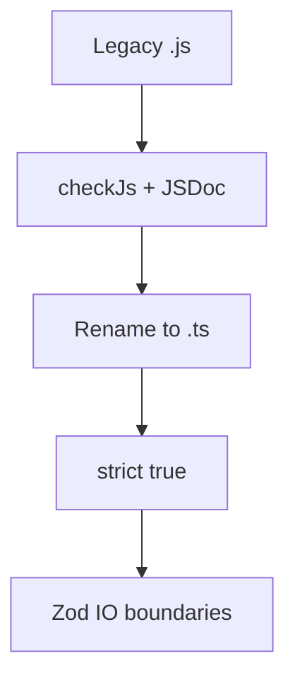

# 31. Tooling: ESLint TypeScript и gradual JS → TS migration

## Сценарий с работы

Monorepo shop: 40% `.js`, 60% `.ts`. CI: `tsc --noEmit` зелёный, но в `.js` файлах `@ts-check` нет — баги живут. ESLint с `@typescript-eslint` ругается на `no-floating-promises` в legacy. PM: «мигрируем за спринт без stop-the-world». Нужен **план**: allowJs, checkJs, rename, strict по пакетам, eslint flat config.

## Что вы узнаете

- ESLint 9 + typescript-eslint (flat config)
- Правила, усиливающие strict
- Gradual migration: allowJs, checkJs, JSDoc
- Стратегия rename `.js` → `.ts`
- `ts-node`, `tsx`, `tsc --build`
- CI: typecheck + lint параллельно

---

## Минимальный ESLint для TS

```bash
npm install -D eslint @eslint/js typescript typescript-eslint
```

`eslint.config.js`:

```javascript
import eslint from "@eslint/js";
import tseslint from "typescript-eslint";

export default tseslint.config(
  eslint.configs.recommended,
  ...tseslint.configs.recommendedTypeChecked,
  {
    languageOptions: {
      parserOptions: {
        projectService: true,
        tsconfigRootDir: import.meta.dirname,
      },
    },
  },
  {
    rules: {
      "@typescript-eslint/no-explicit-any": "warn",
      "@typescript-eslint/no-floating-promises": "error",
      "@typescript-eslint/no-misused-promises": "error",
      "@typescript-eslint/consistent-type-imports": [
        "error",
        { prefer: "type-imports" },
      ],
    },
  }
);
```

`package.json`:

```json
{
  "scripts": {
    "lint": "eslint src",
    "typecheck": "tsc --noEmit"
  }
}
```

**Type-checked rules** требуют `parserOptions.project` — медленнее, но ловят floating promises.

---

## Правила, которые стоят включить

| Rule | Зачем |
|------|-------|
| `no-floating-promises` | забытый `await save()` |
| `no-misused-promises` | async в `array.filter` |
| `no-explicit-any` | не размножать any |
| `consistent-type-imports` | чистый emit |
| `restrict-template-expressions` | не object в template |
| `no-unused-vars` | мёртвый код |

Не включайте всё `strictTypeChecked` сразу в легаси — поднимайте постепенно.

---

## Gradual migration tsconfig

```json
{
  "compilerOptions": {
    "allowJs": true,
    "checkJs": true,
    "strict": true,
    "maxNodeModuleJsDepth": 1
  },
  "include": ["src/**/*"]
}
```

| Флаг | Эффект |
|------|--------|
| `allowJs` | компилятор видит `.js` |
| `checkJs` | проверяет `.js` с JSDoc / inference |
| `strict` | применяется и к JS при checkJs |

### JSDoc в JS до rename

```javascript
/**
 * @param {string} title
 * @param {{ tags?: string[] }} [options]
 * @returns {{ id: string, title: string, status: 'todo' | 'done' }}
 */
export function createTask(title, options) {
  // ...
}
```

Переименование в `.ts` — удаляете JSDoc, добавляете нативные типы.

---

## Стратегия миграции (по шагам)

### Фаза 0. Baseline

- `tsconfig` с `strict: false` → включить `noImplicitAny` only
- ESLint без type-aware rules
- CI: `tsc --noEmit` optional

### Фаза 1. Leaf modules

Мигрируйте **листья** графа (utils, format) — нет зависимых `.js`.

```bash
git mv src/format.js src/format.ts
# fix types, run tsc
```

### Фаза 2. Core domain

`task.js` → `task.ts`, `store.js` → `store.ts` ([javascript-basic/39-capstone](../javascript-basic/39-capstone.md)).

### Фаза 3. Strict per package

Monorepo: `"strict": true` в `packages/shared`, потом `packages/api-client`.

### Фаза 4. Zod на границах

HTTP и file IO — [26-zod-basics.md](26-zod-basics.md).



---

## `// @ts-expect-error` и suppressions

Допустимо **временно** с комментарием и ticket:

```typescript
// @ts-expect-error legacy cart until TASK-1234
legacyCart.add(item);
```

Запрещено: массовый `@ts-ignore` перед strict enable ([24-lab-strict.md](24-lab-strict.md)).

---

## Запуск TS в dev

| Tool | Когда |
|------|-------|
| `tsx src/cli.ts` | быстрый dev без emit |
| `tsc -w` | watch compile |
| `node --import tsx` | Node 20+ |

Production CLI capstone — `tsc` → `node dist/cli.js`.

---

## CI pipeline (пример)

```yaml
- run: npm ci
- run: npm run typecheck
- run: npm run lint
- run: npm test
```

Typecheck и lint **оба** — ESLint не заменяет `tsc`.

---

## Prettier

Форматирование отдельно от ESLint:

```bash
npm install -D prettier eslint-config-prettier
```

Не спорите о semicolons в review — Prettier решает.

---

## Миграция capstone JS → TS

Из [javascript-basic/39-capstone.md](../javascript-basic/39-capstone.md):

1. Скопировать `examples/capstone/` → `typescript-basic/examples/capstone/`
2. Переименовать `.js` → `.ts`, добавить `tsconfig` ([22-tsconfig.md](22-tsconfig.md))
3. Включить strict, пройти [24-lab-strict.md](24-lab-strict.md)
4. `TaskFileSchema` для load ([26-zod-basics.md](26-zod-basics.md))
5. Расширение B: HTTP client ([30-lab-fetch.md](30-lab-fetch.md))

Итог — [33-capstone.md](33-capstone.md).

---

## Связь с курсом

- tsconfig: [22-tsconfig.md](22-tsconfig.md)
- strict: [23-strict-mode.md](23-strict-mode.md)
- modules: [25-modules-declarations.md](25-modules-declarations.md)

---

## Типичные ошибки

1. **Strict сразу на 100k LOC** — команда откатывает TS.

2. **ESLint без project** — type-aware rules молчат.

3. **`allowJs` без плана удаления** — вечный гибрид.

4. **Только lint в CI** — типы не проверяются.

5. **Дублировать Prettier и ESLint stylistic rules** — конфликты.

6. **Мигрировать entry point первым** — максимум ошибок; начните с листьев.

---

## Резюме

typescript-eslint с type-aware rules дополняет `tsc`. Миграция JS→TS: allowJs/checkJs, JSDoc, rename leaf-first, strict по пакетам, Zod на IO. CI: typecheck + lint. Dev: tsx или tsc -w. Capstone Task Tracker — эталонный путь миграции в этом курсе.

---

## Чек-лист

- Зачем `no-floating-promises` если есть strict?
- Чем `allowJs` отличается от `checkJs`?
- С чего начать миграцию — cli.js или format.js?
- ESLint заменяет tsc?
- Когда использовать `@ts-expect-error`?

Следующий урок: [32. Interview Q&A](32-interview-qa.md).
