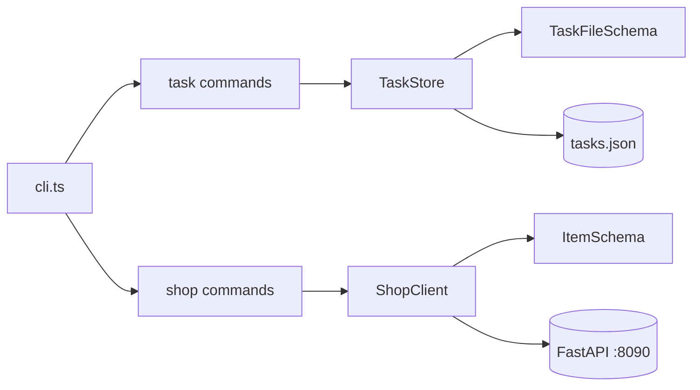

# 33. Capstone: Typed Shop CLI + API client (4–6 часов)

## Введение: зачем capstone

До этой главы вы учили **фрагменты**: tsconfig в 22, strict в 23, Zod в 26, typed fetch в 29. Capstone заставляет **собрать** production-shaped CLI: типы, runtime validation, модули ESM, опционально HTTP к `:8090`. Это **прямое продолжение** [javascript-basic/39-capstone.md](../javascript-basic/39-capstone.md) — тот же домен tasks, но TypeScript + Zod + shop API client.

Если застряли — возвращайтесь к урокам из таблицы «Когда смотреть», не копируйте готовый репозиторий.

**Оценка времени:** 4–6 часов чистой работы (2–3 сессии по 2 часа).

---

## Задача

Два связанных модуля в одном проекте:

1. **Task Tracker CLI** — порт JS capstone на TS со strict и Zod для `tasks.json`.
2. **Shop API client** — typed клиент к FastAPI каталогу на `http://localhost:8090`.

CLI объединяет команды `task …` и `shop …` (или два entry point — задокументируйте).

Позже в **nodejs-basic** TaskStore станет HTTP-only; в **react-basic** — UI поверх того же client.

---

## Функциональные требования

### Модель `Task` (Zod + infer)

| Поле | Тип | Правила |
|------|-----|---------|
| `id` | string (uuid) | уникальный |
| `title` | string | 1–200, не пустой |
| `status` | `"todo"` \| `"done"` | default `todo` |
| `createdAt` | string ISO 8601 | при создании |
| `tags` | string[] | default `[]` |
| `dueDate` | string ISO \| null | optional |

```typescript
export const TaskSchema = z.object({ ... });
export type Task = z.infer<typeof TaskSchema>;
export const TaskFileSchema = z.array(TaskSchema);
```

### `TaskStore`

- `add(title, options?)` → `Task`
- `list({ status?, tag?, search? })` → `Task[]` (копия)
- `markDone(id)` → `Task`
- `remove(id)` → `void`
- `load()` / `save()` — `data/tasks.json`, parse через `TaskFileSchema`
- При битом JSON — stderr + exit 1 (опционально `.bak`)

### Shop client

- `health()` → validated health object
- `listItems()` → `Item[]`
- `getItem(id)` → `Item`
- Все ответы через Zod ([27-lab-zod.md](27-lab-zod.md), [30-lab-fetch.md](30-lab-fetch.md))

### CLI

```bash
npm run start -- task add "Buy milk" --tags home,food
npm run start -- task list --status todo
npm run start -- task done <uuid>
npm run start -- shop health
npm run start -- shop list
npm run start -- shop item 1
```

Exit code: `0` success, `1` validation/not found/HTTP/Zod error. Сообщения в **stderr**.

---

## Нефункциональные требования

| Требование | Зачем |
|------------|-------|
| `"strict": true`, `noUncheckedIndexedAccess` | [23-strict-mode.md](23-strict-mode.md) |
| ESM, NodeNext, import `.js` | [22-tsconfig.md](22-tsconfig.md), [25-modules-declarations.md](25-modules-declarations.md) |
| Нет `@ts-ignore`; минимум `as` | [24-lab-strict.md](24-lab-strict.md) |
| Типы Task/Item — `z.infer` | [26-zod-basics.md](26-zod-basics.md) |
| `main().catch` + typed unknown | [28-async-types.md](28-async-types.md) |
| ESLint recommended + no-floating-promises | [31-tooling-migration.md](31-tooling-migration.md) |
| README с командами и Docker `:8090` | для проверяющего |

---

## Целевая структура

```text
examples/capstone/
├── README.md
├── package.json              # "type": "module"
├── tsconfig.json
├── eslint.config.js
├── data/
│   └── tasks.json
└── src/
    ├── cli.ts                # argv router
    ├── commands/
    │   ├── task.ts
    │   └── shop.ts
    ├── domain/
    │   ├── task.ts           # createTask, ValidationError
    │   ├── store.ts          # TaskStore
    │   └── errors.ts
    ├── schemas/
    │   ├── task.ts
    │   └── item.ts
    ├── api/
    │   ├── http.ts
    │   └── shop-client.ts
    ├── parse-args.ts
    └── format.ts
```



---

## Пошаговый план (рекомендуемый)

### Сессия 1 (~2 ч): порт JS capstone → TS strict

1. Скопируйте логику из [javascript-basic/39-capstone.md](../javascript-basic/39-capstone.md) или `examples/capstone/` JS-версии.
2. Переименуйте в `.ts`, настройте tsconfig ([22-tsconfig.md](22-tsconfig.md)).
3. Опишите `TaskSchema`, замените ручную validation на Zod где уместно.
4. Пройдите strict errors ([24-lab-strict.md](24-lab-strict.md)).
5. **Критерий:** `task add` + `task list` + перезапуск — задачи на месте; `npm run typecheck` — 0 errors.

**Уроки:** 22–24, 26, JS capstone 39.

### Сессия 2 (~2 ч): Shop client + команды shop

1. Поднимите [deploy/fastapi](../../deploy/fastapi/README.md).
2. Перенесите schemas/client из [30-lab-fetch.md](30-lab-fetch.md).
3. Команды `shop health`, `shop list`, `shop item <id>`.
4. **Критерий:** таблица items из реального API; 404 на bad id — exit 1.

**Уроки:** 27–30, [javascript-basic/29-fetch.md](../javascript-basic/29-fetch.md).

### Сессия 3 (~1–2 ч): CLI polish, ESLint, README

1. Discriminated union для parsed argv ([24-lab-strict.md](24-lab-strict.md)).
2. `format.ts`: table output, truncate uuid.
3. ESLint flat config ([31-tooling-migration.md](31-tooling-migration.md)).
4. README: setup, Docker, примеры, ограничения идемпотентности `done`.

---

## Подсказки по реализации

### createTask с Zod

```typescript
const CreateTaskInputSchema = z.object({
  title: z.string().trim().min(1).max(200),
  tags: z.array(z.string()).default([]),
  dueDate: z.string().datetime().nullable().optional(),
});

export function createTask(input: z.input<typeof CreateTaskInputSchema>): Task {
  const data = CreateTaskInputSchema.parse(input);
  return TaskSchema.parse({
    id: randomUUID(),
    title: data.title,
    status: "todo",
    createdAt: new Date().toISOString(),
    tags: data.tags,
    dueDate: data.dueDate ?? null,
  });
}
```

### load с safeParse

```typescript
async load(path: string): Promise<void> {
  const raw = await readFile(path, "utf-8").catch((e) => {
    if (isEnoent(e)) return null;
    throw e;
  });
  if (raw === null) {
    this.tasks = [];
    return;
  }
  const parsed: unknown = JSON.parse(raw);
  const result = TaskFileSchema.safeParse(parsed);
  if (!result.success) {
    throw new Error(`Invalid tasks.json: ${result.error.message}`);
  }
  this.tasks = result.data;
}
```

### Shop list в CLI

```typescript
const items = await shopClient.listItems();
console.table(
  items.map((i) => ({ id: i.id, name: i.name, price: i.price }))
);
```

### Путь к data/tasks.json

```typescript
import { fileURLToPath } from "node:url";
import path from "node:path";

const __dirname = path.dirname(fileURLToPath(import.meta.url));
const TASKS_PATH = path.join(__dirname, "..", "data", "tasks.json");
```

---

## Расширения (опционально)

| Уровень | Задача | Часы |
|---------|--------|------|
| A | `task export --format json` через `TaskFileSchema` round-trip | +0.5 |
| B | `task sync` — pull/push tasks с `:8090` если endpoint есть | +1.5 |
| C | `shop search <q>` — filter client-side + highlight | +0.5 |
| D | Vitest: unit tests для `createTask` и `TaskFileSchema` | +1 |
| E | `task add` с `--due` ISO date + sort list by dueDate | +1 |

Стенд: `docker compose up -d --build` в `deploy/fastapi`.

---

## Критерии приёмки (самопроверка)

- [ ] `npm run typecheck` и `npm run lint` — без ошибок
- [ ] `task add` → `task list` → restart → задача на месте
- [ ] Битый `tasks.json` — понятная ошибка, exit 1
- [ ] `shop list` при поднятом API — данные с Zod validation
- [ ] Нет файла > 250 строк без обоснования в README
- [ ] Нет дублирующих `interface Task` и `TaskSchema` — только infer
- [ ] `capstone/README.md` с командами

---

## Типичные ошибки

1. **`as Task[]` на load** — strict OK, runtime нет. Только `TaskFileSchema.parse`.

2. **Два источника типов Item** — interface + Zod. Один infer.

3. **Забыли `.js` в imports** — NodeNext ERR_MODULE_NOT_FOUND в dist.

4. **Shop команды без проверки Docker** — cryptic ECONNREFUSED; оберните сообщением «start deploy/fastapi».

5. **Мутация `list()` снаружи** — возвращайте копию.

6. **Floating promise в cli** — `void main()` или await + catch.

7. **any из res.json()** — первый assign в `unknown`.

---

## Когда смотреть уроки

| Проблема | Урок |
|---------|------|
| tsconfig / paths | 22 |
| null / find / index | 23, 24 |
| import type / .d.ts | 25 |
| Zod refine / default | 26, 27 |
| async save | 28 |
| fetch + unknown | 29, 30 |
| ESLint CI | 31 |
| JS исходник capstone | [javascript-basic/39](../javascript-basic/39-capstone.md) |

---

## Связь с экосистемой mock-exams

```text
javascript-basic/39-capstone (JS + JSON file)
        ↓
typescript-basic/33-capstone (TS + Zod + shop API)
        ↓
nodejs-basic (Express BFF → :8090)
        ↓
react-basic (UI + TanStack Query + shared schemas)
```

Shop items и tasks — те же сущности, что в [fastapi](../fastapi/README.md) и [api-design](../api-design/README.md).

---

## После capstone

1. Пройдите [interview-cheatsheet.md](interview-cheatsheet.md) и [32-interview-qa.md](32-interview-qa.md).
2. Отметьте в [javascript-path.md](../javascript-path.md): **nodejs-basic** или **react-basic**.
3. Опубликуйте `examples/capstone/` в ветке — артефакт для резюме.

Поздравляем — **typescript-basic** завершён.

---

[← 32-interview-qa](32-interview-qa.md) · [interview-cheatsheet](interview-cheatsheet.md)
